<div align="center">


<p>
  <a href="https://mustafaras.github.io/s/"></a>
  <a href="https://github.com/mustafaras/s/actions/workflows/pages.yml"></a>
  
  
  
  
  
</p>

<table>
  <tr>
    <td align="center"><b>PRIVATE BY DEFAULT</b><br><sub>personal detail stays local</sub></td>
    <td align="center"><b>STATIC BY DESIGN</b><br><sub>inspectable source, no hidden server</sub></td>
    <td align="center"><b>EVIDENCE-GATED</b><br><sub>claims retain their provenance</sub></td>
  </tr>
</table>

</div>

<div align="center">

> **The product principle:** observe carefully, preserve uncertainty, protect
> private context, and make every operational claim traceable to a source.

</div>

## Navigation

| Goal | Start here |
| --- | --- |
| Understand the product and its scientific posture | [Product thesis](#product-thesis) and [Evidence architecture](#evidence-architecture) |
| Read the formal model and limitations | [Scientific method](#scientific-method) and [Threats to validity](#threats-to-validity) |
| Understand the Quran learning protocol | [Quran Journey](#quran-journey) |
| See the interface language | [Interface gallery](#interface-gallery) |
| Understand the system | [Architecture](#architecture) and [Data lifecycle](#data-lifecycle) |
| Resume safe repository work | [Agent entrypoint](#agent-entrypoint) and [`AGENTS.md`](AGENTS.md) |
| Run verification | [Verification](#verification) |
| Change reminders or notification UX | [`docs/reminders/README.md`](docs/reminders/README.md) |
| Change a roadmap item | [`docs/GELISTIRME-PLANI.md`](docs/GELISTIRME-PLANI.md) |
| Inspect historical design evidence | [`archive/`](archive/) |

## Product thesis

Şeyma is a private, Turkish-language application for mood, daily-life signals,
reflection, habits, reading, listening, faith-related routines and optional
reminders. ÆON is a separate observer surface: it consumes an approved,
redacted projection and presents operational context without becoming a second
source of truth.

The system deliberately separates four things that are often collapsed into a
single “dashboard”:

1. **What a person entered** — the local record.
2. **What the software normalized** — the canonical state and migration result.
3. **What the observer is allowed to see** — the projection and redaction contract.
4. **What has actually been proven** — fixture, deployment and device evidence.

This is a reflection product, not a diagnostic product. It does not infer a
clinical condition, prescribe treatment, make dose decisions, or convert a
personal routine into a score of human worth.

## At a glance

| Surface | Purpose | Trust boundary |
| --- | --- | --- |
| **Şeyma** | Private mood, rhythm, notes, routines and reflection | Local personal source of truth |
| **ÆON Current Panel** | Readable observer summaries and operational status | Redacted projection; read-only observer surface |
| **ÆON Panel-v2 Premium** | Premium visual system for trends, archives and system state | Independent panel runtime and contract suite |
| **Sync layer** | Explicit, sanitized transport and conflict-aware merge | Guarded full-replace boundary with receipts |
| **Verification layer** | Deterministic Node fixtures and VM harnesses | Synthetic data, mocked transport, no browser boot |

## Evidence architecture

The repository uses a layered evidence model inspired by scientific workflow:
separate observation from transformation, transformation from interpretation,
and interpretation from release claims.

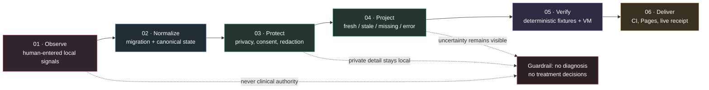

### The scientific posture

| Layer | Question | Allowed claim | Explicitly not claimed |
| --- | --- | --- | --- |
| **Observation** | What was entered or recorded? | “A local record exists.” | “This explains the person.” |
| **Normalization** | How was the record made compatible? | “The state passed migration and shape checks.” | “The normalized value is clinically valid.” |
| **Projection** | What can the observer safely see? | “This redacted projection is fresh/stale/missing/error.” | “Hidden content is absent.” |
| **Interpretation** | What pattern is visible? | “This bounded window shows a change in recorded signals.” | “The change has a causal explanation.” |
| **Action** | What should the product do? | “Offer an optional, user-owned next step.” | “Prescribe, diagnose, shame or escalate automatically.” |

### Evidence levels

Repository health is reported in separate levels. A passing fixture is not a
deployment receipt, and a deployment receipt is not user-device acceptance.

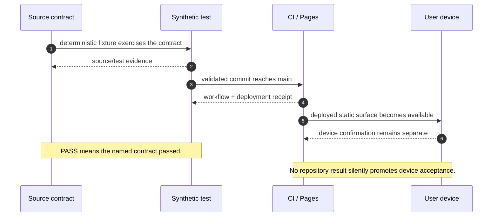

## Scientific method

Şeyma is not presented as a clinical instrument and this repository does not
claim clinical validity. The scientific layer is a discipline for measurement,
provenance, privacy and falsifiable engineering claims. It borrows useful
ideas from ecological momentary assessment, longitudinal self-report,
provenance modeling and risk-based governance while keeping the product’s
scope deliberately smaller: user-owned records, explicit summaries and safe
software behavior.

### 1. Observation is not explanation

An observation is modeled as a contextual record rather than a diagnosis:

$$
o_i = (t_i,\; x_i,\; c_i,\; q_i,\; p_i)
$$

where:

- $t_i$ is the event time;
- $x_i$ is the user-entered value or bounded aggregate;
- $c_i$ is context such as the selected day or surface;
- $q_i$ is quality/provenance metadata; and
- $p_i$ is the privacy class that controls where the record may travel.

The system may display $x_i$ or an explicitly defined function of $x_i$. It
must not silently replace the observation with a causal story about the person.
This is the central distinction between *recording a signal* and *claiming to
understand a human*.

### 2. Longitudinal summaries are descriptive

For a finite observation window $W$, a descriptive mean is:

$$
\bar{x}_{W} = \frac{1}{n_W}\sum_{i\in W}x_i
$$

and a simple window contrast is:

$$
\Delta_W = \bar{x}_{W_{current}} - \bar{x}_{W_{reference}}
$$

These quantities can describe recorded change. They do not identify a cause,
diagnosis, treatment effect or counterfactual outcome. Missingness is preserved
as missingness; it is not silently converted into a zero observation. In the
notation below, $\bot$ means that no valid value is available:

$$
\bar{x}_{\emptyset} = \bot
$$

The UI therefore distinguishes `fresh`, `stale`, `missing`, `error` and
`redacted` rather than presenting every unavailable value as a clean number.

### 3. Canonical state is an idempotent transformation

The application keeps one canonical data object. An old save is transformed by
an additive migration function $M$:

$$
S_{canonical} = M(S_{legacy}), \qquad M(M(S)) = M(S)
$$

The second property is an engineering invariant: running migration twice must
not duplicate records, regress a completed state or erase unknown fields. A
fixture is valuable here because it can test the invariant over minimal,
partial, rich, malformed and future-shaped synthetic inputs.

### 4. Projection is an allowlisted function

The observer does not receive the local object by default. A simplified safe
projection is defined in two explicit stages. Let $A$ be the allowlist of
fields that the observer contract permits:

$$
S^{\prime} = sanitize(merge(S_{local}, S_{remote}))
$$

$$
P = \pi_{A}(S^{\prime})
$$

where $\pi_A$ is an explicit allowlist/redaction projection. The
privacy condition is set containment, not obscurity:

$$
Fields(P) \subseteq Allowlist, \qquad
SensitiveFields \cap Fields(P) = \varnothing
$$

The implementation carries source/revision/timestamp context so that a panel
can say *why* a surface is fresh, stale or unavailable. A redacted value is not
treated as a failed fetch and a stale value is not promoted to current truth.

### 5. A claim is gated by evidence, not by confidence language

Let $T$ denote source/test evidence, $D$ deployment evidence and $U$
user-device evidence. For claims that require all three layers:

$$
Claim_{complete} = T \land D \land U
$$

For a repository-only claim, the admissible scope is explicit:

$$
Claim_{repo} = T, \qquad Claim_{live} = T \land D
$$

No local fixture can manufacture $U$. No deployment receipt can prove that a
particular device used a clean profile. This is why the repository reports
source, deploy and device evidence separately.

### 6. Provenance is a first-class data structure

An operational claim is tied to a provenance tuple rather than a decorative
status badge:

$$
e = (r,\; h_s,\; t_s,\; t_a,\; t_b,\; o)
$$

where $r$ is a snapshot/revision identifier, $h_s$ is a source hash,
$t_s$ is the source timestamp, $t_a$ is the accepted timestamp,
$t_b$ is the build/deployment timestamp and $o$ identifies the owning
surface. If one of the required fields is absent or inconsistent, the UI must
remain non-green or fall back to an explicitly lower evidence state.

## Threats to validity

The following limitations are intentional and documented rather than hidden
behind a polished chart.

| Threat | Why it matters | Mitigation in this repository |
| --- | --- | --- |
| Self-report bias | A recorded value is not an objective measurement of the whole person | Use descriptive language, preserve context and avoid diagnosis |
| Reactivity | Repeated check-ins can influence what is recorded | Keep prompts optional and non-judgmental; do not claim causal effects |
| Missing-not-at-random data | Unrecorded days may differ systematically from recorded days | Preserve missing state and show coverage/window context |
| Confounding | Two changing signals do not establish a causal relationship | Charts are descriptive; no treatment or behavioral prescription is inferred |
| Selection and device bias | One person/device is not a population sample | Treat outputs as personal reflection, not generalizable research findings |
| Stale projection | A dashboard can look coherent while its source is old | Carry freshness, revision and source state through the projection |
| Privacy leakage | Operational convenience can expose sensitive context | Use allowlists, redaction classes and synthetic privacy fixtures |
| Browser-state contamination | A stale profile can trigger a destructive full replacement | No browser verification; use the isolated Node VM boundary |

The references below inform the design posture; they do not turn this repository
into a validated medical device, a clinical decision-support system or a
population study.

## Reference basis

The following sources are not ornamental citations. Each one maps to an
engineering choice in this repository. The mapping is interpretive and scoped:
it documents design influence, not certification or clinical validation.

| Reference | Design implication in Şeyma · ÆON |
| --- | --- |
| [Shiffman, Stone & Hufford, 2008 — *Ecological Momentary Assessment*](https://doi.org/10.1146/annurev.clinpsy.3.022806.091415) | Repeated in-context self-report is treated as contextual observation with missingness, burden and reactivity; it is not promoted to causal truth. |
| [Onnela & Rauch, 2016 — *Harnessing Smartphone-Based Digital Phenotyping*](https://doi.org/10.1038/npp.2016.7) | The repository acknowledges the distinction between personal digital signals and the much stronger claims required for behavioral or health inference. This product uses explicit user records, not passive digital phenotyping. |
| [WHO, 2021 — *Ethics and governance of artificial intelligence for health*](https://www.who.int/publications/i/item/9789240029200) | Human autonomy, privacy, consent, transparency and accountability are treated as release constraints; the product does not make medical decisions. |
| [NIST Privacy Framework](https://www.nist.gov/privacy-framework) | Privacy is handled as a risk-management and data-boundary problem: identify sensitive classes, control their flow, communicate state and protect the individual. |
| [W3C PROV-O](https://www.w3.org/TR/prov-o/) | Source hash, revision, timestamps, receipts and owning surfaces are modeled as provenance-bearing evidence rather than decorative status. |
| [W3C WCAG 2.2](https://www.w3.org/TR/WCAG22/) | Accessibility is a contract surface: keyboard semantics, contrast, focus behavior, reduced motion and target sizes are tested independently. |
| [NIST AI Risk Management Framework 1.0](https://doi.org/10.6028/NIST.AI.100-1) | Used as a governance analogy for `govern → map → measure → manage`; the repository does not claim to be an AI system or to be AI RMF certified. |
| [ACM Artifact Review and Badging](https://www.acm.org/publications/policies/artifact-review-and-badging-current) | Reproducibility is treated as an artifact property: commands, fixtures, boundaries and evidence levels remain inspectable. |

### Reference discipline

1. A reference can motivate a design constraint; it cannot prove that this
   implementation satisfies the source’s full standard or guidance.
2. A descriptive statistic is not a validated scale. No score in the UI should
   be read as a clinical instrument merely because it is numeric.
3. A privacy boundary is not automatically privacy-preserving in every threat
   model. The repository states its classes, guards and test scope instead of
   claiming absolute security.
4. A passing fixture is reproducible evidence for the fixture’s contract. It is
   not evidence that a user’s private device, account or browser has behaved the
   same way.

## Interface gallery

These source-controlled interface previews are intentionally composed from the
verified runtime surfaces, terminology and privacy boundaries. They contain no
user data. They are design previews, not runtime screenshots.

### Runtime screenshot evidence

The repository’s canonical `run-seyma` boundary forbids opening the app in a
browser because an old browser profile can contain a real sync token and stale
local state. Therefore an agent must not fabricate “real” screenshots by
opening the app or panel in a browser. The final runtime capture set should be
created by the user in a clean/incognito profile with synthetic demo data and
then added under:

```text
docs/media/runtime/
├── seyma-demo-today.png
├── aeon-current-panel-demo.png
├── aeon-panel-v2-demo.png
└── quran-journey-demo.png
```

Each capture should include a small provenance note: demo fixture identifier,
surface, viewport, theme, capture date and confirmation that no private account
or token was used. Until those files exist, the SVGs below are intentionally
labelled as previews rather than screenshots.

<table>
  <tr>
    <td width="33%" align="center"><br><sub><b>ŞEYMA · TODAY</b><br>Private reflection and daily rhythm</sub></td>
    <td width="33%" align="center"><br><sub><b>ÆON · CURRENT PANEL</b><br>Source-aware observer projection</sub></td>
    <td width="33%" align="center"><br><sub><b>ÆON · PANEL-V2 PREMIUM</b><br>Premium trends and operational context</sub></td>
  </tr>
</table>

### Product surfaces

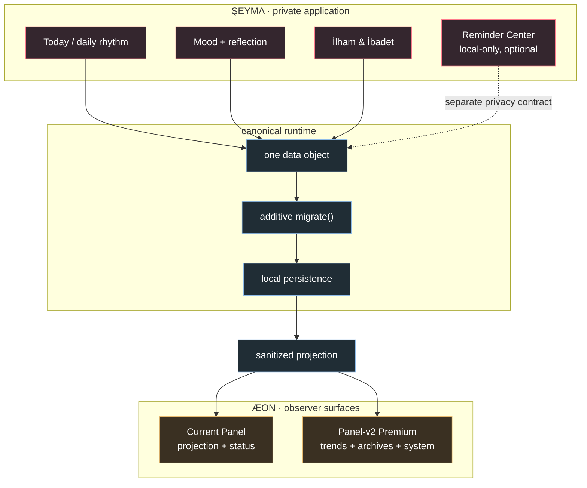

## Architecture

The repository is deliberately boring at runtime: classic scripts, explicit
ownership, no bundler and no hidden server. That makes the privacy and state
boundaries inspectable by both humans and deterministic fixtures.

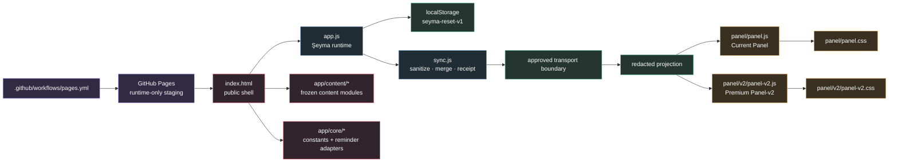

### Runtime ownership

| Surface | Owns | Must not silently own |
| --- | --- | --- |
| [`app.js`](app.js) | UI, state reads/writes, migration entrypoint and `App` handlers | A second persistent store or Panel-v2 rendering |
| [`sync.js`](sync.js) | Sanitized transport, merge helpers, receipts and bounded retries | Raw secrets or unapproved data-repository writes |
| [`app/core/`](app/core/) | Boot constants and reminder runtime contracts | Panel projection or native detail leakage |
| [`app/content/`](app/content/) | Frozen catalogs and domain content modules | Runtime persistence, network or secret discovery |
| [`panel/panel.js`](panel/panel.js) | Current Panel observer projection and UI | Panel-v2 component contracts |
| [`panel/v2/panel-v2.js`](panel/v2/panel-v2.js) | Premium observer rendering, polling, charts and controls | Şeyma local-save semantics |
| [`panel/panelCoverageManifest.js`](panel/panelCoverageManifest.js) | Coverage, redaction and safe projection adapter | Network, DOM mutation or raw secret discovery |
| [`tests/`](tests/) | Synthetic contracts, regression fixtures and parity checks | Production runtime behavior |

## Data lifecycle

Persistent state follows one additive, inspectable path. The migration contract
is idempotent: an old save can be upgraded without deleting unknown fields, and
running the same migration again should not create a new meaning.

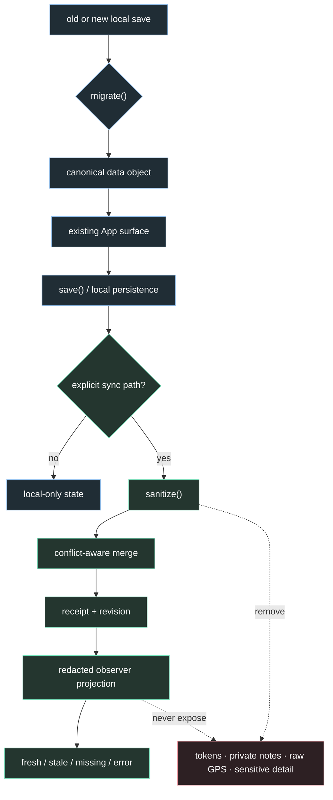

### Projection states are first-class

ÆON does not flatten every failure into an empty dashboard or a reassuring
green badge.

| State | Meaning | UI obligation |
| --- | --- | --- |
| `fresh` | Projection matches the accepted source boundary | Show freshness context and revision/source metadata |
| `stale` | A prior safe projection exists but is older than policy | Show the age and avoid current-state language |
| `missing` | No usable projection is available | Show an honest empty state; never invent zeros |
| `error` | Transport, parse or compatibility failure | Show a bounded diagnosis and retry path |
| `redacted` | Presence is known but content is intentionally withheld | Explain privacy without implying data loss |

## Quran Journey

**Raşit ile Kur’an Yolculuğu** is a first-class product surface and a separate
technical chapter in this repository. It combines a frozen 114-surah revelation
order catalogue, an explicit user request, a guarded message transport, a
validated video response, private learning notes and a provenance-aware panel
projection. It is a learning workflow, not a theological authority layer and
not a clinical or behavioral scoring system.

> **Core promise:** one requested surah, one auditable request identity, one
> validated answer at a time — with uncertainty, retries and replacement
> history kept visible.

### 1. Product surface and learning model

The user enters the journey through the Şeyma faith/learning hub. The catalogue
is ordered by revelation order and retains the canonical Mushaf order as a
secondary fact. Each surah detail view can expose Arabic and Turkish names,
revelation place, ayah count, a bounded theme description, current lifecycle
state and the next valid action.

| Surface capability | Product meaning | Evidence boundary |
| --- | --- | --- |
| 114-stop catalogue | A navigable revelation-order learning map | Frozen catalog module; structural checks only |
| Surah detail | Context before any request is made | Catalog metadata plus local request state |
| “Raşit’ten iste” | An explicit user-owned action | Creates one request record; no background request |
| Delivery status | Whether the message workflow accepted the request | `sent` or `failed` receipt; not a claim that a person watched it |
| Video response | A validated YouTube video identity | HTTPS allowlist, one video, token/request/surah match |
| Watching | An intentional media action | Click-to-load player; iframe load alone is not completion |
| Learning notes | User-owned timestamped reflection | Local canonical state; bounded text and note count |
| Question action | A deliberate handoff to Raşit | Opens the configured external question path; no automatic send claim |
| Panel projection | Cross-surface operational visibility | Same status, timestamps and provenance; no private reply token |

The current implementation keeps the catalogue in
`app/content/quranRevelationOrderV1.js`, the optional rotating verse content in
`app/content/quranStrikingVersesV1.js`, the transport contract in
`app/content/quranTransportV1.js` and the user-facing runtime in `app.js`.
The archived deterministic demo is [`archive/demos/quran-flow-demo.html`](archive/demos/quran-flow-demo.html).

### 2. The three-document transport topology

The transport receipts are deliberately independent from the ordinary
`data/latest.json` full-snapshot chain. The app may later carry the applied
user-owned `quranJourney` state through the normal guarded canonical merge, but
the Quran automation itself has exactly three writable documents.

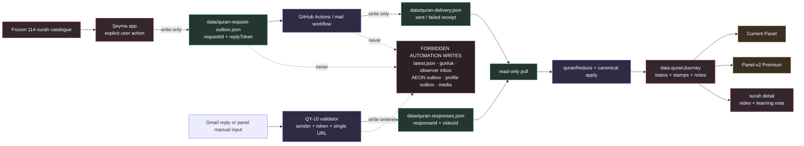

The path invariant is a set-separation rule. $W_Q$ is the Quran transport
allowlist; $W_M$ is the main snapshot and observer write denylist:

$$
W_Q = \{q_{outbox},\; q_{delivery},\; q_{responses}\}
$$

$$
W_M = \{latest,\; gunluk,\; observerInbox,\; aeonOutbox,\;
profileOutbox,\; media\}
$$

$$
W_Q \cap W_M = \emptyset
$$

`QuranTransportV1.isWritableTransportPath()` is the shared gate. A successful
HTTP PUT is not sufficient evidence of a valid Quran write: the path must be
one of the three exact allowlisted paths and the payload must pass its parser.

### 3. Write/read responsibility matrix

| Actor | Operation | Exact path or state | Allowed payload | Explicit prohibition |
| --- | --- | --- | --- | --- |
| Şeyma app | write | `data/quran-request-outbox.json` | request identity, surah metadata, timestamp, reply token | no `latest.json` replacement; no panel or media write |
| GitHub Actions | read | `data/quran-request-outbox.json` | pending requests without a `sent` receipt | no second mail for a sent `requestId` |
| GitHub Actions | write | `data/quran-delivery.json` | `sent`/`failed`, bounded receipt metadata | no raw email body, token, stack trace or address |
| Şeyma app / panels | read | delivery document | status, provider id, bounded error | no delivery inference from a missing file |
| Gmail Apps Script | write | `data/quran-responses.json` | validated response identity, video id, source, fingerprint | no raw sender address or unvalidated URL |
| Panel manual path | write | response document through the same contract | explicit `panel_manual` response | no alternate response schema |
| App reducer | write | local `data.quranJourney` | canonical state transition with supplied timestamp | no direct status mutation outside `quranReduce` |
| Current Panel / Panel-v2 | read | approved canonical projection | shared status/stamps/provenance | no panel-specific lifecycle meaning |

The separation prevents a Quran retry from behaving like a general sync. A
failed or ambiguous answer can be visible as a bounded error without becoming a
reason to overwrite the user’s ordinary mood, notes, reminders or panel inbox.

### 4. Versioned document contracts

All three transport documents carry `schemaVersion`, `updatedAt` and a bounded
map. Parsers return `{ ok, value, errors }`; they do not throw on empty files,
invalid JSON, missing roots, old schema versions or future schema versions.
Known valid records survive with an error list so the caller can keep a safe
state and explain the boundary.

#### Request outbox

`data/quran-request-outbox.json` is keyed by `requestId` and capped at 50
requests. Its required record semantics are:

| Field | Constraint | Why it exists |
| --- | --- | --- |
| `requestId` | `qr_` plus 8–64 URL-safe characters | Stable idempotency and join key |
| `surahId` | lowercase slug, for example `al-alaq` | Catalog identity without display-text parsing |
| `revelationOrder` | integer from 1 through 114 | Preserves the learning route |
| `mushafOrder` | optional integer from 1 through 114 | Supplies the secondary canonical order |
| `surahName` | bounded display fallback | Human-readable mail context; not a join key |
| `requestedAt` | UTC ISO-8601 timestamp | Ordering, audit and retry evidence |
| `replyToken` | 32–128 URL-safe characters | User-present correlation secret; never rendered in a panel |

The token is not a password requested from the user in chat and is not a
display field. It exists only at the intended transport boundary. The README
uses placeholders in examples; it never embeds a real token.

#### Delivery receipt

`data/quran-delivery.json` is keyed by the same `requestId`. The only transport
statuses are `sent` and `failed`. A receipt may carry `sentAt`, a provider
message id and a short bounded error code. It must not carry an email address,
message body, token, stack trace, local file path or private note.

The retry rule is explicit: a pending outbox request is eligible for delivery
until a receipt with `status = sent` exists. Once that receipt exists, the same
request is not posted again merely because a device polls or retries.

#### Response record

`data/quran-responses.json` is keyed by `requestId`, capped at 200 responses and
stores the latest validated response for that logical request:

| Field | Accepted values or shape | Privacy role |
| --- | --- | --- |
| `responseId` | `qrr_` plus 8–64 URL-safe characters | Separates answer identity from request identity |
| `requestId` | Existing `qr_...` key | Prevents cross-request attachment |
| `surahId` | Catalog slug | Prevents a valid video for another surah being attached |
| `videoId` | Exactly 11 YouTube id characters | Stores the minimum identity needed to embed/watch |
| `source` | `gmail_reply` or `panel_manual` | Provenance of the answer path |
| `status` | `ready` or `revoked` | Validated availability, not theological correctness |
| `receivedAt` | Optional UTC timestamp | Transport arrival evidence |
| `validatedAt` | Required UTC timestamp | Validation boundary evidence |
| `senderFingerprint` | Optional 16–64 lowercase hex characters | Correlates a sender without publishing the address |

The local canonical reducer may additionally use `invalid` as an internal
failure state while validating a response. That internal state is not written
as an accepted `ready` transport record.

### 5. Pure validation boundary

QY-04 is intentionally a pure module: no network, storage, DOM, timers,
`Date.now()`, token logging or exception-driven control flow. Every timestamp is
passed by the caller. The same input therefore produces the same normalized
output and the same error list in the headless fixtures.

The implementation-level identity checks are:

```js
requestId   = /^qr_[A-Za-z0-9_-]{8,64}$/
responseId  = /^qrr_[A-Za-z0-9_-]{8,64}$/
surahId     = /^[a-z]+(-[a-z]+)*$/
videoId     = /^[A-Za-z0-9_-]{11}$/
replyToken  = /^[A-Za-z0-9_-]{32,128}$/
timestamp   = /^\d{4}-\d{2}-\d{2}T\d{2}:\d{2}:\d{2}(\.\d{1,3})?Z$/
fingerprint = /^[a-f0-9]{16,64}$/
```

Only these HTTPS URL families may produce a video id:

```text
https://www.youtube.com/watch?v=<11-character-id>
https://m.youtube.com/watch?v=<11-character-id>
https://youtu.be/<11-character-id>
https://www.youtube.com/shorts/<11-character-id>
```

Channel pages, playlists, profiles, `javascript:` URLs, `data:` URLs, other
hosts and malformed identifiers are rejected. Free-text replies are tokenized,
punctuation is trimmed at URL edges and all extracted ids are deduplicated.
The acceptance rule is:

$$
|V(m)| = 1 \Rightarrow accept
$$

$$
|V(m)| = 0 \lor |V(m)| > 1 \Rightarrow reject
$$

where $V(m)$ is the set of distinct accepted YouTube ids extracted from message
$m$. This avoids silently choosing one link when a reply contains two competing
videos. `requestId`, `surahId` and `replyToken` must also agree before a response
can reach the `ready` state. Client comparison uses a length-checked XOR loop;
the server-side Apps Script remains the authoritative secret comparison point.

### 6. Canonical request record

The runtime stores one normalized request record per surah in
`data.quranJourney.requests`. `ensureQuranJourney()` repairs missing containers,
preserves unknown future fields and removes only malformed records that cannot
be safely identified. The canonical request shape is:

```text
requestId, status, requestedAt, notifiedAt, deliverySentAt,
providerMessageId, responseId, responseSource, responseReceivedAt,
responseValidatedAt, responseStatus, videoId, readyAt,
startedWatchingAt, watchedAt, questionOpenedAt, updatedAt,
videoHistory[], notes[], lastNoteAt
```

The runtime status vocabulary is deliberately explicit:

| Status | Rank | Meaning | Retry or next action |
| --- | ---: | --- | --- |
| `idle` | 0 | No request has been made | Request is allowed |
| `submitting` | 1 | Local action is being persisted | Wait for outbox result |
| `queued` | 2 | Outbox record exists | Wait for delivery receipt |
| `notification_error` | 2 | Delivery failed | Retry request |
| `notified` | 3 | Delivery receipt says sent | Await response |
| `awaiting_reply` | 4 | Response window is open | Pull updates |
| `validating_reply` | 5 | A response is being checked | Wait for validator result |
| `invalid_reply` | 5 | Response did not satisfy the contract | Request a new link |
| `ready` | 6 | One validated video is available | Explicitly load/watch |
| `video_unavailable` | 6 | Existing video is revoked/unavailable | Request a replacement |
| `watching` | 7 | User opened the player | Continue or use visible fallback |
| `watched` | 8 | Completion was recorded | Open an optional question |
| `question_opened` | 9 | Question handoff was opened | No automatic send claim |
| `request_error` | 0 | Local/outbox write did not complete | Retry without losing intent |

### 7. Monotonic state machine

The lifecycle is a partially ordered state machine. Rank is not a quality score;
it is a safety ordering that stops stale devices and late errors from erasing
completed learning evidence.

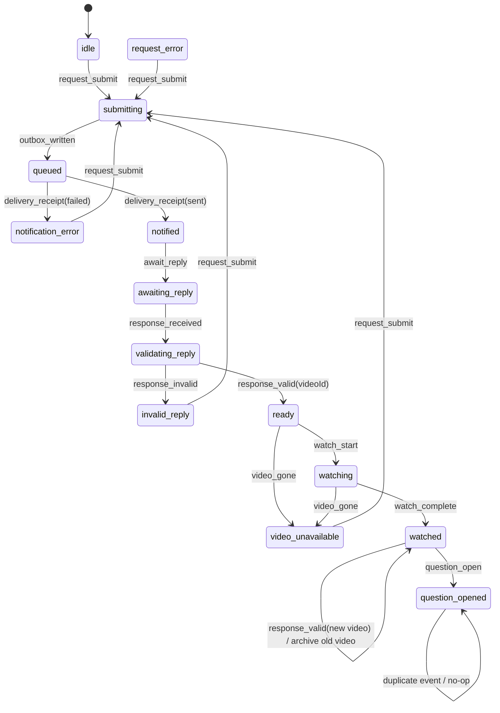

The rank function is defined by the runtime and copied into `sync.js` so the
merge layer cannot drift from the reducer:

$$
\rho(idle)=0,\; \rho(request\_error)=0,\; \rho(submitting)=1
$$

$$
\rho(queued)=2,\; \rho(notification\_error)=2,\; \rho(notified)=3
$$

$$
\rho(awaiting\_reply)=4,\; \rho(validating\_reply)=5,
\; \rho(invalid\_reply)=5
$$

$$
\rho(ready)=6,\; \rho(video\_unavailable)=6,\; \rho(watching)=7
$$

$$
\rho(watched)=8,\; \rho(question\_opened)=9
$$

For ordinary progress events:

$$
\rho(s_{t+1}) \geq \rho(s_t)
$$

Retryable failures share the rank of the point they failed at, so a retry does
not invent progress and an error does not delete the attempted request. A
`watched` record is never destructively downgraded by `video_gone`. A new valid
response after watching archives the old video and retains the current rank:

$$
history_{t+1} = history_t \cup \{video_t\}
$$

$$
\rho(s_{t+1}) \geq \rho(s_t)
$$

### 8. Reducer, idempotence and multi-device merge

`quranReduce(request, event)` is a pure single-event reducer. It clones the
input, requires a supplied timestamp, validates a response video before the
transition, rejects unknown events and rejects transitions that are not in the
explicit transition table. Side effects such as save, sync, outbox writes and
external handoff belong to the caller.

For a duplicate event $e$, the reducer must converge without adding a second
record:

$$
q^{\prime} = R(q,e),\qquad R(q^{\prime},e) = q^{\prime}
$$

The returned result distinguishes `ok: false` validation/transition failure
from `ok: true, changed: false` idempotent replay. This distinction is important
for retries: a safe no-op is not the same as a broken request.

The guarded sync merge applies the same rank table independently of `app.js`:

1. Higher rank wins; a completed `watched` record beats a stale `ready` record.
2. Equal rank uses the newest `updatedAt` as the last-writer tie-breaker.
3. Missing timestamps and provenance fields are filled from the losing side
   when the winning side is empty.
4. `videoHistory` is unioned and deduplicated by response/video/replacement
   identity, then capped at 20 records.
5. Notes are unioned by note id; the newest `updatedAt` version wins and the
   result is capped at 100 notes.
6. `startedAt` is the earliest journey start, not a last-writer field.
7. Different surahs merge independently, so one request cannot replace another.

The merge contract can be summarized as:

$$
rank(q_{merged}) \geq max(rank(q_{local}),\; rank(q_{remote}))
$$

unless both records are malformed and the safe empty contract must be used. The
merge is not a blind object replacement; it is a field-aware, bounded union.

### 9. Watch integrity and click-to-load privacy

The video surface has two separate events: opening a player and completing a
video. The first is not treated as the second.

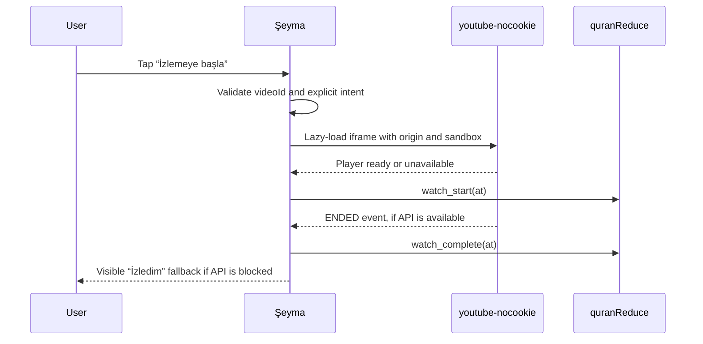

The player contract is intentionally narrow:

- no iframe is rendered on the first detail render;
- the iframe is injected only after the user chooses to watch;
- the host is `youtube-nocookie.com`;
- `enablejsapi=1` and an origin are supplied for completion detection;
- autoplay is not requested;
- a sandbox and restricted `allow` list are used;
- a blocked API does not silently claim completion; the visible fallback is
  available only while the request is `watching`.

The thumbnail is a presentation aid, not evidence that the video is reachable.
If the video is unavailable, its identity remains available for diagnosis and
the user sees a replacement action rather than a broken empty player.

### 10. Learning notes and user-owned reflection

Notes are attached to the surah request, not to the global mood record. They can
be classified as `watch`, `listen` or `reflection`, and may carry an optional
non-negative video-second position and a short tag. The current UI enforces:

| Note property | Bound |
| --- | ---: |
| Note text | 2,000 characters |
| Tag | 40 characters |
| Timestamp | Optional integer seconds, never negative |
| Stored notes per surah | 100 |
| Visible notes in the detail view | Latest 12 |

Notes are not sent as delivery metadata, sender evidence or panel secrets. A
panel can show safe note counts and lifecycle context only where its projection
contract allows it; the content remains user-owned detail.

### 11. Failure matrix and honest UI states

The protocol treats failure as a state with a recovery path, not as an empty
success card:

| Failure or ambiguity | Rejected/held at | Canonical state | User-facing action |
| --- | --- | --- | --- |
| Empty or invalid JSON | Parser | safe empty contract | Explain unavailable transport and retry pull |
| Unknown request key | Parser | no accepted record | Keep the user’s existing state |
| Bad token or mismatched surah | Response validator | `invalid_reply` | Request a new response |
| Multiple distinct video links | Free-text extraction | `invalid_reply` | Ask for one direct video link |
| Non-YouTube or playlist link | URL parser | `invalid_reply` | Show accepted link formats |
| Delivery receipt `failed` | Delivery merge | `notification_error` | Retry without duplicate success mail |
| 404/blocked YouTube video | Player/response refresh | `video_unavailable` | Preserve id and request replacement |
| Duplicate request event | Reducer | unchanged | Safe no-op; no second outbox slot |
| Duplicate response event | Reducer/merge | unchanged | Safe no-op; no duplicate history item |
| Stale device push | Guarded merge | higher-rank state retained | Preserve newer request/video evidence |
| Forbidden transport path | Write gate | write denied | Zero write to main snapshot or observer files |

This table is also a reporting rule: `missing`, `error`, `invalid` and
`unavailable` must not be rendered as `ready`, a zero, or a completed learning
event.

### 12. Panel parity and provenance projection

The Current Panel and Panel-v2 can use different visual systems, but they read
the same canonical fields. Neither panel is allowed to create a local Quran
state machine or to infer a delivery from a timestamp alone.

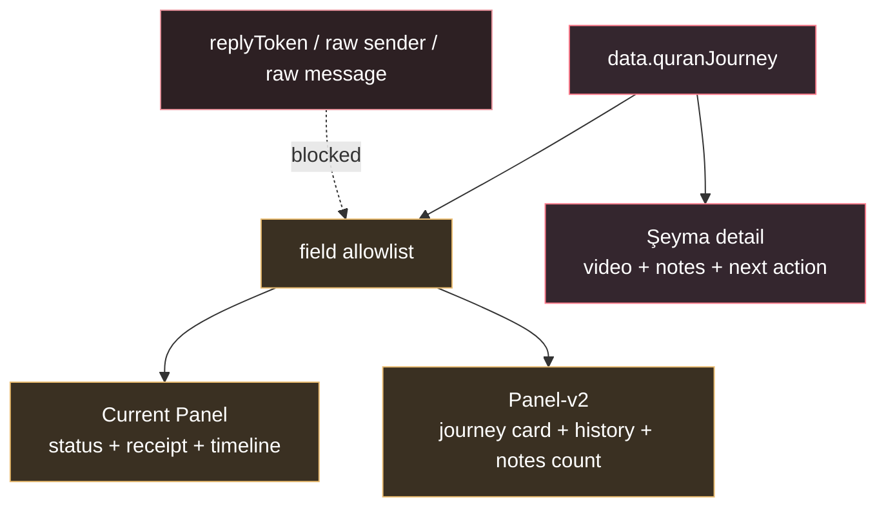

The minimum safe evidence record for a visible Quran row is:

```text
surahId              = frozen catalogue identity
requestId            = logical request identity
responseId           = validated answer identity, if any
status               = canonical lifecycle state
deliverySentAt       = provider receipt time, if sent
responseReceivedAt   = response arrival time, if known
responseValidatedAt  = validation boundary time, if ready/revoked
responseSource       = gmail_reply | panel_manual
videoId              = validated 11-character identity, if present
videoHistoryCount    = bounded replacement count
noteCount            = bounded user-owned note count
```

A panel may say “response validated at …” only when the matching field exists.
It may say “waiting for response” when the state is `awaiting_reply`, but it
must not claim that a person received or watched a message without that evidence.

### 13. Deterministic Quran test matrix

The Quran suite is intentionally layered. It proves software contracts with
synthetic fixtures; it does not prove the truth of religious interpretation or
the behavior of a private user device.

| Fixture | Contract tested | Boundary |
| --- | --- | --- |
| `test_quran_catalog.js` | 114 records, revelation order, cross-links and frozen catalog shape | isolated `node:vm` |
| `test_quran_striking_verses.js` | 100 structural verse entries and surah references | isolated `node:vm` |
| `test_quran_transport.js` | path gate, IDs, token shape, URL extraction, parse safety and caps | pure module, no network |
| `test_quran_outbox_sync.js` | allowlisted outbox PUT, no `latest.json`, token containment and retry | mocked fetch |
| `test_quran_pull_sync.js` | read-only pull, cache busting, 404/304/invalid payload handling | mocked fetch |
| `test_quran_flow_demo.js` | end-to-end synthetic request → delivery → response → watch flow | VM/demo fixture |
| `test_quran_merge.js` | rank merge, stale-device recovery, supersession and note/history union | pure merge fixtures |
| `test_quran_panel_parity.js` | Current Panel and Panel-v2 canonical field parity | static contract scan |
| `test_quran_a11y_contrast.js` | Quran color tokens and WCAG AA contrast calculations | deterministic color math |

Run the whole focused surface from the repository root:

```bash
for f in tests/quran/test_*.js; do node "$f" || exit $?; done
```

The fixture boundary is fail-closed: no browser boot, real localStorage, real
GitHub token, live private data, outbound mail or real sync repository is needed
to prove these contracts.

### 14. Reproducible demo storyline

The README’s visual language should use the following synthetic storyline when a
user captures runtime screenshots. The values are illustrative and contain no
private account data:

1. **Library:** the user is at revelation-order stop `01 / 114`; the library
   displays filters for `Tümü`, `İstenmedi`, `Bekleniyor`, `Hazır` and `İzlendi`.
2. **Request:** the user opens a surah detail and taps `Raşit’ten iste`; the
   UI disables a second request while the first is `submitting` or `queued`.
3. **Delivery:** a synthetic receipt changes the row to `notified`, then the
   app displays `awaiting_reply` without inventing a video.
4. **Validated response:** one synthetic `youtube.com/watch?v=...` identity
   reaches `ready`; two distinct links would instead reach `invalid_reply`.
5. **Watch:** the screenshot shows the consent-like click-to-load cover before
   the iframe and the visible fallback during `watching`.
6. **Reflection:** after completion, the user adds one `reflection` note with a
   short tag and optionally opens the question handoff.
7. **Observer:** the panel shows status, provenance and counts, never the reply
   token, raw sender, private message or hidden personal detail.

The archived page is a structural demo, not proof of a private live account.
For real runtime captures, use a clean user-owned demo profile and record the
fixture id, viewport, theme, commit and capture time alongside the image.

## Privacy and safety contracts

The most important feature is the boundary itself.

- **Local-first:** personal state is owned by the app’s local data model.
- **Explicit sync:** transport is opt-in and guarded; a stale device must not
  silently clobber a newer remote snapshot.
- **Projection redaction:** private notes, therapy text, raw profile responses,
  secrets, raw GPS and sensitive reminder detail do not cross the observer
  boundary.
- **Reminder separation:** reminders are local-only, optional,
  non-judgmental and private. Native copy is generic; detailed context stays
  in the app.
- **No clinical authority:** the product does not choose doses, interactions,
  treatment, catch-up actions or missed-dose decisions.
- **No browser verification:** opening the app in a browser can load stale
  localStorage and schedule a full replacement. Verification uses the committed
  Node VM harnesses instead.

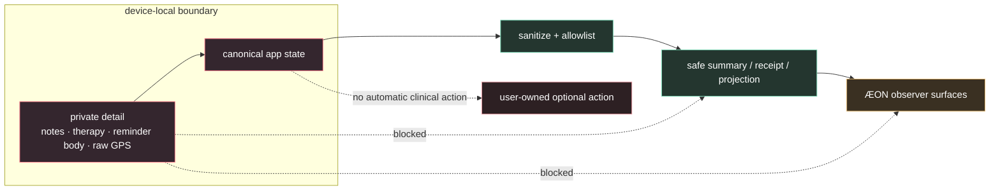

## Verification

There is no `package.json`, bundler, framework, npm test script or linter. The
repository favors inspectable source and deterministic, committed contracts.

### Fast safe checks

```bash
# JavaScript syntax
node --check app.js
node --check sync.js
node --check sw.js

# App VM surfaces; no browser, no real network, no user localStorage
node .claude/skills/run-seyma/driver.mjs
node .claude/skills/run-seyma/zikr-harness.mjs

# Focused Panel-v2 suite
for f in tests/panel-v2/test_panel_v2_*.js; do node "$f" || exit $?; done

# Current Panel and Quran suites
for f in tests/panel/test_*.js tests/quran/test_*.js; do node "$f" || exit $?; done

# State boundary contracts
node .claude/skills/run-seyma/verify-state-helper-boundary.mjs
node .claude/skills/run-seyma/verify-state-migration-boundary.mjs
node .claude/skills/run-seyma/verify-state-adapter-contract.mjs

# Diff hygiene
git diff --check
```

### Test architecture

| Family | Location | Contract |
| --- | --- | --- |
| App and sync | [`tests/app/`](tests/app/) | Migration, merge, anti-clobber and transport safety |
| Current Panel | [`tests/panel/`](tests/panel/) | Projection, redaction, polling, boot resilience and observer UI |
| Panel-v2 Premium | [`tests/panel-v2/`](tests/panel-v2/) | Tokens, components, accessibility, performance and page contracts |
| Quran transport | [`tests/quran/`](tests/quran/) | Catalog, outbox, delivery, response, merge and panel parity |
| Reminder program | [`tests/reminders/`](tests/reminders/) | Local-only UX, permission, privacy, sync and current-panel boundaries |
| State harnesses | [`.claude/skills/run-seyma/`](.claude/skills/run-seyma/) | Isolated VM boot, migration and dependency-bag contracts |

Test evidence is synthetic and deterministic. It is deliberately not a claim
that a particular person’s device, browser profile or private account has been
accepted.

## Reproducibility dossier

The smallest useful evidence record is a tuple, not a screenshot alone:

$$
R = (h_c,\; k,\; f,\; b,\; v,\; s)
$$

where $h_c$ is the commit hash, $k$ is the exact command, $f$ is the
fixture identifier, $b$ is the boundary mode (VM, mock transport or live
deployment), $v$ is the environment/version context and $s$ is the resulting
status. A visual capture adds a second tuple:

$$
V = (R,\; surface,\; viewport,\; theme,\; data\_class,\; captured\_at)
$$

This prevents a polished image from becoming unauditable. A screenshot must
be traceable to a synthetic data class, a surface and a commit or fixture.

### Synthetic demo data contract

The README gallery and future runtime capture pack should use only deterministic
demo values:

| Demo dimension | Required property | Forbidden content |
| --- | --- | --- |
| Mood/rhythm | bounded values, fixed dates, explicit window | real journal text or private health context |
| Reminder surface | generic title, local status, permission state | medication name, dose, therapy text or raw reminder body |
| Current Panel | redacted aggregate, revision, freshness state | tokens, raw notes, raw GPS or profile answers |
| Panel-v2 | trend points, KPI labels, audit metadata | user identity, account identifiers or private payloads |
| Capture environment | clean profile, fixed viewport, named theme | an existing personal browser profile |

### Verification output contract

```text
source  = commit SHA + changed surface
fixture = exact command or fixture family
boundary = node:vm / synthetic mock / Pages receipt
result  = PASS | FAIL | BLOCKED | NOT-CLAIMED
scope   = what the evidence does and does not establish
```

The `NOT-CLAIMED` state is intentional. It is the correct state for user-device
acceptance when only repository or deployment evidence is available.

## Release model

`main` is the production branch. GitHub Pages stages the runtime-only public
surface and deploys it without a build step.

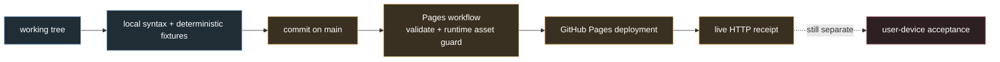

Every release claim should identify its evidence level:

1. **Source/test evidence** — local code and deterministic fixtures.
2. **Deployment evidence** — CI run, deployment state and live HTTP response.
3. **User-device evidence** — confirmation from the user’s own clean device
   context; never inferred from the first two levels.

## Repository map

```text
.
├── index.html / panel.html      public Şeyma and Current Panel shells
├── panel-v2.html                Premium observer shell
├── app/                         app core, content modules and shared styles
├── panel/                       Current Panel + Panel-v2 implementation assets
├── app.js / sync.js / sw.js     runtime entrypoints and guarded synchronization
├── assets/                      public ÆON/PWA icons
├── tests/                       committed headless Node fixtures by surface
├── docs/                        roadmap, contracts, summaries and previews
├── archive/                     completed work and historical context
├── .claude/skills/run-seyma/    data-safe VM verification harnesses
├── AGENTS.md / CLAUDE.md        operational and engineering guidance
└── README.md                   product, architecture and verification entrypoint
```

The root is intentionally small. Runtime entrypoints stay discoverable for a
static deployment; content, panel implementations, tests, documents and
historical artifacts have explicit ownership directories.

## Agent entrypoint

Before changing anything:

1. Read [`AGENTS.md`](AGENTS.md) for data-safety, browser, sync and handoff rules.
2. Read [`CLAUDE.md`](CLAUDE.md) for the detailed engineering contract.
3. Read [`docs/GELISTIRME-PLANI.md`](docs/GELISTIRME-PLANI.md) for roadmap scope.
4. For reminders, read [`docs/reminders/README.md`](docs/reminders/README.md)
   and its approval gate before any release action.
5. Inspect `git status --short --branch`; preserve existing user changes.
6. Use synthetic headless evidence. Never open the Şeyma app in a browser to
   “check whether it runs.”

When a change touches persisted state, extend `migrate()` additively, preserve
unknown fields, decide the sync/projection class explicitly and add fixtures for
present, missing, stale and malformed shapes.

## Further reading

- [`AGENTS.md`](AGENTS.md) — operational safety and repository rules
- [`CLAUDE.md`](CLAUDE.md) — detailed architecture and development guidance
- [`docs/GELISTIRME-PLANI.md`](docs/GELISTIRME-PLANI.md) — living roadmap and technical principles
- [`docs/reminders/README.md`](docs/reminders/README.md) — reminder state, contracts and gates
- [`tests/README.md`](tests/README.md) — test inventory and safe execution notes
- [`archive/README.md`](archive/README.md) — historical context and archive policy

<div align="center">

<sub>Built as an inspectable static system: warm on the surface, strict at the boundary.</sub>

</div>
