<div align="center">

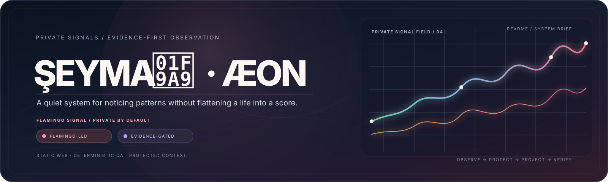

<p>
  <a href="https://mustafaras.github.io/s/"></a>
  <a href="https://github.com/mustafaras/s/actions/workflows/pages.yml"></a>
  
  
  
  
  
</p>

<table>
  <tr>
    <td align="center"><b>PRIVATE BY DEFAULT</b><br><sub>personal detail stays local</sub></td>
    <td align="center"><b>STATIC BY DESIGN</b><br><sub>inspectable source, no hidden server</sub></td>
    <td align="center"><b>EVIDENCE-GATED</b><br><sub>claims retain their provenance</sub></td>
  </tr>
</table>

</div>

<div align="center">

> **The product principle:** observe carefully, preserve uncertainty, protect
> private context, and make every operational claim traceable to a source.

</div>

## Navigation

| Goal | Start here |
| --- | --- |
| Understand the product and its scientific posture | [Product thesis](#product-thesis) and [Evidence architecture](#evidence-architecture) |
| See the interface language | [Interface gallery](#interface-gallery) |
| Understand the system | [Architecture](#architecture) and [Data lifecycle](#data-lifecycle) |
| Resume safe repository work | [Agent entrypoint](#agent-entrypoint) and [`AGENTS.md`](AGENTS.md) |
| Run verification | [Verification](#verification) |
| Change reminders or notification UX | [`docs/reminders/README.md`](docs/reminders/README.md) |
| Change a roadmap item | [`docs/GELISTIRME-PLANI.md`](docs/GELISTIRME-PLANI.md) |
| Inspect historical design evidence | [`archive/`](archive/) |

## Product thesis

Şeyma is a private, Turkish-language application for mood, daily-life signals,
reflection, habits, reading, listening, faith-related routines and optional
reminders. ÆON is a separate observer surface: it consumes an approved,
redacted projection and presents operational context without becoming a second
source of truth.

The system deliberately separates four things that are often collapsed into a
single “dashboard”:

1. **What a person entered** — the local record.
2. **What the software normalized** — the canonical state and migration result.
3. **What the observer is allowed to see** — the projection and redaction contract.
4. **What has actually been proven** — fixture, deployment and device evidence.

This is a reflection product, not a diagnostic product. It does not infer a
clinical condition, prescribe treatment, make dose decisions, or convert a
personal routine into a score of human worth.

## At a glance

| Surface | Purpose | Trust boundary |
| --- | --- | --- |
| **Şeyma** | Private mood, rhythm, notes, routines and reflection | Local personal source of truth |
| **ÆON Current Panel** | Readable observer summaries and operational status | Redacted projection; read-only observer surface |
| **ÆON Panel-v2 Premium** | Premium visual system for trends, archives and system state | Independent panel runtime and contract suite |
| **Sync layer** | Explicit, sanitized transport and conflict-aware merge | Guarded full-replace boundary with receipts |
| **Verification layer** | Deterministic Node fixtures and VM harnesses | Synthetic data, mocked transport, no browser boot |

## Evidence architecture

The repository uses a layered evidence model inspired by scientific workflow:
separate observation from transformation, transformation from interpretation,
and interpretation from release claims.

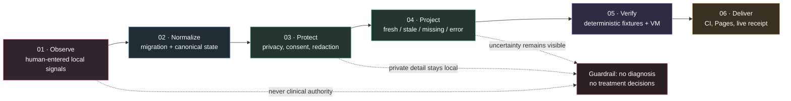

### The scientific posture

| Layer | Question | Allowed claim | Explicitly not claimed |
| --- | --- | --- | --- |
| **Observation** | What was entered or recorded? | “A local record exists.” | “This explains the person.” |
| **Normalization** | How was the record made compatible? | “The state passed migration and shape checks.” | “The normalized value is clinically valid.” |
| **Projection** | What can the observer safely see? | “This redacted projection is fresh/stale/missing/error.” | “Hidden content is absent.” |
| **Interpretation** | What pattern is visible? | “This bounded window shows a change in recorded signals.” | “The change has a causal explanation.” |
| **Action** | What should the product do? | “Offer an optional, user-owned next step.” | “Prescribe, diagnose, shame or escalate automatically.” |

### Evidence levels

Repository health is reported in separate levels. A passing fixture is not a
deployment receipt, and a deployment receipt is not user-device acceptance.

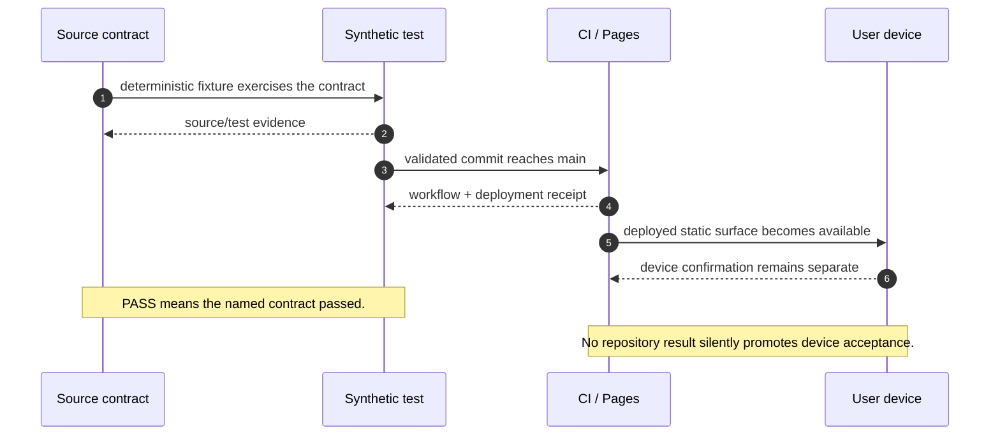

## Interface gallery

These source-controlled interface previews are intentionally composed from the
verified runtime surfaces, terminology and privacy boundaries. They contain no
user data and are not live account screenshots. Keeping them versioned makes
the README readable on GitHub without opening the application or introducing a
browser into repository verification.

<table>
  <tr>
    <td width="33%" align="center">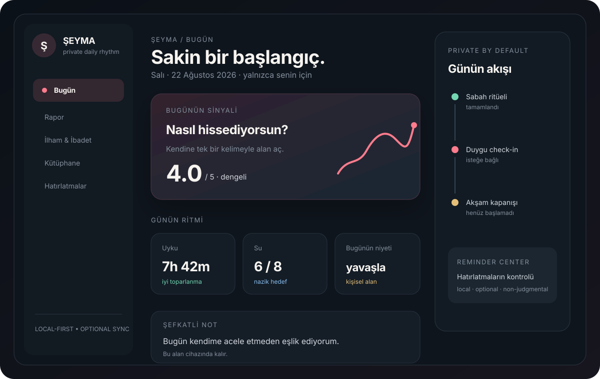<br><sub><b>ŞEYMA · TODAY</b><br>Private reflection and daily rhythm</sub></td>
    <td width="33%" align="center">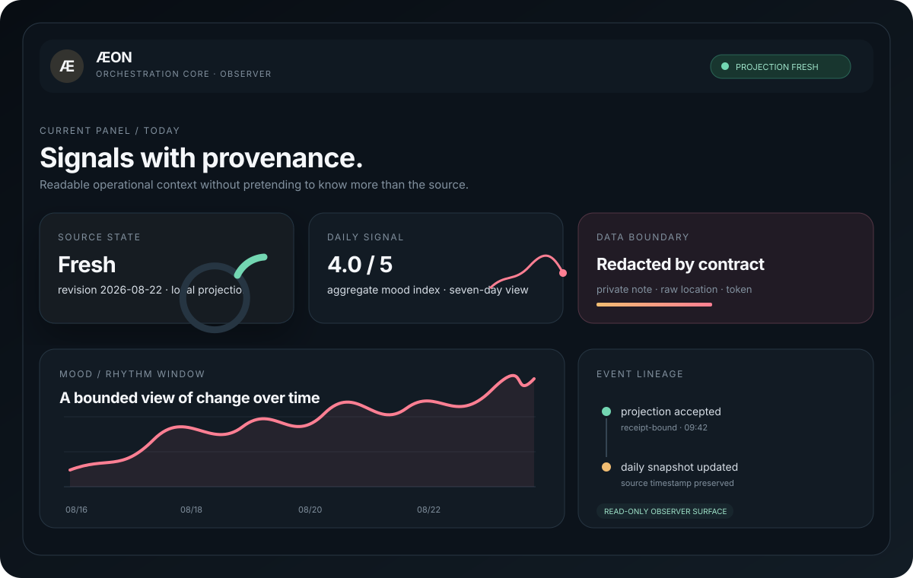<br><sub><b>ÆON · CURRENT PANEL</b><br>Source-aware observer projection</sub></td>
    <td width="33%" align="center">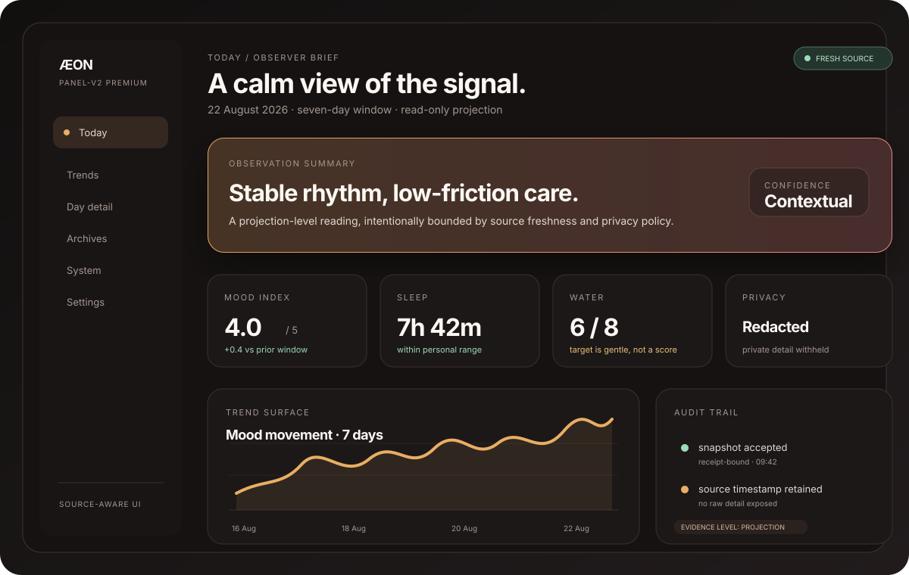<br><sub><b>ÆON · PANEL-V2 PREMIUM</b><br>Premium trends and operational context</sub></td>
  </tr>
</table>

### Product surfaces

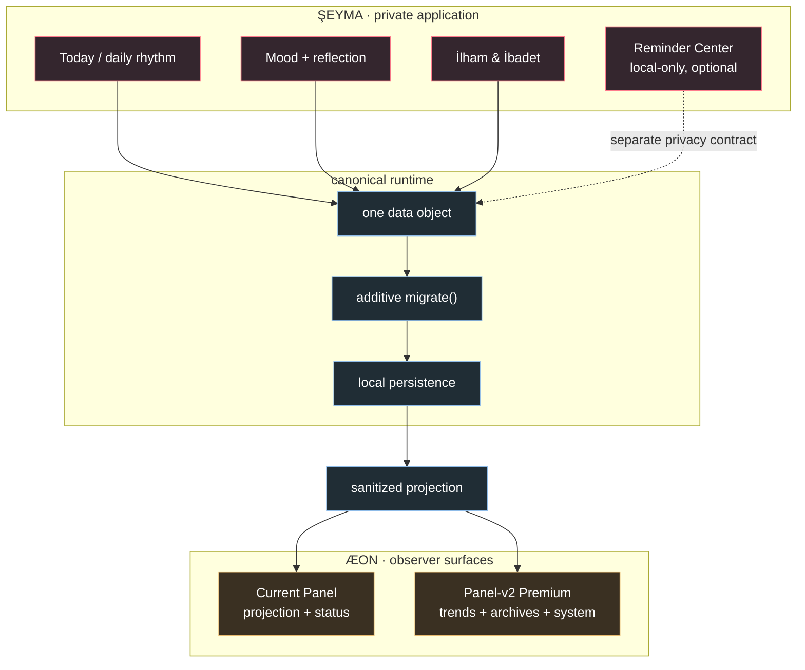

## Architecture

The repository is deliberately boring at runtime: classic scripts, explicit
ownership, no bundler and no hidden server. That makes the privacy and state
boundaries inspectable by both humans and deterministic fixtures.

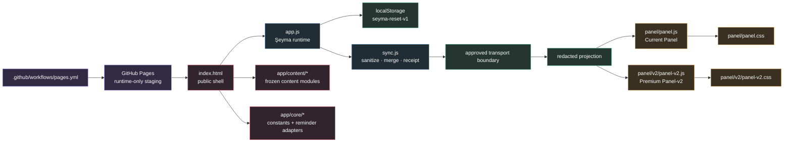

### Runtime ownership

| Surface | Owns | Must not silently own |
| --- | --- | --- |
| [`app.js`](app.js) | UI, state reads/writes, migration entrypoint and `App` handlers | A second persistent store or Panel-v2 rendering |
| [`sync.js`](sync.js) | Sanitized transport, merge helpers, receipts and bounded retries | Raw secrets or unapproved data-repository writes |
| [`app/core/`](app/core/) | Boot constants and reminder runtime contracts | Panel projection or native detail leakage |
| [`app/content/`](app/content/) | Frozen catalogs and domain content modules | Runtime persistence, network or secret discovery |
| [`panel/panel.js`](panel/panel.js) | Current Panel observer projection and UI | Panel-v2 component contracts |
| [`panel/v2/panel-v2.js`](panel/v2/panel-v2.js) | Premium observer rendering, polling, charts and controls | Şeyma local-save semantics |
| [`panel/panelCoverageManifest.js`](panel/panelCoverageManifest.js) | Coverage, redaction and safe projection adapter | Network, DOM mutation or raw secret discovery |
| [`tests/`](tests/) | Synthetic contracts, regression fixtures and parity checks | Production runtime behavior |

## Data lifecycle

Persistent state follows one additive, inspectable path. The migration contract
is idempotent: an old save can be upgraded without deleting unknown fields, and
running the same migration again should not create a new meaning.

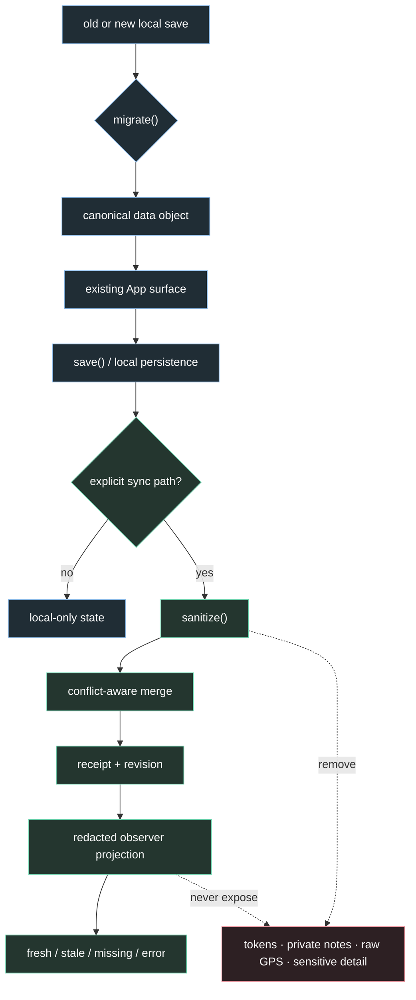

### Projection states are first-class

ÆON does not flatten every failure into an empty dashboard or a reassuring
green badge.

| State | Meaning | UI obligation |
| --- | --- | --- |
| `fresh` | Projection matches the accepted source boundary | Show freshness context and revision/source metadata |
| `stale` | A prior safe projection exists but is older than policy | Show the age and avoid current-state language |
| `missing` | No usable projection is available | Show an honest empty state; never invent zeros |
| `error` | Transport, parse or compatibility failure | Show a bounded diagnosis and retry path |
| `redacted` | Presence is known but content is intentionally withheld | Explain privacy without implying data loss |

## Privacy and safety contracts

The most important feature is the boundary itself.

- **Local-first:** personal state is owned by the app’s local data model.
- **Explicit sync:** transport is opt-in and guarded; a stale device must not
  silently clobber a newer remote snapshot.
- **Projection redaction:** private notes, therapy text, raw profile responses,
  secrets, raw GPS and sensitive reminder detail do not cross the observer
  boundary.
- **Reminder separation:** reminders are local-only, optional,
  non-judgmental and private. Native copy is generic; detailed context stays
  in the app.
- **No clinical authority:** the product does not choose doses, interactions,
  treatment, catch-up actions or missed-dose decisions.
- **No browser verification:** opening the app in a browser can load stale
  localStorage and schedule a full replacement. Verification uses the committed
  Node VM harnesses instead.

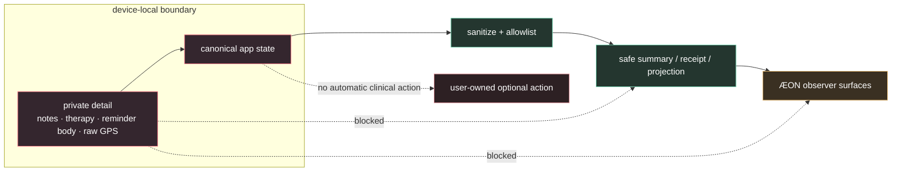

## Verification

There is no `package.json`, bundler, framework, npm test script or linter. The
repository favors inspectable source and deterministic, committed contracts.

### Fast safe checks

```bash
# JavaScript syntax
node --check app.js
node --check sync.js
node --check sw.js

# App VM surfaces; no browser, no real network, no user localStorage
node .claude/skills/run-seyma/driver.mjs
node .claude/skills/run-seyma/zikr-harness.mjs

# Focused Panel-v2 suite
for f in tests/panel-v2/test_panel_v2_*.js; do node "$f" || exit $?; done

# Current Panel and Quran suites
for f in tests/panel/test_*.js tests/quran/test_*.js; do node "$f" || exit $?; done

# State boundary contracts
node .claude/skills/run-seyma/verify-state-helper-boundary.mjs
node .claude/skills/run-seyma/verify-state-migration-boundary.mjs
node .claude/skills/run-seyma/verify-state-adapter-contract.mjs

# Diff hygiene
git diff --check
```

### Test architecture

| Family | Location | Contract |
| --- | --- | --- |
| App and sync | [`tests/app/`](tests/app/) | Migration, merge, anti-clobber and transport safety |
| Current Panel | [`tests/panel/`](tests/panel/) | Projection, redaction, polling, boot resilience and observer UI |
| Panel-v2 Premium | [`tests/panel-v2/`](tests/panel-v2/) | Tokens, components, accessibility, performance and page contracts |
| Quran transport | [`tests/quran/`](tests/quran/) | Catalog, outbox, delivery, response, merge and panel parity |
| Reminder program | [`tests/reminders/`](tests/reminders/) | Local-only UX, permission, privacy, sync and current-panel boundaries |
| State harnesses | [`.claude/skills/run-seyma/`](.claude/skills/run-seyma/) | Isolated VM boot, migration and dependency-bag contracts |

Test evidence is synthetic and deterministic. It is deliberately not a claim
that a particular person’s device, browser profile or private account has been
accepted.

## Release model

`main` is the production branch. GitHub Pages stages the runtime-only public
surface and deploys it without a build step.

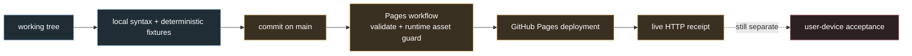

Every release claim should identify its evidence level:

1. **Source/test evidence** — local code and deterministic fixtures.
2. **Deployment evidence** — CI run, deployment state and live HTTP response.
3. **User-device evidence** — confirmation from the user’s own clean device
   context; never inferred from the first two levels.

## Repository map

```text
.
├── index.html / panel.html      public Şeyma and Current Panel shells
├── panel-v2.html                Premium observer shell
├── app/                         app core, content modules and shared styles
├── panel/                       Current Panel + Panel-v2 implementation assets
├── app.js / sync.js / sw.js     runtime entrypoints and guarded synchronization
├── assets/                      public ÆON/PWA icons
├── tests/                       committed headless Node fixtures by surface
├── docs/                        roadmap, contracts, summaries and previews
├── archive/                     completed work and historical context
├── .claude/skills/run-seyma/    data-safe VM verification harnesses
├── AGENTS.md / CLAUDE.md        operational and engineering guidance
└── README.md                   product, architecture and verification entrypoint
```

The root is intentionally small. Runtime entrypoints stay discoverable for a
static deployment; content, panel implementations, tests, documents and
historical artifacts have explicit ownership directories.

## Agent entrypoint

Before changing anything:

1. Read [`AGENTS.md`](AGENTS.md) for data-safety, browser, sync and handoff rules.
2. Read [`CLAUDE.md`](CLAUDE.md) for the detailed engineering contract.
3. Read [`docs/GELISTIRME-PLANI.md`](docs/GELISTIRME-PLANI.md) for roadmap scope.
4. For reminders, read [`docs/reminders/README.md`](docs/reminders/README.md)
   and its approval gate before any release action.
5. Inspect `git status --short --branch`; preserve existing user changes.
6. Use synthetic headless evidence. Never open the Şeyma app in a browser to
   “check whether it runs.”

When a change touches persisted state, extend `migrate()` additively, preserve
unknown fields, decide the sync/projection class explicitly and add fixtures for
present, missing, stale and malformed shapes.

## Further reading

- [`AGENTS.md`](AGENTS.md) — operational safety and repository rules
- [`CLAUDE.md`](CLAUDE.md) — detailed architecture and development guidance
- [`docs/GELISTIRME-PLANI.md`](docs/GELISTIRME-PLANI.md) — living roadmap and technical principles
- [`docs/reminders/README.md`](docs/reminders/README.md) — reminder state, contracts and gates
- [`tests/README.md`](tests/README.md) — test inventory and safe execution notes
- [`archive/README.md`](archive/README.md) — historical context and archive policy

<div align="center">

<sub>Built as an inspectable static system: warm on the surface, strict at the boundary.</sub>

</div>
