<div align="center">


<br>

<p>
  <a href="https://mustafaras.github.io/s/"></a>
  <a href="https://github.com/mustafaras/s/actions/workflows/pages.yml"></a>
  
  
  
  
  
</p>

**A private, Turkish-language wellbeing companion and its read-only observer —<br>
built as an inspectable static system: warm on the surface, strict at the boundary.**

<table>
  <tr>
    <td align="center" width="25%"><b>PRIVATE BY DEFAULT</b><br><sub>personal detail stays on the device</sub></td>
    <td align="center" width="25%"><b>STATIC BY DESIGN</b><br><sub>no server, no bundler, no hidden runtime</sub></td>
    <td align="center" width="25%"><b>EVIDENCE-GATED</b><br><sub>every claim keeps its provenance</sub></td>
    <td align="center" width="25%"><b>VERIFIED HEADLESS</b><br><sub>213 deterministic test files, zero browser</sub></td>
  </tr>
</table>

</div>

<div align="center">

> **The product principle:** observe carefully, preserve uncertainty, protect
> private context, and make every operational claim traceable to a source.

</div>

## Contents

| Part | Sections |
| --- | --- |
| **I · Product** | [Overview](#overview) · [Interface gallery](#interface-gallery) · [Feature tour](#feature-tour) |
| **II · Science** | [Evidence architecture](#evidence-architecture) · [Scientific method](#scientific-method) · [Threats to validity](#threats-to-validity) · [Reference basis](#reference-basis) |
| **III · System** | [Architecture](#architecture) · [Data lifecycle](#data-lifecycle) · [Privacy and safety contracts](#privacy-and-safety-contracts) |
| **IV · Quran** | [Quran Journey](#quran-journey) · [Quranic Arabic learning](#quranic-arabic-learning) |
| **V · Proof** | [Accessibility as measurement](#accessibility-as-measurement) · [Verification](#verification) · [Reproducibility dossier](#reproducibility-dossier) · [Release model](#release-model) |
| **VI · Repository** | [Repository map](#repository-map) · [Working on this repository](#working-on-this-repository) · [Further reading](#further-reading) |

---

# I · Product

## Overview

**Şeyma 🦩** is a private, single-user web app for mood, daily rhythm,
reflection, habits, reading, listening, faith routines, Quranic Arabic study
and optional reminders. **ÆON** is a separate observer surface: it consumes an
approved, redacted projection and presents operational context so that a
trusted second person can follow along — without ever becoming a second source
of truth.

The system deliberately separates four things that are often collapsed into a
single “dashboard”:

| | Layer | Question it answers |
| :-: | --- | --- |
| 1 | **Local record** | What did the person actually enter? |
| 2 | **Canonical state** | How did the software normalize and migrate it? |
| 3 | **Projection** | What is the observer allowed to see? |
| 4 | **Evidence** | What has actually been proven — by fixture, by deployment, on a device? |

> **Scope statement.** This is a reflection product, not a diagnostic product.
> It does not infer a clinical condition, prescribe treatment, make dose
> decisions, or convert a personal routine into a score of human worth.

### By the numbers

<table>
  <tr>
    <td align="center"><h3>0</h3><sub>build steps · servers · runtime dependencies</sub></td>
    <td align="center"><h3>33 + 18</h3><sub><code>app/core</code> registries · frozen <code>app/content</code> modules</sub></td>
    <td align="center"><h3>213</h3><sub>committed headless test files in six families</sub></td>
    <td align="center"><h3>77.42%</h3><sub>Quranic token coverage reachable with 524 verified lemmas</sub></td>
  </tr>
</table>

### Surfaces at a glance

| Surface | Purpose | Trust boundary |
| --- | --- | --- |
| **Şeyma** · [`index.html`](index.html) | Mood, rhythm, notes, routines, faith hub, Arabic study, reflection | Local personal source of truth |
| **ÆON Current Panel** · [`panel.html`](panel.html) | Readable observer summaries and operational status | Redacted projection; read-only observer surface |
| **ÆON Panel-v2 Premium** · [`panel-v2.html`](panel-v2.html) | Premium visual system for trends, archives and system state | Independent panel runtime and contract suite |
| **v3.0 Welcome** · [`v3-tanitim/`](v3-tanitim/) | Standalone release introduction and celebration page | Runs *before* the app runtime; never touches app data |
| **Sync layer** · [`sync.js`](sync.js) | Explicit, sanitized transport and conflict-aware merge | Guarded full-replace boundary with receipts and anti-clobber guards |
| **Verification layer** · [`tests/`](tests/) | Deterministic Node fixtures and VM harnesses | Synthetic data, mocked transport, no browser boot |

## Interface gallery

<table>
  <tr>
    <td width="33%" align="center"><br><sub><b>ŞEYMA · TODAY</b><br>Private reflection and daily rhythm</sub></td>
    <td width="33%" align="center"><br><sub><b>ÆON · CURRENT PANEL</b><br>Source-aware observer projection</sub></td>
    <td width="33%" align="center"><br><sub><b>ÆON · PANEL-V2 PREMIUM</b><br>Premium trends and operational context</sub></td>
  </tr>
</table>

These source-controlled previews are composed from the verified runtime
surfaces, terminology and privacy boundaries. They contain no user data and are
**design previews, not runtime screenshots**.

### Runtime screenshot evidence

The canonical verification boundary forbids opening the app in an everyday
browser profile, because such a profile can hold a real sync token and stale
local state. An agent therefore must not fabricate “real” screenshots. Runtime
captures are created in a clean, disposable profile with synthetic demo data
and stored next to the previews under `.github/media/runtime/`:

| File | Surface |
| --- | --- |
| `seyma-demo-today.png` | Şeyma · Today |
| `aeon-current-panel-demo.png` | ÆON · Current Panel |
| `aeon-panel-v2-demo.png` | ÆON · Panel-v2 Premium |
| `quran-journey-demo.png` | Kur'an Yolculuğu |

Each capture carries a provenance note — demo fixture id, surface, viewport,
theme, capture date and confirmation that no private account or token was
used. Until those files exist, the SVGs above remain labelled as previews.

## Feature tour

<table>
  <tr>
    <td width="50%" valign="top">
      <h4>🌅 Today &amp; daily rhythm</h4>
      Mood, energy and sleep check-ins, notes, habits and a per-day record that
      survives every schema change through an additive <code>migrate()</code>.
      Longitudinal summaries stay descriptive and keep missing days visible.
    </td>
    <td width="50%" valign="top">
      <h4>🕌 İlham &amp; İbadet hub</h4>
      Prayer times, zikirmatik with core presets, qibla, an offset-adjustable
      Hijri calendar with holy-day lookup, 99 Esmâü'l-Hüsnâ, a rotating set of
      100 human-verified verses and a daily inspirational figure.
    </td>
  </tr>
  <tr>
    <td valign="top">
      <h4>📖 Kur'an Yolculuğu</h4>
      A revelation-order journey through all 114 surahs: one explicit request,
      one validated video answer, private learning notes and a monotonic state
      machine that a stale device cannot roll back.
      <a href="#quran-journey">Protocol →</a>
    </td>
    <td valign="top">
      <h4>🔤 Kur'an Arapçası</h4>
      Quranic Arabic study with an FSRS-5 scheduler, 12 units / 109 lessons /
      524 verified lemmas, a lesson player, a reader for 20 short surahs,
      phonics and articulation-point (mahreç) schemas.
      <a href="#quranic-arabic-learning">Model →</a>
    </td>
  </tr>
  <tr>
    <td valign="top">
      <h4>🔔 Reminder center</h4>
      Local-only, optional and non-judgmental reminders. Native notification
      copy stays generic; detailed context never leaves the app.
    </td>
    <td valign="top">
      <h4>✨ Premium motion &amp; live sky</h4>
      A champagne-gold design system, gated audio/haptic/motion feedback (quiet
      hours 23–07, reduced-motion aware) and a canvas header sky driven by live
      weather: 4 solar times × 8 weather codes × 6 seasons = 192 scenes.
    </td>
  </tr>
  <tr>
    <td valign="top">
      <h4>🛰️ ÆON observer</h4>
      Two independent panels read the same redacted projection and render
      <code>fresh</code>, <code>stale</code>, <code>missing</code>,
      <code>error</code> and <code>redacted</code> as first-class states — never
      a reassuring zero.
    </td>
    <td valign="top">
      <h4>🎉 v3.0 welcome</h4>
      A standalone release page that redirects before the app boots, so the
      first open carries no data or sync risk; its day count is derived from
      the record, never hard-coded.
    </td>
  </tr>
</table>

---

# II · Science

## Evidence architecture

The repository uses a layered evidence model inspired by scientific workflow:
separate observation from transformation, transformation from interpretation,
and interpretation from release claims.

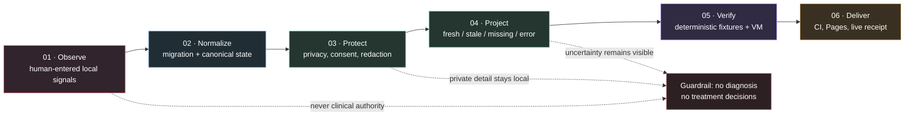
```mermaid
flowchart LR
    O["01 · Observe<br/>human-entered local signals"] --> N["02 · Normalize<br/>migration + canonical state"]
    N --> P["03 · Protect<br/>privacy, consent, redaction"]
    P --> X["04 · Project<br/>fresh / stale / missing / error"]
    X --> V["05 · Verify<br/>deterministic fixtures + VM"]
    V --> D["06 · Deliver<br/>CI, Pages, live receipt"]

    O -. "never clinical authority" .-> G["Guardrail: no diagnosis<br/>no treatment decisions"]
    P -. "private detail stays local" .-> G
    X -. "uncertainty remains visible" .-> G

    classDef source fill:#31242d,stroke:#ff7c8d,color:#fff;
    classDef transform fill:#202d35,stroke:#8fbce9,color:#fff;
    classDef protect fill:#24362f,stroke:#73d6b2,color:#fff;
    classDef verify fill:#302a42,stroke:#b9a0ff,color:#fff;
    classDef deliver fill:#3a3022,stroke:#e9bb70,color:#fff;
    classDef guard fill:#2d2023,stroke:#e8959e,color:#fff;
    class O source;
    class N transform;
    class P,X protect;
    class V verify;
    class D deliver;
    class G guard;
```

### The scientific posture

| Layer | Question | Allowed claim | Explicitly not claimed |
| --- | --- | --- | --- |
| **Observation** | What was entered or recorded? | “A local record exists.” | “This explains the person.” |
| **Normalization** | How was the record made compatible? | “The state passed migration and shape checks.” | “The normalized value is clinically valid.” |
| **Projection** | What can the observer safely see? | “This redacted projection is fresh/stale/missing/error.” | “Hidden content is absent.” |
| **Interpretation** | What pattern is visible? | “This bounded window shows a change in recorded signals.” | “The change has a causal explanation.” |
| **Action** | What should the product do? | “Offer an optional, user-owned next step.” | “Prescribe, diagnose, shame or escalate automatically.” |

### Evidence levels

Repository health is reported in separate levels. A passing fixture is not a
deployment receipt, and a deployment receipt is not user-device acceptance.

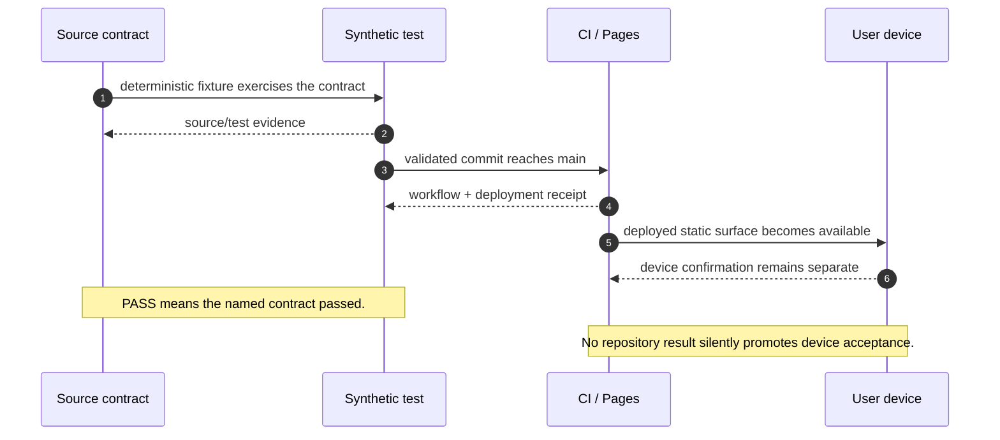
```mermaid
sequenceDiagram
    autonumber
    participant S as Source contract
    participant T as Synthetic test
    participant C as CI / Pages
    participant U as User device

    S->>T: deterministic fixture exercises the contract
    T-->>S: source/test evidence
    T->>C: validated commit reaches main
    C-->>T: workflow + deployment receipt
    C->>U: deployed static surface becomes available
    U-->>C: device confirmation remains separate

    Note over S,T: PASS means the named contract passed.
    Note over C,U: No repository result silently promotes device acceptance.
```

## Scientific method

Şeyma is not presented as a clinical instrument and this repository does not
claim clinical validity. The scientific layer is a discipline for measurement,
provenance, privacy and falsifiable engineering claims. It borrows useful ideas
from ecological momentary assessment, longitudinal self-report, provenance
modelling, memory research and risk-based governance while keeping the
product's scope deliberately smaller: user-owned records, explicit summaries
and safe software behaviour.

Every subsection below states a definition, the invariant the code is held to,
and the artifact that checks it.

### 1. Observation is not explanation

An observation is modelled as a contextual record rather than a diagnosis:

$$
o_i = (t_i,\; x_i,\; c_i,\; q_i,\; p_i)
$$

where

- $t_i$ is the event time;
- $x_i$ is the user-entered value or a bounded aggregate;
- $c_i$ is context such as the selected day or surface;
- $q_i$ is quality/provenance metadata; and
- $p_i$ is the privacy class that controls where the record may travel.

The system may display $x_i$ or an explicitly defined function $g(x_i)$. It
must not silently replace the observation with a causal story about the person.
This is the central distinction between *recording a signal* and *claiming to
understand a human*.

### 2. Longitudinal summaries are descriptive

For a finite observation window $W$ containing $n_W$ valid observations, a
descriptive mean is

$$
\bar{x}_{W} = \frac{1}{n_W}\sum_{i \in W} x_i
$$

and a simple window contrast is

$$
\Delta_W = \bar{x}_{W_{\text{current}}} - \bar{x}_{W_{\text{reference}}}
$$

These quantities describe recorded change. They do not identify a cause,
diagnosis, treatment effect or counterfactual outcome. Missingness is preserved
as missingness and never converted into a zero observation. Writing $\bot$ for
“no valid value”:

$$
n_W = 0 \;\Longrightarrow\; \bar{x}_{W} = \bot
$$

Because a mean over a sparse window is fragile, the window also carries its
coverage — the share of calendar days that hold a valid record:

$$
\kappa_W = \frac{n_W}{\lvert W \rvert}, \qquad 0 \le \kappa_W \le 1
$$

A summary is therefore reported as the pair $(\bar{x}_W,\, \kappa_W)$, and the
UI distinguishes `fresh`, `stale`, `missing`, `error` and `redacted` rather than
presenting every unavailable value as a clean number.

### 3. Canonical state is an idempotent, conservative transformation

The application keeps one canonical data object. An old save is transformed by
an additive migration function $M$:

$$
S_{\text{canonical}} = M(S_{\text{legacy}}), \qquad M(M(S)) = M(S)
$$

Idempotence alone is not enough — a migration could be idempotent and still
discard data. The second invariant is conservation of unknown fields:

$$
\operatorname{keys}(S) \subseteq \operatorname{keys}(M(S))
$$

Running migration twice must not duplicate records, regress a completed state or
erase unknown fields. Fixtures test both properties over minimal, partial,
rich, malformed and future-shaped synthetic inputs
([`verify-state-migration-boundary.mjs`](.claude/skills/run-seyma/verify-state-migration-boundary.mjs)).

### 4. Projection is an allowlisted function

The observer never receives the local object by default. A safe projection is
defined in two explicit stages. Let $A$ be the allowlist of fields the observer
contract permits:

$$
S' = \operatorname{sanitize}\big(\operatorname{merge}(S_{\text{local}},\, S_{\text{remote}})\big)
$$

$$
P = \pi_{A}(S')
$$

where $\pi_A$ is an explicit allowlist/redaction projection. The privacy
condition is set containment, not obscurity:

$$
\operatorname{Fields}(P) \subseteq A, \qquad \operatorname{Sensitive} \cap \operatorname{Fields}(P) = \varnothing
$$

The implementation carries source, revision and timestamp context so a panel can
say *why* a surface is fresh, stale or unavailable. A redacted value is not
treated as a failed fetch, and a stale value is not promoted to current truth.

### 5. A claim is gated by evidence, not by confidence language

Let $T$ denote source/test evidence, $D$ deployment evidence and $U$
user-device evidence. The admissible scope of a claim is the conjunction of the
evidence that actually exists:

$$
\text{Claim}_{\text{repo}} = T, \qquad
\text{Claim}_{\text{live}} = T \land D, \qquad
\text{Claim}_{\text{complete}} = T \land D \land U
$$

The levels form a chain, and no level is inferred from a lower one:

$$
U \not\Leftarrow D, \qquad D \not\Leftarrow T
$$

No local fixture can manufacture $U$. No deployment receipt can prove that a
particular device used a clean profile. This is why every report in this
repository lists source, deploy and device evidence separately.

### 6. Provenance is a first-class data structure

An operational claim is tied to a provenance tuple rather than a decorative
status badge:

$$
e = (r,\; h_s,\; t_s,\; t_a,\; t_b,\; o)
$$

where $r$ is a snapshot/revision identifier, $h_s$ a source hash, $t_s$ the
source timestamp, $t_a$ the accepted timestamp, $t_b$ the build/deployment
timestamp and $o$ the owning surface. Causality between the stamps is itself
checkable:

$$
t_s \le t_a \le t_b
$$

If a required field is absent or the ordering is violated, the UI remains
non-green or falls back to an explicitly lower evidence state.

### 7. Anti-clobber is a monotonicity guard

`sync.js` performs a *full replace* of the remote snapshot, so the dangerous
event is a stale device overwriting a richer remote record. Let
$d(S) = \lvert \operatorname{days}(S) \rvert$ be the number of recorded days, and
let $O_{\text{dev}}$ be the set of development origins (`localhost`,
`127.0.0.1`, `0.0.0.0`, `::1`, `*.local`, `file:`). A push of local state $L$
over remote state $R$ is admissible only when

$$
\text{push}(L, R) \iff \text{origin} \notin O_{\text{dev}} \;\land\; \neg\big(d(R) > 0 \,\land\, d(L) \lt d(R)\big)
$$

The first conjunct is **Guard 1** (no pushes from a development origin); the
second is **Guard 2** (a push may never shrink the remote day set). A refused
push raises a typed `anti_clobber` error and leaves the remote untouched. Both
guards have a deliberate, explicit escape hatch for an intentional overwrite;
they are never relaxed implicitly.

### 8. The public surface is a set difference

The deployed site is the repository minus an explicit exclusion set $E$ and all
Markdown, plus one relocated page:

$$
\text{Site} = \big(\text{Repo} \setminus (E \cup \text{Markdown})\big) \cup \lbrace \text{profil-degerlendirme-174.html} \rbrace
$$

Two invariants make the deployment safe: internal directories $I$ never leak,
and required runtime assets $Q$ are never dropped:

$$
I \cap \text{Site} = \varnothing, \qquad Q \subseteq \text{Site}
$$

[`test_deploy_surface_contract.js`](tests/app/test_deploy_surface_contract.js)
extracts the real `rsync` flags from the workflow, executes them against the
tree and checks both conditions — including a deliberately removed exclusion,
which must turn the fixture red.

### 9. Cache-busting is a version invariant

The PWA and the Pages CDN can serve stale bytes. For every asset $a$ whose
content changes between releases, its version pin must change too, and the app
shell and service worker must agree on the release pin:

$$
h(a_{k+1}) \ne h(a_k) \;\Longrightarrow\; v(a_{k+1}) \ne v(a_k), \qquad v_{\text{index}}(\texttt{quranLearn}) = v_{\text{sw}}
$$

The second equality is a gate in [`tools/kapi/kapilar.sh`](tools/kapi/kapilar.sh);
asset freshness is checked by `tests/app/test_asset_pin_freshness.js`.

## Threats to validity

The following limitations are intentional and documented rather than hidden
behind a polished chart.

| Threat | Why it matters | Mitigation in this repository |
| --- | --- | --- |
| Self-report bias | A recorded value is not an objective measurement of the whole person | Descriptive language, preserved context, no diagnosis |
| Reactivity | Repeated check-ins can influence what is recorded | Optional, non-judgmental prompts; no causal claims |
| Missing-not-at-random data | Unrecorded days may differ systematically from recorded days | Missing state and the coverage ratio $\kappa_W$ stay visible |
| Confounding | Two changing signals do not establish a causal relationship | Charts are descriptive; no treatment or behavioural prescription |
| Selection and device bias | One person and one device are not a population sample | Outputs are personal reflection, not generalizable findings |
| Stale projection | A dashboard can look coherent while its source is old | Freshness, revision and source state travel with the projection |
| Privacy leakage | Operational convenience can expose sensitive context | Allowlists, redaction classes, synthetic privacy fixtures |
| Browser-state contamination | A stale profile can trigger a destructive full replacement | No browser verification; isolated Node VM boundary; Guards 1 and 2 |
| Measurement of learning | Card statistics are not proof of understanding | Coverage is reported as a token ratio with an explicit ceiling; no proficiency claim |
| Content authority | Generated teaching text could carry subtle errors | Arabic is never hand-written; review level is stated (L1), L2 is reported as absent |

The references below inform the design posture; they do not turn this
repository into a validated medical device, a clinical decision-support system
or a population study.

## Reference basis

The following sources are not ornamental citations. Each maps to an engineering
choice in this repository. The mapping is interpretive and scoped: it documents
design influence, not certification or clinical validation.

| Reference | Design implication in Şeyma · ÆON |
| --- | --- |
| [Shiffman, Stone & Hufford, 2008 — *Ecological Momentary Assessment*](https://doi.org/10.1146/annurev.clinpsy.3.022806.091415) | Repeated in-context self-report is treated as contextual observation with missingness, burden and reactivity; it is not promoted to causal truth. |
| [Onnela & Rauch, 2016 — *Harnessing Smartphone-Based Digital Phenotyping*](https://doi.org/10.1038/npp.2016.7) | Distinguishes personal digital signals from the far stronger claims needed for behavioural or health inference. This product uses explicit user records, not passive phenotyping. |
| [WHO, 2021 — *Ethics and governance of artificial intelligence for health*](https://www.who.int/publications/i/item/9789240029200) | Autonomy, privacy, consent, transparency and accountability are release constraints; the product does not make medical decisions. |
| [NIST Privacy Framework](https://www.nist.gov/privacy-framework) | Privacy as a risk-management and data-boundary problem: identify sensitive classes, control their flow, communicate state. |
| [W3C PROV-O](https://www.w3.org/TR/prov-o/) | Source hash, revision, timestamps, receipts and owning surfaces are modelled as provenance-bearing evidence. |
| [W3C WCAG 2.2](https://www.w3.org/TR/WCAG22/) | Accessibility is a contract surface: keyboard semantics, contrast, focus, reduced motion and target sizes are tested independently. |
| [Ye, Su & Cao, 2022 — *A Stochastic Shortest Path Algorithm for Optimizing Spaced Repetition Scheduling*](https://doi.org/10.1145/3534678.3539081) | Research basis of the FSRS family; the scheduler is a licensed port of [`ts-fsrs` v4.5.2](https://github.com/open-spaced-repetition/ts-fsrs/tree/v4.5.2). |
| [Nation, 2006 — *How Large a Vocabulary Is Needed for Reading and Listening?*](https://doi.org/10.3138/cmlr.63.1.59) | Motivates token coverage as the unit of progress and a high per-verse threshold before a verse is presented as understandable. |
| [Dukes & Habash, 2010 — Quranic Arabic Corpus](https://corpus.quran.com/) | Lemma, root and morphology source (v0.4, GPL) aligned with the [Tanzil](https://tanzil.net/) Uthmani text. |
| [NIST AI Risk Management Framework 1.0](https://doi.org/10.6028/NIST.AI.100-1) | A governance analogy for `govern → map → measure → manage`; no AI RMF certification is claimed. |
| [ACM Artifact Review and Badging](https://www.acm.org/publications/policies/artifact-review-and-badging-current) | Reproducibility as an artifact property: commands, fixtures, boundaries and evidence levels remain inspectable. |

### Reference discipline

1. A reference can motivate a design constraint; it cannot prove that this
   implementation satisfies the source's full standard or guidance.
2. A descriptive statistic is not a validated scale. No number in the UI should
   be read as a clinical instrument merely because it is numeric.
3. A privacy boundary is not automatically privacy-preserving in every threat
   model. The repository states its classes, guards and test scope instead of
   claiming absolute security.
4. A passing fixture is reproducible evidence for that fixture's contract. It is
   not evidence that a user's private device, account or browser behaved the
   same way.

---

# III · System

## Architecture

The repository is deliberately boring at runtime: classic scripts, explicit
ownership, no bundler and no hidden server. That makes the privacy and state
boundaries inspectable by both humans and deterministic fixtures.

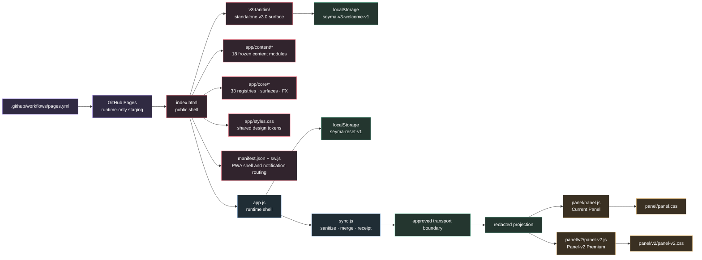
```mermaid
flowchart LR
    HTML["index.html<br/>public shell"] --> APP["app.js<br/>runtime shell"]
    HTML --> CONTENT["app/content/*<br/>18 frozen content modules"]
    HTML --> CORE["app/core/*<br/>33 registries · surfaces · FX"]
    HTML --> STYLE["app/styles.css<br/>shared design tokens"]
    HTML --> PWA["manifest.json + sw.js<br/>PWA shell and notification routing"]
    HTML --> V3["v3-tanitim/<br/>standalone v3.0 surface"]
    V3 --> V3STORE["localStorage<br/>seyma-v3-welcome-v1"]
    APP --> STORE["localStorage<br/>seyma-reset-v1"]
    APP --> SYNC["sync.js<br/>sanitize · merge · receipt"]
    SYNC --> REMOTE["approved transport boundary"]
    REMOTE --> PROJ["redacted projection"]
    PROJ --> PANEL["panel/panel.js<br/>Current Panel"]
    PROJ --> V2["panel/v2/panel-v2.js<br/>Panel-v2 Premium"]
    PANEL --> CSS1["panel/panel.css"]
    V2 --> CSS2["panel/v2/panel-v2.css"]
    CI[".github/workflows/pages.yml"] --> SITE["GitHub Pages<br/>runtime-only staging"]
    SITE --> HTML

    classDef shell fill:#31242d,stroke:#ff7c8d,color:#fff;
    classDef runtime fill:#202d35,stroke:#8fbce9,color:#fff;
    classDef storage fill:#24362f,stroke:#73d6b2,color:#fff;
    classDef observer fill:#3a3022,stroke:#e9bb70,color:#fff;
    classDef delivery fill:#302a42,stroke:#b9a0ff,color:#fff;
    class HTML,CONTENT,CORE,STYLE,PWA,V3 shell;
    class APP,SYNC runtime;
    class STORE,V3STORE,REMOTE,PROJ storage;
    class PANEL,V2,CSS1,CSS2 observer;
    class CI,SITE delivery;
```

### Product surfaces

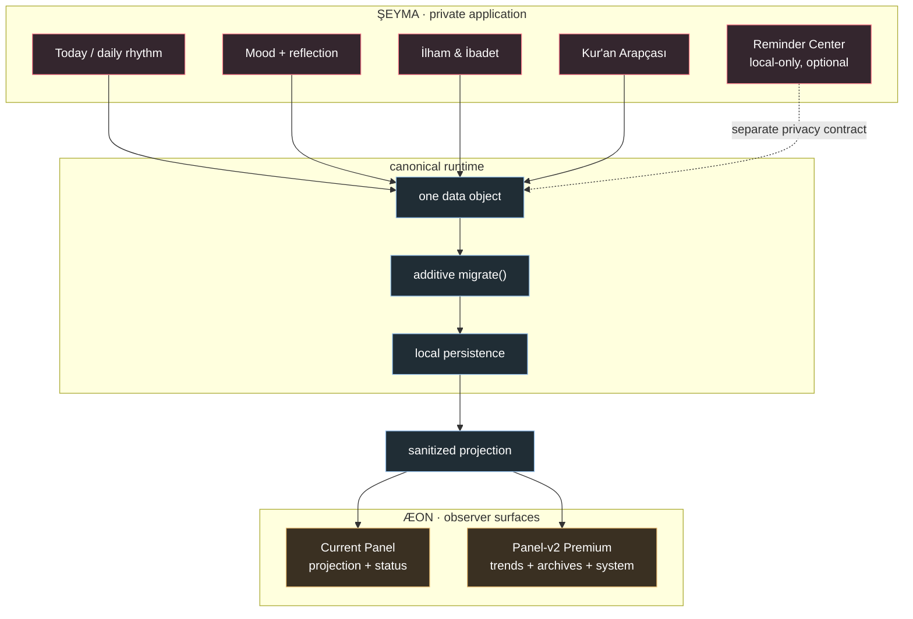
```mermaid
flowchart TB
    subgraph APPS["ŞEYMA · private application"]
        TODAY["Today / daily rhythm"]
        REFLECT["Mood + reflection"]
        FAITH["İlham & İbadet"]
        KAO["Kur'an Arapçası"]
        REM["Reminder Center<br/>local-only, optional"]
    end

    subgraph CORELAYER["canonical runtime"]
        STATE["one data object"]
        MIGRATE["additive migrate()"]
        SAVE["local persistence"]
    end

    subgraph OBS["ÆON · observer surfaces"]
        P1["Current Panel<br/>projection + status"]
        P2["Panel-v2 Premium<br/>trends + archives + system"]
    end

    TODAY --> STATE
    REFLECT --> STATE
    FAITH --> STATE
    KAO --> STATE
    REM -. "separate privacy contract" .-> STATE
    STATE --> MIGRATE --> SAVE
    SAVE --> PROJ["sanitized projection"]
    PROJ --> P1
    PROJ --> P2

    classDef app fill:#34262e,stroke:#ff7c8d,color:#fff;
    classDef core fill:#202d35,stroke:#8fbce9,color:#fff;
    classDef panel fill:#3a3022,stroke:#e9bb70,color:#fff;
    class TODAY,REFLECT,FAITH,KAO,REM app;
    class STATE,MIGRATE,SAVE,PROJ core;
    class P1,P2 panel;
```

### Design principles

1. **One `data` object.** Every persistent field lives in one canonical object
   so sync and the observer pick it up automatically. New fields are added
   through an additive, idempotent `migrate()` and never assumed to exist.
2. **Strings, not a framework.** `render()` rebuilds the visible tab as an HTML
   string; interaction is wired through `App.<name>` handlers. There is no
   virtual DOM and no component runtime to audit.
3. **Registries own bodies; the shell owns state.** `app.js` (about 7.8k lines,
   down from about 19k) keeps mutable state, rebinds, timers and handler
   registration; 33 `app/core/*` registries own domain logic and rendering.
4. **Theme through tokens.** Colours are CSS variables defined for both light
   and dark themes; components carry no hard-coded hex values.
5. **Cache-busting is a contract.** Every changed asset carries a new `?v=` pin
   in `index.html`, `sw.js` and `panel-v2.html` ([§ 9](#9-cache-busting-is-a-version-invariant)).

### Runtime ownership

| Surface | Owns | Must not silently own |
| --- | --- | --- |
| [`app.js`](app.js) | Runtime shell: mutable state, persistence/migration bridges, data rebinds, timer/listener registration, `App` exposure and compatibility shims | Domain/render/reminder bodies, a second persistent store or Panel-v2 rendering |
| [`sync.js`](sync.js) | Sanitized transport, merge helpers, receipts, bounded retries, Guards 1 and 2 | Raw secrets or unapproved data-repository writes |
| [`app/core/`](app/core/) | State/save/date/helper registries, domain registries, reminder stack, Arabic learning, render/app surfaces and FX modules | A second persistent store, Panel projection or private-detail leakage |
| [`app/core/render.js`](app/core/render.js) | Tab, shell and modal HTML builders and the `render()` body through `SeymaRender` | Persistence, sync, timer/listener registration or `App` assignment |
| [`app/core/appSurface.js`](app/core/appSurface.js) | Daily/domain/overlay handler bodies, lifecycle callbacks and boot bridges through `SeymaAppSurface` | Global handler registration, `window.App` exposure or independent state |
| [`app/core/reminderSurface.js`](app/core/reminderSurface.js) | Reminder side effects and reminder handler bodies through `SeymaReminderSurface` | A second reminder store or unapproved external writes |
| [`app/core/quranLearn.js`](app/core/quranLearn.js) | FSRS scheduling, queues, coverage and the Arabic learning screens through `SeymaQuranLearn` | Persistence outside `data`, network outside `assets/kao/`, storage APIs |
| [`app/content/`](app/content/) | Frozen catalogs, content layers and pure transport contracts | Runtime persistence, secret discovery or unbounded side effects |
| [`panel/panel.js`](panel/panel.js) | Current Panel observer projection and UI | Panel-v2 component contracts |
| [`panel/v2/panel-v2.js`](panel/v2/panel-v2.js) | Premium observer rendering, polling, charts and controls | Şeyma local-save semantics |
| [`panel/panelCoverageManifest.js`](panel/panelCoverageManifest.js) | Coverage, redaction and safe projection adapter | Network, DOM mutation or raw secret discovery |
| [`tests/`](tests/) | Synthetic contracts, regression fixtures and parity checks | Production runtime behaviour |

### Module and load-order contract

`app/core/` uses classic scripts in an explicit order; files are not discovered
automatically. When a core module is added or moved, the same load-order
contract must be updated in all four places in one commit:

1. [`index.html`](index.html) — production script order and cache-bust.
2. [`.claude/skills/run-seyma/driver.mjs`](.claude/skills/run-seyma/driver.mjs) — VM boot list.
3. [`.claude/skills/run-seyma/zikr-harness.mjs`](.claude/skills/run-seyma/zikr-harness.mjs) — fixture boot list.
4. [`tests/app/test_state_rebind_boundary.js`](tests/app/test_state_rebind_boundary.js) — state-rebind boot list.

Every registry loads before `app.js`; the app shell remains the owner of
mutable state, persistence, rebinds and global handler registration.

### Module inventory

The production app is an explicit classic-script runtime with **33
`app/core/` modules** and **18 `app/content/` modules**.

| Layer | Modules | Responsibility |
| --- | --- | --- |
| Core boot/state (5) | `constants` · `state` · `syncGlue` · `dateUtils` · `helpers` | Boot constants, migration/state body, save bridge, dates and shared view helpers |
| Domain registries (14) | `prayer` · `zikir` · `quran` · `saygi` · `motivation` · `crisis` · `journal` · `health` · `library` · `report` · `map` · `profile` · `settings` · `messaging` | Domain calculations and HTML bodies exposed through `Seyma*` registries |
| Reminder stack (6) | `reminderCatalog` · `reminderEngine` · `reminderScheduler` · `reminderDelivery` · `reminders` · `reminderSurface` | Frozen reminder contracts, policy, scheduling, delivery and views |
| Quranic Arabic (3) | `quranLearn` · `quranLearnFlow` · `quranLearnViews` | FSRS scheduler and queues, navigation flow, learning screens |
| FX and scene (3) | `mediaFx` · `timeTheme` · `skyFx` | Audio, haptics, motion, time/season theme and live weather sky |
| Surfaces (2) | `render` · `appSurface` | Render builders, `render()`, handler bodies, lifecycle callbacks |
| Programs (4) | `motivationProgramV2` · `motivationNarratives` · `saygiPeople` · `profileAssessmentV1` | Frozen motivation, narrative, inspirational-figure and profile content |
| Calendar & Journey (4) | `hijriCalendar` · `quranRevelationOrderV1` · `quranStrikingVersesV1` · `quranTransportV1` | Calendar and catalog data, verse showcase, pure Quran transport contract |
| Faith catalogs (3) | `esmaulHusnaV1` · `esmaulHusnaV2` · `zikirCoreContentV1` | Esmâ and core zikir content layers |
| Arabic content (7) | `quranLexiconV1` · `quranGrammarV1` · `quranShortSurahsV1` · `quranPhonicsV1` · `quranCurriculumV2` · `quranConceptTextsV1` · `quranMahrecSchemasV1` | Tool-generated, byte-frozen learning content |

The independent public surfaces are `index.html` + `app.js`/`sync.js`,
`panel.html` + `panel/`, `panel-v2.html` + `panel/v2/`, and
`v3-tanitim/index.html` with its own modules. They share allowlisted contracts
where documented, but they are not one runtime and must not be treated as
interchangeable acceptance evidence.

## Data lifecycle

Persistent state follows one additive, inspectable path. Migration is
idempotent and conservative ([§ 3](#3-canonical-state-is-an-idempotent-conservative-transformation)):
an old save can be upgraded without deleting unknown fields, and running the
same migration again does not create a new meaning.

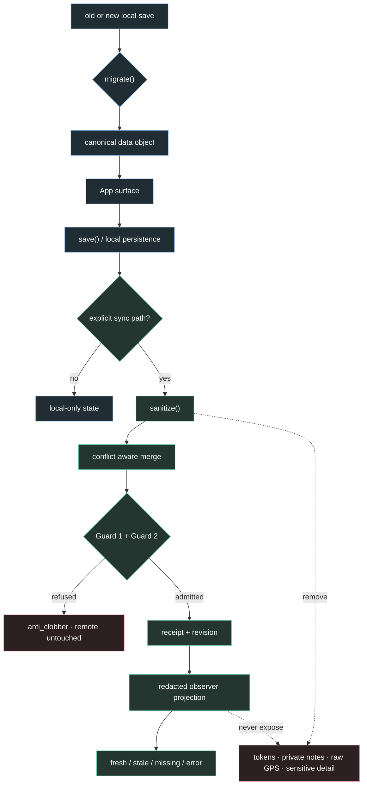
```mermaid
flowchart TD
    A["old or new local save"] --> B{"migrate()"}
    B --> C["canonical data object"]
    C --> D["App surface"]
    D --> E["save() / local persistence"]
    E --> F{"explicit sync path?"}
    F -- "no" --> L["local-only state"]
    F -- "yes" --> G["sanitize()"]
    G --> H["conflict-aware merge"]
    H --> GU{"Guard 1 + Guard 2"}
    GU -- "refused" --> AC["anti_clobber · remote untouched"]
    GU -- "admitted" --> I["receipt + revision"]
    I --> J["redacted observer projection"]
    J --> K["fresh / stale / missing / error"]

    G -. "remove" .-> X["tokens · private notes · raw GPS · sensitive detail"]
    J -. "never expose" .-> X

    classDef state fill:#202d35,stroke:#8fbce9,color:#fff;
    classDef safe fill:#24362f,stroke:#73d6b2,color:#fff;
    classDef forbidden fill:#2d2023,stroke:#e8959e,color:#fff;
    class A,B,C,D,E,L state;
    class F,G,H,GU,I,J,K safe;
    class X,AC forbidden;
```

### Projection states are first-class

ÆON does not flatten every failure into an empty dashboard or a reassuring
green badge.

| State | Meaning | UI obligation |
| --- | --- | --- |
| `fresh` | Projection matches the accepted source boundary | Show freshness context and revision/source metadata |
| `stale` | A prior safe projection exists but is older than policy | Show the age and avoid current-state language |
| `missing` | No usable projection is available | Show an honest empty state; never invent zeros |
| `error` | Transport, parse or compatibility failure | Show a bounded diagnosis and a retry path |
| `redacted` | Presence is known but content is intentionally withheld | Explain privacy without implying data loss |

## Privacy and safety contracts

The most important feature is the boundary itself.

- **Local-first.** Personal state is owned by the app's local data model.
- **Explicit sync.** Transport is opt-in and guarded; a stale device cannot
  silently clobber a newer remote snapshot ([§ 7](#7-anti-clobber-is-a-monotonicity-guard)).
- **Secrets never travel.** `sanitize()` strips tokens and keys before every
  push; secrets are never written to the data repository.
- **Projection redaction.** Private notes, therapy text, raw profile responses,
  secrets, raw GPS and sensitive reminder detail do not cross the observer
  boundary.
- **Reminder separation.** Reminders are local-only, optional, non-judgmental
  and private. Native copy is generic; detailed context stays in the app.
- **No clinical authority.** The product does not choose doses, interactions,
  treatment, catch-up actions or missed-dose decisions.
- **No generic browser verification.** Opening the app in an existing browser
  profile can load stale localStorage and schedule a full replacement. The
  default remains the committed Node VM harnesses. A screenshot request may use
  only a controlled loopback visual-QA path with a disposable browser profile
  and the Guard 1 source/test contract; that is neither device acceptance nor
  production verification.

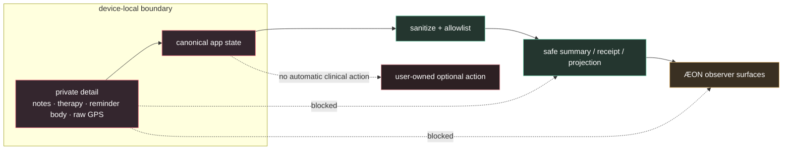
```mermaid
flowchart LR
    subgraph LOCAL["device-local boundary"]
        DETAIL["private detail<br/>notes · therapy · reminder body · raw GPS"]
        APPSTATE["canonical app state"]
        DETAIL --> APPSTATE
    end

    APPSTATE --> SAN["sanitize + allowlist"]
    SAN --> SAFE["safe summary / receipt / projection"]
    SAFE --> OBSERVER["ÆON observer surfaces"]
    DETAIL -. "blocked" .-> SAFE
    DETAIL -. "blocked" .-> OBSERVER
    APPSTATE -. "no automatic clinical action" .-> ACTION["user-owned optional action"]

    classDef local fill:#34262e,stroke:#ff7c8d,color:#fff;
    classDef safe fill:#24362f,stroke:#73d6b2,color:#fff;
    classDef observer fill:#3a3022,stroke:#e9bb70,color:#fff;
    classDef guard fill:#2d2023,stroke:#e8959e,color:#fff;
    class DETAIL,APPSTATE local;
    class SAN,SAFE safe;
    class OBSERVER observer;
    class ACTION guard;
```

The public deployment is runtime-only ([§ 8](#8-the-public-surface-is-a-set-difference)).
Source data under `kaynak/`, tooling, tests, harnesses, demos, maintenance files
and every Markdown file stay out of the published site, and a guard step fails
the deploy if any of them leaks or a runtime asset goes missing.

---

# IV · Quran

## Quran Journey

**Raşit ile Kur'an Yolculuğu** is a first-class product surface and a separate
technical chapter in this repository. It combines a frozen 114-surah
revelation-order catalogue, an explicit user request, a guarded message
transport, a validated video response, private learning notes and a
provenance-aware panel projection. It is a learning workflow — not a
theological authority layer and not a clinical or behavioural scoring system.

> **Core promise:** one requested surah, one auditable request identity, one
> validated answer at a time — with uncertainty, retries and replacement
> history kept visible.

### 1. Product surface and learning model

The user enters the journey through the Şeyma faith and learning hub. The
catalogue is ordered by revelation order and retains the canonical Mushaf order
as a secondary fact. Each surah detail view can expose Arabic and Turkish
names, revelation place, ayah count, a bounded theme description, the current
lifecycle state and the next valid action.

| Surface capability | Product meaning | Evidence boundary |
| --- | --- | --- |
| 114-stop catalogue | A navigable revelation-order learning map | Frozen catalog module; structural checks only |
| Surah detail | Context before any request is made | Catalog metadata plus local request state |
| “Raşit'ten iste” | An explicit user-owned action | Creates one request record; no background request |
| Delivery status | Whether the message workflow accepted the request | `sent` or `failed` receipt; not a claim that a person watched it |
| Video response | A validated YouTube video identity | HTTPS allowlist, one video, token/request/surah match |
| Watching | An intentional media action | Click-to-load player; iframe load alone is not completion |
| Learning notes | User-owned timestamped reflection | Local canonical state; bounded text and note count |
| Question action | A deliberate handoff to Raşit | Opens the configured external question path; no automatic send claim |
| Panel projection | Cross-surface operational visibility | Same status, timestamps and provenance; no private reply token |

The catalogue lives in `app/content/quranRevelationOrderV1.js`, the rotating
verse content in `app/content/quranStrikingVersesV1.js`, the transport contract
in `app/content/quranTransportV1.js`, and the user-facing domain runtime in
`app/core/quran.js` through `SeymaQuran`. `app.js` keeps the app-owned mutation,
persistence and `App` handler bridge around that registry. A deterministic
synthetic demo of the whole flow is
[`demos/quran-flow-demo.html`](demos/quran-flow-demo.html).

### 2. The three-document transport topology

The transport receipts are deliberately independent from the ordinary
`data/latest.json` full-snapshot chain. The app may later carry the applied
user-owned `quranJourney` state through the normal guarded canonical merge, but
the Quran automation itself has exactly three writable documents.

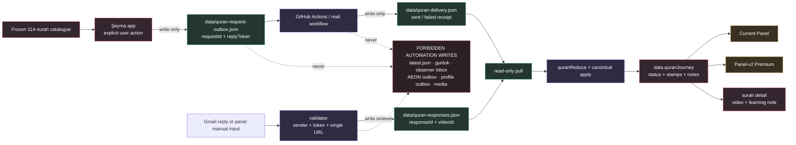
```mermaid
flowchart LR
    CATALOG["Frozen 114-surah catalogue"] --> APP["Şeyma app<br/>explicit user action"]
    APP -->|write only| OUT["data/quran-request-outbox.json<br/>requestId + replyToken"]
    OUT --> ACTION["GitHub Actions / mail workflow"]
    ACTION -->|write only| DEL["data/quran-delivery.json<br/>sent / failed receipt"]
    HUMAN["Gmail reply or panel manual input"] --> VALID["validator<br/>sender + token + single URL"]
    VALID -->|write only| RES["data/quran-responses.json<br/>responseId + videoId"]
    DEL --> PULL["read-only pull"]
    RES --> PULL
    PULL --> APPLY["quranReduce + canonical apply"]
    APPLY --> CANON["data.quranJourney<br/>status + stamps + notes"]
    CANON --> PANEL1["Current Panel"]
    CANON --> PANEL2["Panel-v2 Premium"]
    CANON --> USER["surah detail<br/>video + learning note"]

    FORBIDDEN["FORBIDDEN AUTOMATION WRITES<br/>latest.json · gunluk · observer inbox<br/>AEON outbox · profile outbox · media"]
    OUT -. "never" .-> FORBIDDEN
    ACTION -. "never" .-> FORBIDDEN
    VALID -. "never" .-> FORBIDDEN

    classDef app fill:#34262e,stroke:#ff7c8d,color:#fff;
    classDef transport fill:#24362f,stroke:#73d6b2,color:#fff;
    classDef validate fill:#302a42,stroke:#b9a0ff,color:#fff;
    classDef observer fill:#3a3022,stroke:#e9bb70,color:#fff;
    classDef forbidden fill:#2d2023,stroke:#e8959e,color:#fff;
    class CATALOG,APP,CANON,USER app;
    class OUT,DEL,RES,PULL transport;
    class ACTION,VALID,APPLY validate;
    class PANEL1,PANEL2 observer;
    class FORBIDDEN forbidden;
```

The path invariant is a set-separation rule. $W_Q$ is the Quran transport
allowlist and $W_M$ the main snapshot and observer write denylist:

$$
W_Q = \lbrace q_{\text{outbox}},\; q_{\text{delivery}},\; q_{\text{responses}} \rbrace
$$

$$
W_M = \lbrace \text{latest},\; \text{gunluk},\; \text{observerInbox},\; \text{aeonOutbox},\; \text{profileOutbox},\; \text{media} \rbrace
$$

$$
W_Q \cap W_M = \varnothing
$$

`QuranTransportV1.isWritableTransportPath()` is the shared gate. A successful
HTTP PUT is not sufficient evidence of a valid Quran write: the path must be one
of the three exact allowlisted paths and the payload must pass its parser.

### 3. Write/read responsibility matrix

| Actor | Operation | Exact path or state | Allowed payload | Explicit prohibition |
| --- | --- | --- | --- | --- |
| Şeyma app | write | `data/quran-request-outbox.json` | request identity, surah metadata, timestamp, reply token | no `latest.json` replacement; no panel or media write |
| GitHub Actions | read | `data/quran-request-outbox.json` | pending requests without a `sent` receipt | no second mail for a sent `requestId` |
| GitHub Actions | write | `data/quran-delivery.json` | `sent`/`failed`, bounded receipt metadata | no raw email body, token, stack trace or address |
| Şeyma app / panels | read | delivery document | status, provider id, bounded error | no delivery inference from a missing file |
| Gmail Apps Script | write | `data/quran-responses.json` | validated response identity, video id, source, fingerprint | no raw sender address or unvalidated URL |
| Panel manual path | write | response document through the same contract | explicit `panel_manual` response | no alternate response schema |
| App reducer | write | local `data.quranJourney` | canonical state transition with supplied timestamp | no direct status mutation outside `quranReduce` |
| Current Panel / Panel-v2 | read | approved canonical projection | shared status/stamps/provenance | no panel-specific lifecycle meaning |

The separation prevents a Quran retry from behaving like a general sync. A
failed or ambiguous answer can be visible as a bounded error without becoming a
reason to overwrite the user's ordinary mood, notes, reminders or panel inbox.

### 4. Versioned document contracts

All three transport documents carry `schemaVersion`, `updatedAt` and a bounded
map. Parsers return `{ ok, value, errors }`; they do not throw on empty files,
invalid JSON, missing roots, old schema versions or future schema versions.
Known valid records survive with an error list so the caller can keep a safe
state and explain the boundary.

**Request outbox.** `data/quran-request-outbox.json` is keyed by `requestId`
and capped at 50 requests:

| Field | Constraint | Why it exists |
| --- | --- | --- |
| `requestId` | `qr_` plus 8–64 URL-safe characters | Stable idempotency and join key |
| `surahId` | lowercase slug, for example `al-alaq` | Catalog identity without display-text parsing |
| `revelationOrder` | integer from 1 through 114 | Preserves the learning route |
| `mushafOrder` | optional integer from 1 through 114 | Supplies the secondary canonical order |
| `surahName` | bounded display fallback | Human-readable mail context; not a join key |
| `requestedAt` | UTC ISO-8601 timestamp | Ordering, audit and retry evidence |
| `replyToken` | 32–128 URL-safe characters | User-present correlation secret; never rendered in a panel |

The token is never requested from the user in chat and is not a display field.
It exists only at the intended transport boundary; this document uses
placeholders and never embeds a real token.

**Delivery receipt.** `data/quran-delivery.json` is keyed by the same
`requestId`. The only transport statuses are `sent` and `failed`. A receipt may
carry `sentAt`, a provider message id and a short bounded error code, and must
not carry an email address, message body, token, stack trace, local file path
or private note. A pending outbox request is eligible for delivery until a
receipt with `status = sent` exists; after that the same request is never
posted again merely because a device polls or retries.

**Response record.** `data/quran-responses.json` is keyed by `requestId`,
capped at 200 responses and stores the latest validated response for that
logical request:

| Field | Accepted values or shape | Privacy role |
| --- | --- | --- |
| `responseId` | `qrr_` plus 8–64 URL-safe characters | Separates answer identity from request identity |
| `requestId` | Existing `qr_...` key | Prevents cross-request attachment |
| `surahId` | Catalog slug | Prevents a valid video for another surah being attached |
| `videoId` | Exactly 11 YouTube id characters | Stores the minimum identity needed to embed and watch |
| `source` | `gmail_reply` or `panel_manual` | Provenance of the answer path |
| `status` | `ready` or `revoked` | Validated availability, not theological correctness |
| `receivedAt` | Optional UTC timestamp | Transport arrival evidence |
| `validatedAt` | Required UTC timestamp | Validation boundary evidence |
| `senderFingerprint` | Optional 16–64 lowercase hex characters | Correlates a sender without publishing the address |

The local reducer may additionally use `invalid` as an internal failure state
while validating a response; that state is never written as an accepted
`ready` transport record.

### 5. Pure validation boundary

The transport module is intentionally pure: no network, storage, DOM, timers,
`Date.now()`, token logging or exception-driven control flow. Every timestamp
is passed by the caller, so the same input produces the same normalized output
and the same error list in the headless fixtures.

```js
requestId   = /^qr_[A-Za-z0-9_-]{8,64}$/
responseId  = /^qrr_[A-Za-z0-9_-]{8,64}$/
surahId     = /^[a-z]+(-[a-z]+)*$/
videoId     = /^[A-Za-z0-9_-]{11}$/
replyToken  = /^[A-Za-z0-9_-]{32,128}$/
timestamp   = /^\d{4}-\d{2}-\d{2}T\d{2}:\d{2}:\d{2}(\.\d{1,3})?Z$/
fingerprint = /^[a-f0-9]{16,64}$/
```

Only these HTTPS URL families may produce a video id:

```text
https://www.youtube.com/watch?v=<11-character-id>
https://m.youtube.com/watch?v=<11-character-id>
https://youtu.be/<11-character-id>
https://www.youtube.com/shorts/<11-character-id>
```

Channel pages, playlists, profiles, `javascript:` URLs, `data:` URLs, other
hosts and malformed identifiers are rejected. Free-text replies are tokenized,
punctuation is trimmed at URL edges and all extracted ids are deduplicated.
Writing $V(m)$ for the set of distinct accepted YouTube ids extracted from
message $m$, the acceptance rule is

$$
\lvert V(m) \rvert = 1 \;\Longrightarrow\; \text{accept}
$$

$$
\lvert V(m) \rvert = 0 \;\lor\; \lvert V(m) \rvert > 1 \;\Longrightarrow\; \text{reject}
$$

This avoids silently choosing one link when a reply contains two competing
videos. `requestId`, `surahId` and `replyToken` must also agree before a
response can reach `ready`. Client comparison uses a length-checked XOR loop;
the server-side Apps Script remains the authoritative secret comparison point.

### 6. Canonical request record

The runtime stores one normalized request record per surah in
`data.quranJourney.requests`. `ensureQuranJourney()` repairs missing
containers, preserves unknown future fields and removes only malformed records
that cannot be safely identified. The canonical request shape is:

```text
requestId, status, requestedAt, notifiedAt, deliverySentAt,
providerMessageId, responseId, responseSource, responseReceivedAt,
responseValidatedAt, responseStatus, videoId, readyAt,
startedWatchingAt, watchedAt, questionOpenedAt, updatedAt,
videoHistory[], notes[], lastNoteAt
```

| Status | Rank | Meaning | Retry or next action |
| --- | ---: | --- | --- |
| `idle` | 0 | No request has been made | Request is allowed |
| `submitting` | 1 | Local action is being persisted | Wait for outbox result |
| `queued` | 2 | Outbox record exists | Wait for delivery receipt |
| `notification_error` | 2 | Delivery failed | Retry request |
| `notified` | 3 | Delivery receipt says sent | Await response |
| `awaiting_reply` | 4 | Response window is open | Pull updates |
| `validating_reply` | 5 | A response is being checked | Wait for validator result |
| `invalid_reply` | 5 | Response did not satisfy the contract | Request a new link |
| `ready` | 6 | One validated video is available | Explicitly load and watch |
| `video_unavailable` | 6 | Existing video is revoked or unavailable | Request a replacement |
| `watching` | 7 | User opened the player | Continue or use visible fallback |
| `watched` | 8 | Completion was recorded | Open an optional question |
| `question_opened` | 9 | Question handoff was opened | No automatic send claim |
| `request_error` | 0 | Local/outbox write did not complete | Retry without losing intent |

### 7. Monotonic state machine

The lifecycle is a partially ordered state machine. Rank is not a quality
score; it is a safety ordering that stops stale devices and late errors from
erasing completed learning evidence.

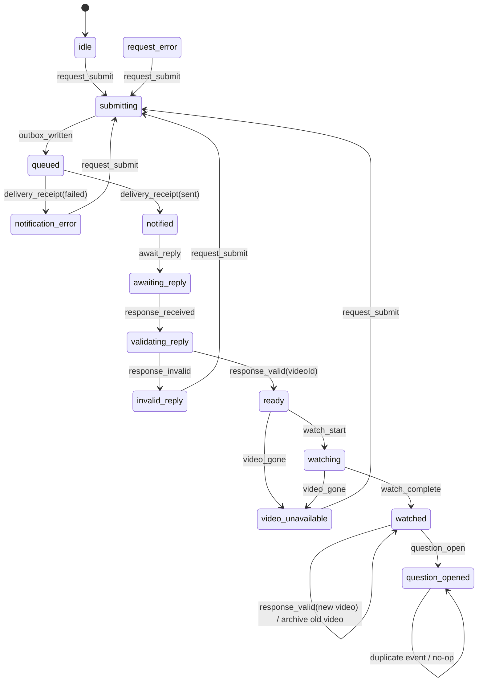
```mermaid
stateDiagram-v2
    [*] --> idle
    idle --> submitting: request_submit
    request_error --> submitting: request_submit
    notification_error --> submitting: request_submit
    invalid_reply --> submitting: request_submit
    video_unavailable --> submitting: request_submit
    submitting --> queued: outbox_written
    queued --> notified: delivery_receipt(sent)
    queued --> notification_error: delivery_receipt(failed)
    notified --> awaiting_reply: await_reply
    awaiting_reply --> validating_reply: response_received
    validating_reply --> ready: response_valid(videoId)
    validating_reply --> invalid_reply: response_invalid
    ready --> watching: watch_start
    watching --> watched: watch_complete
    watched --> question_opened: question_open
    ready --> video_unavailable: video_gone
    watching --> video_unavailable: video_gone
    watched --> watched: response_valid(new video) / archive old video
    question_opened --> question_opened: duplicate event / no-op
```

Let $\Sigma$ be the status vocabulary and $\rho : \Sigma \to \lbrace 0, \dots, 9 \rbrace$
the rank function from the table above. The rank function is defined by the
runtime and copied into `sync.js`, so the merge layer cannot drift from the
reducer. For ordinary progress events

$$
\rho(s_{t+1}) \ge \rho(s_t)
$$

Retryable failures share the rank of the point at which they failed, so a retry
does not invent progress and an error does not delete the attempted request. A
`watched` record is never destructively downgraded by `video_gone`. A new valid
response after watching archives the old video and retains the current rank:

$$
H_{t+1} = H_t \cup \lbrace v_t \rbrace, \qquad \rho(s_{t+1}) \ge \rho(s_t)
$$

where $H_t$ is the video history and $v_t$ the video being replaced.

### 8. Reducer, idempotence and multi-device merge

`quranReduce(request, event)` is a pure single-event reducer. It clones the
input, requires a supplied timestamp, validates a response video before the
transition, rejects unknown events and rejects transitions that are not in the
explicit transition table. Side effects such as save, sync, outbox writes and
external handoff belong to the caller.

For a duplicate event $e$ the reducer must converge without adding a second
record:

$$
q' = R(q, e), \qquad R(q', e) = q'
$$

The result distinguishes `ok: false` (validation or transition failure) from
`ok: true, changed: false` (idempotent replay). A safe no-op is not the same as
a broken request, and retries depend on that distinction.

The guarded sync merge applies the same rank table independently of `app.js`:

1. Higher rank wins; a completed `watched` record beats a stale `ready` record.
2. Equal rank uses the newest `updatedAt` as the last-writer tie-breaker.
3. Missing timestamps and provenance fields are filled from the losing side
   when the winning side is empty.
4. `videoHistory` is unioned and deduplicated by response/video/replacement
   identity, then capped at 20 records.
5. Notes are unioned by note id; the newest `updatedAt` version wins and the
   result is capped at 100 notes.
6. `startedAt` is the earliest journey start, not a last-writer field.
7. Different surahs merge independently, so one request cannot replace another.

Rules 1–2 make the merge a *join* on the rank order — it is commutative,
idempotent and never moves below either input:

$$
\rho(q_L \sqcup q_R) = \max\big(\rho(q_L),\, \rho(q_R)\big), \qquad
q_L \sqcup q_R = q_R \sqcup q_L, \qquad q \sqcup q = q
$$

unless both records are malformed and the safe empty contract must be used.
The merge is not a blind object replacement; it is a field-aware, bounded union.

### 9. Watch integrity and click-to-load privacy

The video surface has two separate events: opening a player and completing a
video. The first is never treated as the second.

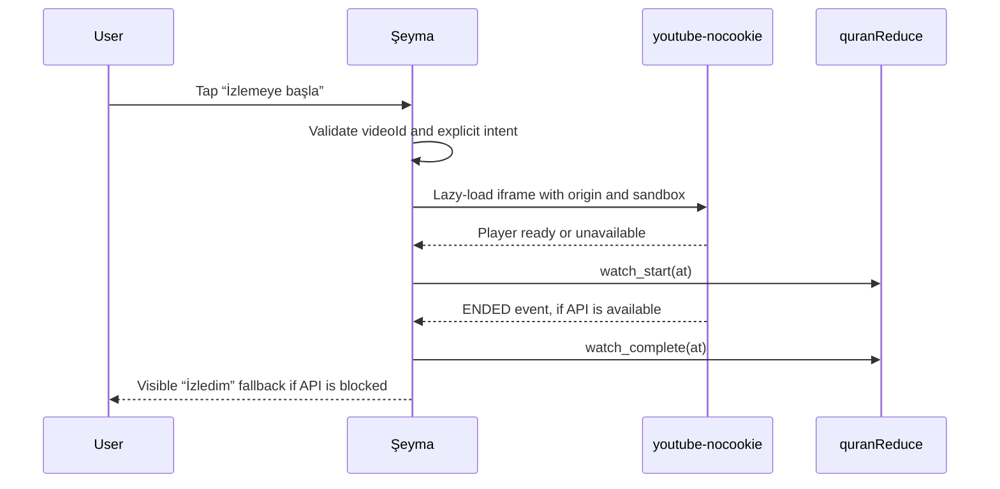
```mermaid
sequenceDiagram
    participant U as User
    participant S as Şeyma
    participant Y as youtube-nocookie
    participant Q as quranReduce

    U->>S: Tap “İzlemeye başla”
    S->>S: Validate videoId and explicit intent
    S->>Y: Lazy-load iframe with origin and sandbox
    Y-->>S: Player ready or unavailable
    S->>Q: watch_start(at)
    Y-->>S: ENDED event, if API is available
    S->>Q: watch_complete(at)
    S-->>U: Visible “İzledim” fallback if API is blocked
```

The player contract is intentionally narrow:

- no iframe is rendered on the first detail render;
- the iframe is injected only after the user chooses to watch;
- the host is `youtube-nocookie.com`;
- `enablejsapi=1` and an origin are supplied for completion detection;
- autoplay is not requested;
- a sandbox and a restricted `allow` list are used;
- a blocked API does not silently claim completion; the visible fallback is
  available only while the request is `watching`.

The thumbnail is a presentation aid, not evidence that the video is reachable.
If the video is unavailable, its identity remains available for diagnosis and
the user sees a replacement action rather than a broken empty player.

### 10. Learning notes and user-owned reflection

Notes are attached to the surah request, not to the global mood record. They can
be classified as `watch`, `listen` or `reflection`, and may carry an optional
non-negative video-second position and a short tag.

| Note property | Bound |
| --- | ---: |
| Note text | 2,000 characters |
| Tag | 40 characters |
| Timestamp | Optional integer seconds, never negative |
| Stored notes per surah | 100 |
| Visible notes in the detail view | Latest 12 |

Notes are not sent as delivery metadata, sender evidence or panel secrets. A
panel can show safe note counts and lifecycle context only where its projection
contract allows it; the content remains user-owned detail.

### 11. Failure matrix and honest UI states

The protocol treats failure as a state with a recovery path, not as an empty
success card.

| Failure or ambiguity | Rejected or held at | Canonical state | User-facing action |
| --- | --- | --- | --- |
| Empty or invalid JSON | Parser | safe empty contract | Explain unavailable transport and retry pull |
| Unknown request key | Parser | no accepted record | Keep the user's existing state |
| Bad token or mismatched surah | Response validator | `invalid_reply` | Request a new response |
| Multiple distinct video links | Free-text extraction | `invalid_reply` | Ask for one direct video link |
| Non-YouTube or playlist link | URL parser | `invalid_reply` | Show accepted link formats |
| Delivery receipt `failed` | Delivery merge | `notification_error` | Retry without duplicate success mail |
| 404 or blocked YouTube video | Player / response refresh | `video_unavailable` | Preserve id and request replacement |
| Duplicate request event | Reducer | unchanged | Safe no-op; no second outbox slot |
| Duplicate response event | Reducer / merge | unchanged | Safe no-op; no duplicate history item |
| Stale device push | Guarded merge | higher-rank state retained | Preserve newer request and video evidence |
| Forbidden transport path | Write gate | write denied | Zero write to main snapshot or observer files |

This table is also a reporting rule: `missing`, `error`, `invalid` and
`unavailable` must never be rendered as `ready`, as a zero, or as a completed
learning event.

### 12. Panel parity and provenance projection

The Current Panel and Panel-v2 use different visual systems but read the same
canonical fields. Neither panel may create a local Quran state machine or infer
a delivery from a timestamp alone.

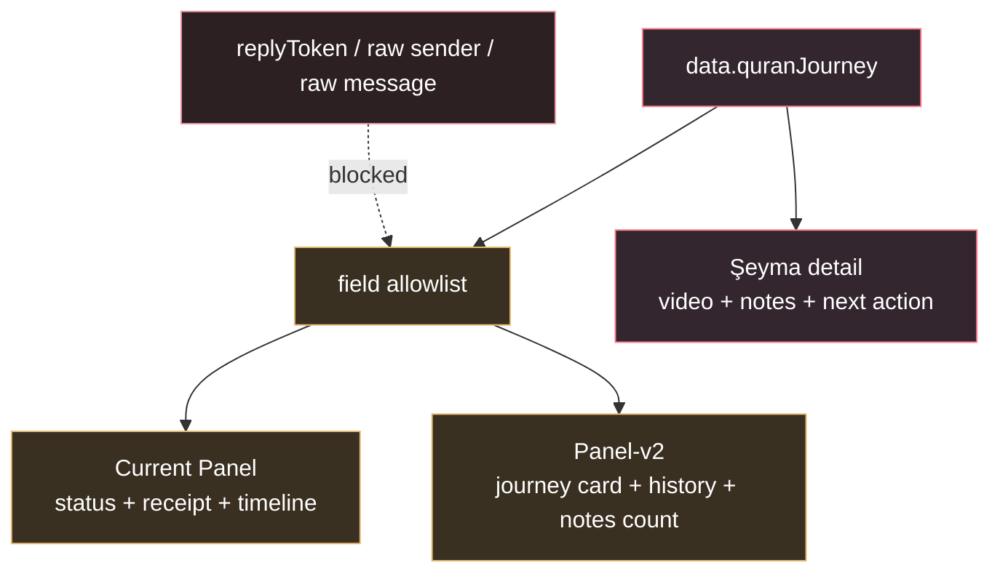
```mermaid
flowchart TB
    Q["data.quranJourney"] --> F["field allowlist"]
    F --> P1["Current Panel<br/>status + receipt + timeline"]
    F --> P2["Panel-v2<br/>journey card + history + notes count"]
    Q --> APPV["Şeyma detail<br/>video + notes + next action"]
    SECRET["replyToken / raw sender / raw message"] -. blocked .-> F
    classDef state fill:#34262e,stroke:#ff7c8d,color:#fff;
    classDef view fill:#3a3022,stroke:#e9bb70,color:#fff;
    classDef blocked fill:#2d2023,stroke:#e8959e,color:#fff;
    class Q,APPV state;
    class F,P1,P2 view;
    class SECRET blocked;
```

The minimum safe evidence record for a visible Quran row is:

```text
surahId              = frozen catalogue identity
requestId            = logical request identity
responseId           = validated answer identity, if any
status               = canonical lifecycle state
deliverySentAt       = provider receipt time, if sent
responseReceivedAt   = response arrival time, if known
responseValidatedAt  = validation boundary time, if ready/revoked
responseSource       = gmail_reply | panel_manual
videoId              = validated 11-character identity, if present
videoHistoryCount    = bounded replacement count
noteCount            = bounded user-owned note count
```

A panel may say “response validated at …” only when the matching field exists.
It may say “waiting for response” when the state is `awaiting_reply`, but it
must not claim that a person received or watched a message without that
evidence.

### 13. Deterministic Quran test matrix

The Quran suite proves software contracts with synthetic fixtures; it does not
prove the truth of religious interpretation or the behaviour of a private
device.

| Fixture | Contract tested | Boundary |
| --- | --- | --- |
| `test_quran_catalog.js` | 114 records, revelation order, cross-links and frozen catalog shape | isolated `node:vm` |
| `test_quran_striking_verses.js` | 100 structural verse entries and surah references | isolated `node:vm` |
| `test_quran_transport.js` | Path gate, ids, token shape, URL extraction, parse safety and caps | pure module, no network |
| `test_quran_outbox_sync.js` | Allowlisted outbox PUT, no `latest.json`, token containment and retry | mocked fetch |
| `test_quran_pull_sync.js` | Read-only pull, cache busting, 404/304/invalid payload handling | mocked fetch |
| `test_quran_flow_demo.js` | End-to-end synthetic request → delivery → response → watch flow | VM/demo fixture |
| `test_quran_merge.js` | Rank merge, stale-device recovery, supersession and note/history union | pure merge fixtures |
| `test_quran_panel_parity.js` | Current Panel and Panel-v2 canonical field parity | static contract scan |
| `test_quran_a11y_contrast.js` | Quran colour tokens and WCAG AA contrast calculations | deterministic colour math |

```bash
for f in tests/quran/test_*.js; do node "$f" || exit $?; done
```

The fixture boundary is fail-closed: no browser boot, real localStorage, real
GitHub token, live private data, outbound mail or real sync repository is
needed to prove these contracts.

### 14. Reproducible demo storyline

Runtime screenshots of the journey use the following synthetic storyline. The
values are illustrative and contain no private account data:

1. **Library** — the user is at revelation-order stop `01 / 114`; the library
   shows filters for `Tümü`, `İstenmedi`, `Bekleniyor`, `Hazır` and `İzlendi`.
2. **Request** — the user opens a surah detail and taps `Raşit'ten iste`; the UI
   disables a second request while the first is `submitting` or `queued`.
3. **Delivery** — a synthetic receipt moves the row to `notified`, then the app
   shows `awaiting_reply` without inventing a video.
4. **Validated response** — one synthetic `youtube.com/watch?v=...` identity
   reaches `ready`; two distinct links would instead reach `invalid_reply`.
5. **Watch** — the click-to-load cover appears before the iframe, and the
   visible fallback appears during `watching`.
6. **Reflection** — after completion the user adds one `reflection` note with a
   short tag and optionally opens the question handoff.
7. **Observer** — the panel shows status, provenance and counts, never the
   reply token, raw sender, private message or hidden personal detail.

## Quranic Arabic learning

**Kur'an Arapçası Öğreniyorum** teaches the Arabic of the Quran from the
letters up: phonics and articulation points, a lemma-based vocabulary, grammar
concepts, a curriculum of lessons, a reader for the short surahs and the
prayer texts, and a spaced-repetition scheduler that decides what to review
next. One rule shapes all of it:

> **Arabic is never hand-written.** Arabic text, transliteration and morphology
> are compiled from pinned corpora by network-free tools, reviewed, then frozen
> byte-for-byte into the runtime modules.

### 1. Content pipeline

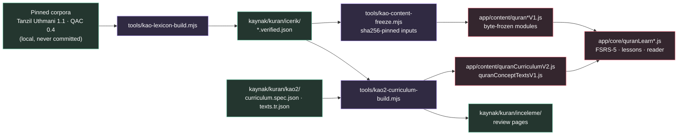
```mermaid
flowchart LR
    IN["Pinned corpora<br/>Tanzil Uthmani 1.1 · QAC 0.4<br/>(local, never committed)"] --> LEX["tools/kao-lexicon-build.mjs"]
    LEX --> VER["kaynak/kuran/icerik/<br/>*.verified.json"]
    SPEC["kaynak/kuran/kao2/<br/>curriculum.spec.json · texts.tr.json"] --> CUR["tools/kao2-curriculum-build.mjs"]
    VER --> FRZ["tools/kao-content-freeze.mjs<br/>sha256-pinned inputs"]
    FRZ --> MODS["app/content/quran*V1.js<br/>byte-frozen modules"]
    VER --> CUR
    CUR --> CMOD["app/content/quranCurriculumV2.js<br/>quranConceptTextsV1.js"]
    CUR --> REV["kaynak/kuran/inceleme/<br/>review pages"]
    MODS --> RT["app/core/quranLearn*.js<br/>FSRS-5 · lessons · reader"]
    CMOD --> RT

    classDef src fill:#24362f,stroke:#73d6b2,color:#fff;
    classDef tool fill:#302a42,stroke:#b9a0ff,color:#fff;
    classDef out fill:#34262e,stroke:#ff7c8d,color:#fff;
    class IN,VER,SPEC,REV src;
    class LEX,CUR,FRZ tool;
    class MODS,CMOD,RT out;
```

| Content | Size | Source |
| --- | --- | --- |
| Lexicon | 524 verified lemmas (31 particles) | Quranic Arabic Corpus v0.4 morphology aligned with the Tanzil Uthmani text |
| Curriculum | 12 units · 109 lessons | `curriculum.spec.json` compiled against the frozen lexicon |
| Grammar | 25 concepts with worked examples and error explanations | `grammar.verified.json` |
| Short surahs | 20 surahs (95–114) · 837 reviewed rows | `surahs.verified.json` |
| Phonics | 28 letters · 12 contrast pairs · 7 rules · 12 mahreç schemas | `phonics.verified.json`, `quranMahrecSchemasV1.js` |
| Scheduling | FSRS-5, 19 trained weights | Licensed port of `ts-fsrs` v4.5.2 |

### 2. Reproducibility as hash equality

Let $I$ be the pinned inputs, $F$ a deterministic build tool and $h$ SHA-256.
Inputs are admitted only when their hash equals the pin, and a build is
reproducible when rebuilding yields the shipped bytes:

$$
h(I) = h_{\text{pin}}(I), \qquad h\big(F(I)\big) = h(\text{shipped module})
$$

Tanzil's copyright header carries a rolling year, so its whole-file hash
changes every calendar year. The pin is therefore taken over the **body** only
— verse lines with `#` comment lines removed, CRLF normalized to LF and edges
trimmed — and a structural gate requires the verse-line count to equal the QAC
verse count (6,236). The freeze tool regenerates `quranGrammarV1.js`,
`quranShortSurahsV1.js` and `quranPhonicsV1.js`; the curriculum tool
regenerates the curriculum, concept texts and review pages; the lemma-morphology
fixture has a `--check` mode. Fixtures in [`tests/kao/`](tests/kao/) assert that
every regeneration is byte-identical.

### 3. The FSRS-5 memory model

Each card holds a stability $S$ (days until recall probability falls to the
target), a difficulty $D \in [1, 10]$ and a review state
(`new`, `learning`, `review`, `relearning`). The learner grades a review with
$G \in \lbrace 1, 2, 3, 4 \rbrace$ (*again, hard, good, easy*). The constants
are those of FSRS-5:

$$
C = -0.5, \qquad F = \frac{19}{81}, \qquad r^{\ast} = 0.9, \qquad I_{\max} = 36500
$$

**Retrievability.** The probability of recall $t$ days after the last review
follows a power-law forgetting curve:

$$
R(t, S) = \left(1 + F \cdot \frac{t}{S}\right)^{C}
$$

The constants are chosen so that stability has a direct meaning — after exactly
$S$ days, recall probability equals the target:

$$
R(S, S) = \left(1 + \frac{19}{81}\right)^{-1/2} = \left(\frac{100}{81}\right)^{-1/2} = \frac{9}{10}
$$

**Initial state.** For the first grade $G$, with weights $w_0, \dots, w_{18}$:

$$
S_0(G) = \max\big(w_{G-1},\; 0.1\big)
$$

$$
D_0(G) = \operatorname{clamp}\big(w_4 - e^{\,w_5 (G - 1)} + 1,\; 1,\; 10\big)
$$

**Difficulty update.** A linear step, damped near the ceiling, then
mean-reverted toward the difficulty of an *easy* first answer:

$$
\Delta D = -w_6 \,(G - 3), \qquad D' = D + \Delta D \cdot \frac{10 - D}{9}
$$

$$
D'' = \operatorname{clamp}\big(w_7 \, D_0(4) + (1 - w_7)\, D',\; 1,\; 10\big)
$$

**Stability after successful recall** ($G \ge 2$). Stability grows more when the
card was hard to retrieve (low $R$), when difficulty is low and when stability
is still small:

$$
S'_{r} = S \cdot \left(1 + e^{\,w_8} \,(11 - D)\, S^{-w_9} \left(e^{\,w_{10}(1 - R)} - 1\right) \cdot \eta_G \right)
$$

where $\eta_2 = w_{15}$ (hard penalty), $\eta_4 = w_{16}$ (easy bonus) and
$\eta_3 = 1$.

**Stability after a lapse** ($G = 1$):

$$
S'_{f} = w_{11} \, D^{-w_{12}} \left((S + 1)^{w_{13}} - 1\right) e^{\,w_{14}(1 - R)}
$$

and the *again* branch never exceeds the short-term reduction of the current
stability:

$$
S'_{\text{again}} = \min\left(\frac{S}{e^{\,w_{17} w_{18}}},\; S'_f\right)
$$

**Same-day (short-term) reviews:**

$$
S'_{\text{short}} = S \cdot e^{\,w_{17}\,(G - 3 + w_{18})}
$$

All stabilities are clamped to $[0.01,\; I_{\max}]$.

**Next interval.** Inverting the forgetting curve at the requested retention
gives the interval at which $R$ falls to $r^{\ast}$:

$$
I(S) = \min\left(\max\left(1,\; \operatorname{round}\left(S \cdot \frac{(r^{\ast})^{1/C} - 1}{F}\right)\right),\; I_{\max}\right)
$$

At the shipped target $r^{\ast} = 0.9$ the modifier is exactly one — the
scheduled interval equals the stability:

$$
\frac{0.9^{-2} - 1}{19/81} = \frac{19/81}{19/81} = 1 \quad\Longrightarrow\quad I(S) = \operatorname{round}(S)
$$

Finally, the four answer buttons are kept strictly ordered so a better grade
never yields a shorter interval:

$$
I_{\text{hard}} \le I_{\text{good}}, \qquad I_{\text{good}} \ge I_{\text{hard}} + 1, \qquad I_{\text{easy}} \ge I_{\text{good}} + 1
$$

The shipped weights (FSRS-5 defaults) are:

```text
w =  0.40255  1.18385  3.173    15.69105  7.1949   0.5345   1.4604   0.0046
     1.54575  0.1192   1.01925  1.9395    0.11     0.29605  2.2698   0.2315
     2.9898   0.51655  0.6621
```

### 4. What “known” means

A memory statistic is not knowledge, so the learning surface uses a strict,
single definition. A card is **settled** at threshold $m$ when

$$
\text{settled}(c, m) \iff \text{state}(c) = \text{review} \;\land\; S(c) \ge m \;\land\; \neg\,\text{orphan}(c) \;\land\; \neg\,\text{readerUnknown}(c)
$$

and **durable** when $\text{settled}(c, 21)$ — three weeks of stability. Every
lemma $\ell$ has two cards, Arabic→Turkish and Turkish→Arabic. The known-lemma
set requires both directions to be durable:

$$
K = \left\lbrace \ell \;:\; \text{durable}\big(c_{\ell}^{\,ar \to tr}\big) \land \text{durable}\big(c_{\ell}^{\,tr \to ar}\big) \right\rbrace
$$

### 5. Coverage of the Quranic text

Progress is reported in tokens, not in cards. With $f(\ell)$ the corpus
frequency of lemma $\ell$ and $N = 77{,}430$ tokens in the Quranic Arabic
Corpus, the learner's coverage is

$$
\operatorname{Cov}(K) = \min\left(1,\; \frac{1}{N} \sum_{\ell \in K} f(\ell)\right)
$$

Because Quranic vocabulary is strongly Zipfian, a small, frequency-ordered set
of lemmas covers a large share of the text. Sorting the 524 verified lemmas by
frequency $f_{(1)} \ge f_{(2)} \ge \dots$, the reachable coverage of the first
$k$ is

$$
\operatorname{Cov}(k) = \frac{1}{N} \sum_{j=1}^{k} f_{(j)}
$$

| Lemmas learned $k$ | 50 | 100 | 200 | 300 | 524 |
| --- | ---: | ---: | ---: | ---: | ---: |
| Reachable coverage | 45.17% | 54.81% | 64.48% | 70.34% | **77.42%** |

The ceiling of the shipped lexicon is therefore $\operatorname{Cov}(524) = 0.7742$.
The milestones respect it honestly — the former “80 %” milestone was lowered to
0.75 rather than left unreachable:

| Milestone | Condition |
| --- | --- |
| Besmele | Level-0 lesson 12 completed, or placement reading score $\ge 7$ |
| Fâtiha / Namaz | Every lemma of the text has a forward card with $\text{settled}(c, 7)$ |
| Half of the words | $\operatorname{Cov}(K) \ge 0.50$ |
| Two thirds | $\operatorname{Cov}(K) \ge 0.68$ |
| Three quarters | $\operatorname{Cov}(K) \ge 0.75$ |
| Unit mastered | Unit mastery check passed: $\text{correct} / \text{answered} \ge 0.80$ |

A failed mastery check is not a dead end: the lemmas answered wrongly are stored
as a repair set, and the unit's next attempt starts from them. Once earned, a
milestone is never revoked — it does not disappear if coverage later dips.

**Understandable verses.** Reading research suggests that comprehension needs
very high lexical coverage. A verse $a$ with tokens $T_a$ is offered as
*understandable* only when the learner knows at least 95 % of its tokens:

$$
\frac{\lvert \lbrace \tau \in T_a : \text{lemma}(\tau) \in K \rbrace \rvert}{\lvert T_a \rvert} \ge 0.95
$$

### 6. Performance budget as a statistical gate

The learning runtime must stay small and fast on a phone. Sizes are measured as
gzip level-9 bytes, and the gates are absolute:

$$
B_{\text{content}} \le 256\ \text{KiB}, \quad B_{\text{legacy}} \le 176\ \text{KiB}, \quad B_{\text{curriculum}} \le 48\ \text{KiB}, \quad B_{\text{runtime}} \le 128\ \text{KiB}, \quad B_{\text{css}} \le 14\ \text{KiB}
$$

Boot time is sampled $n = 20$ times by evaluating every content and runtime
module in a fresh `node:vm` context. With the sorted samples
$x_{(1)} \le \dots \le x_{(n)}$:

$$
p_{95} = x_{(\lceil 0.95\, n \rceil)}, \qquad \tilde{p} = \operatorname{median}\big(x_{(1)}, x_{(2)}, x_{(3)}\big) = x_{(2)}
$$

The robust estimate $\tilde{p}$ (median of the best three runs) measures the
code's cost while discarding load spikes from the host. Both must satisfy
$p_{95} \le 40$ ms and $\tilde{p} \le 40$ ms. On the reference machine a
relative band also applies, $\tilde{p} \le 1.25 \cdot p_{95}^{\text{baseline}}$;
on a declared slow host only that relative band is skipped, never the absolute
ceilings. A recent measurement: content 183.9 KiB, runtime 118.1 KiB, CSS
13.0 KiB, $p_{95}$ = 5.9 ms.

### 7. Honest review status

> **What is and is not claimed.** The Turkish teaching layer was reviewed under
> an owner-delegated AI review (level **L1**). There is **no** independent
> sign-off from a domain expert (level **L2**) yet. Isolated-syllable audio is
> awaiting qualified human recordings — the pipeline refuses to synthesize
> Arabic pronunciation and reports `awaiting-recording` instead. Recitation
> clips come from datasets licensed CC0 1.0 and CC BY-NC 4.0, with attribution
> kept in the audio manifest.

The content sources, review pages and the two KAO tools live outside the public
deployment, in [`kaynak/kuran/`](kaynak/kuran/) and [`tools/kao/`](tools/kao/).

---

# V · Proof

## Accessibility as measurement

Contrast is computed, not eyeballed. For an sRGB channel value $u \in [0, 255]$,
with $s = u / 255$, the linearized channel is

$$
\operatorname{lin}(s) = \frac{s}{12.92} \quad \text{for } s \le 0.04045
$$

$$
\operatorname{lin}(s) = \left(\frac{s + 0.055}{1.055}\right)^{2.4} \quad \text{for } s > 0.04045
$$

the relative luminance of a colour is

$$
L = 0.2126\, \operatorname{lin}(R) + 0.7152\, \operatorname{lin}(G) + 0.0722\, \operatorname{lin}(B)
$$

and the contrast ratio between the lighter $L_1$ and the darker $L_2$ is

$$
\operatorname{CR} = \frac{L_1 + 0.05}{L_2 + 0.05} \in [1, 21]
$$

[`tools/kao/kao-verify-contrast.mjs`](tools/kao/kao-verify-contrast.mjs) reads
the real CSS tokens — `var()`, hex, `rgba()`, `color-mix()` and every stop of a
`linear-gradient` — composites translucent colours over their actual
background, and requires

$$
\operatorname{CR}_{\text{text}} \ge 4.5, \qquad \operatorname{CR}_{\text{ui}} \ge 3
$$

for text pairs and for non-text UI pairs (focus rings, progress, selected
state). The latest run checked **722 pairs across both themes with 0 below
threshold**. Keyboard behaviour is a contract too: every dismissible overlay is
a `role="dialog" aria-modal="true"` that owns Tab, Shift+Tab and Escape, and
each modal ships with a headless keyboard regression.

## Verification

There is no `package.json`, bundler, framework, npm script or linter — only
plain Node. Everything runs headless: app code boots inside `node:vm` with
`fetch` and timers stubbed dead, so **verification cannot reach the network or
push data**.

### The full gate

[`tools/kapi/kapilar.sh`](tools/kapi/kapilar.sh) is the release gate. It is a
conjunction — a single red check makes the whole gate red:

$$
\text{Gate} = \bigwedge_{k} \text{check}_k
$$

| Check | What it proves |
| --- | --- |
| `node --check` on the learning runtime and content | Syntax of the shipped modules |
| `tests/kao` · `tests/app` · `tests/panel` · `tests/panel-v2` · `tests/quran` | Every fixture family passes |
| `reminders smoke` | The frozen reminder contracts and curated fixtures |
| `run-seyma driver` · `run-seyma zikr` | The app boots twice and real interactions render |
| `kontrast` | WCAG contrast over the real CSS tokens |
| `kao-plan-check` | KAO source rules (no storage APIs, no network outside `assets/kao/`) |
| `pin senkronu` | $v_{\text{index}} = v_{\text{sw}}$ |
| `tekrar-uret` | Every previously fixed audit finding is still reproducibly fixed (10/10) |
| `perf` | The statistical budget of [§ 6](#6-performance-budget-as-a-statistical-gate) |

### Commands

```bash
# Full gate (about 20–30 minutes; add KAO2_ACCEPT_SLOW_HOST=1 on a slow host)
bash tools/kapi/kapilar.sh

# JavaScript syntax
node --check app.js
node --check sync.js
node --check sw.js

# App VM surfaces: no browser, no real network, no user localStorage
node .claude/skills/run-seyma/driver.mjs
node .claude/skills/run-seyma/zikr-harness.mjs

# Fixture families
for f in tests/app/test_*.js; do node "$f" || exit $?; done
for f in tests/kao/test_*.js; do node "$f" || exit $?; done
for f in tests/panel-v2/test_panel_v2_*.js; do node "$f" || exit $?; done
for f in tests/panel/test_*.js tests/quran/test_*.js; do node "$f" || exit $?; done
node tests/reminders/run-reminder-smoke.mjs

# Arabic learning tools
node tools/kao/kao-plan-check.mjs
node tools/kao/kao-verify-contrast.mjs
node tools/kao2-lemma-morph-build.mjs --check
node tools/kapi/tekrar-uret.cjs

# State boundary contracts
node .claude/skills/run-seyma/verify-state-helper-boundary.mjs
node .claude/skills/run-seyma/verify-state-migration-boundary.mjs
node .claude/skills/run-seyma/verify-state-adapter-contract.mjs

# Diff hygiene
git diff --check
```

### Test architecture

| Family | Files | Contract |
| --- | :-: | --- |
| [`tests/app/`](tests/app/) | 78 | Migration, merge, anti-clobber, deploy surface, asset pins, FX, v3.0, modal keyboard, accessibility |
| [`tests/kao/`](tests/kao/) | 55 | Content freeze, lexicon contract, curriculum, lesson flow, reader, contrast, performance |
| [`tests/panel-v2/`](tests/panel-v2/) | 27 | Tokens, components, accessibility, performance and page contracts |
| [`tests/panel/`](tests/panel/) | 23 | Projection, redaction, polling, boot resilience and provenance |
| [`tests/reminders/`](tests/reminders/) | 21 | Local-only UX, permission, privacy, sync and current-panel boundaries |
| [`tests/quran/`](tests/quran/) | 9 | Catalog, outbox, delivery, response, merge and panel parity |
| [`.claude/skills/run-seyma/`](.claude/skills/run-seyma/) | — | Isolated VM boot, migration and dependency-bag contracts |

Test evidence is synthetic and deterministic. It is deliberately **not** a
claim that a particular person's device, browser profile or account has been
accepted.

## Reproducibility dossier

The smallest useful evidence record is a tuple, not a screenshot alone:

$$
\mathcal{R} = (h_c,\; k,\; f,\; b,\; v,\; s)
$$

where $h_c$ is the commit hash, $k$ the exact command, $f$ the fixture
identifier, $b$ the boundary mode (VM, mock transport or live deployment), $v$
the environment and version context and $s$ the resulting status. A visual
capture adds a second tuple:

$$
\mathcal{V} = (\mathcal{R},\; \text{surface},\; \text{viewport},\; \text{theme},\; \text{data class},\; t_{\text{captured}})
$$

This prevents a polished image from becoming unauditable: a screenshot must be
traceable to a synthetic data class, a surface and a commit or fixture.

### Synthetic demo data contract

| Demo dimension | Required property | Forbidden content |
| --- | --- | --- |
| Mood and rhythm | Bounded values, fixed dates, explicit window | Real journal text or private health context |
| Reminder surface | Generic title, local status, permission state | Medication name, dose, therapy text or raw reminder body |
| Current Panel | Redacted aggregate, revision, freshness state | Tokens, raw notes, raw GPS or profile answers |
| Panel-v2 | Trend points, KPI labels, audit metadata | User identity, account identifiers or private payloads |
| Arabic learning | Synthetic card states and coverage | A real learner's review history |
| Capture environment | Clean profile, fixed viewport, named theme | An existing personal browser profile |

### Verification output contract

```text
source   = commit SHA + changed surface
fixture  = exact command or fixture family
boundary = node:vm / synthetic mock / Pages receipt
result   = PASS | FAIL | BLOCKED | NOT-CLAIMED
scope    = what the evidence does and does not establish
```

`NOT-CLAIMED` is intentional. It is the correct state for user-device
acceptance when only repository or deployment evidence is available.

## Release model

`main` is the production branch. GitHub Pages stages the runtime-only public
surface and deploys it without a build step.


```mermaid
flowchart LR
    W["working tree"] --> Q["local syntax + deterministic fixtures"]
    Q --> G["full gate · kapilar.sh"]
    G --> C["commit on main"]
    C --> CI["Pages workflow<br/>exclusion list + runtime asset guard"]
    CI --> DEP["GitHub Pages deployment"]
    DEP --> LIVE["live byte-equality + 404 privacy checks"]
    LIVE -. "still separate" .-> DEVICE["user-device acceptance"]

    classDef local fill:#202d35,stroke:#8fbce9,color:#fff;
    classDef delivery fill:#3a3022,stroke:#e9bb70,color:#fff;
    classDef separate fill:#2d2023,stroke:#e8959e,color:#fff;
    class W,Q,G local;
    class C,CI,DEP,LIVE delivery;
    class DEVICE separate;
```

A live release is verified by comparing every versioned asset byte-for-byte
with the committed blob and by confirming that internal paths return 404:

$$
\forall a \in A_{\text{versioned}} :\; h\big(\text{live}(a)\big) = h\big(\text{git}(a)\big), \qquad \forall p \in I :\; \text{status}(p) = 404
$$

Every release claim identifies its evidence level:

1. **Source/test evidence** — local code and deterministic fixtures.
2. **Deployment evidence** — CI run, deployment state and live HTTP comparison.
3. **User-device evidence** — confirmation from the user's own clean device,
   never inferred from the first two levels.

---

# VI · Repository

## Repository map

| Path | Role | Published |
| --- | --- | :-: |
| [`index.html`](index.html) · [`app.js`](app.js) · [`sync.js`](sync.js) · [`sw.js`](sw.js) | Şeyma shell, runtime shell, guarded sync, service worker | ✅ |
| [`panel.html`](panel.html) · [`panel-v2.html`](panel-v2.html) | ÆON observer shells | ✅ |
| [`manifest.json`](manifest.json) | PWA metadata and install surface | ✅ |
| [`app/core/`](app/core/) | 33 classic-script registries | ✅ |
| [`app/content/`](app/content/) | 18 frozen content modules | ✅ |
| [`app/styles.css`](app/styles.css) · [`app/kao.css`](app/kao.css) | Design tokens and surface styles | ✅ |
| [`panel/`](panel/) | Current Panel and Panel-v2 implementations | ✅ |
| [`v3-tanitim/`](v3-tanitim/) | Standalone v3.0 welcome and celebration surface | ✅ |
| [`assets/`](assets/) | PWA and ÆON icons | ✅ |
| [`demos/`](demos/) | Profile-assessment page (published at the root) and the synthetic Quran flow demo | partly |
| [`kaynak/kuran/`](kaynak/kuran/) | Arabic source data, curriculum spec and review pages | — |
| [`tools/`](tools/) | Network-free content builders; [`tools/kao/`](tools/kao/) and [`tools/kapi/`](tools/kapi/) gate tooling | — |
| [`tests/`](tests/) | Six headless fixture families | — |
| [`jev-gate/`](jev-gate/) | Discovery-stage control plane for future typed AI judgments | — |
| [`.claude/skills/run-seyma/`](.claude/skills/run-seyma/) | Data-safe VM verification harnesses | — |
| [`.github/`](.github/) | Pages workflow and README media | — |
| [`files/bakim/`](files/bakim/) | Local maintenance scripts | — |
| [`AGENTS.md`](AGENTS.md) · [`CLAUDE.md`](CLAUDE.md) | Operational and engineering guidance | — |

The root stays small. Runtime entrypoints remain discoverable for a static
deployment, while content sources, tooling, tests and guidance have explicit
ownership directories. Planning records, ledgers and evidence from completed
programs are kept in a separate private archive repository, so this tree holds
only code, content inputs, tests and the tooling that verifies them.

## Working on this repository

Before changing anything:

1. Read [`AGENTS.md`](AGENTS.md) for data-safety, browser, sync and handoff
   rules.
2. Read [`CLAUDE.md`](CLAUDE.md) for the detailed engineering contract.
3. Inspect `git status --short --branch` and preserve existing changes.
4. Use synthetic headless evidence. Never open the Şeyma app in an everyday
   browser profile “to check that it runs”. For an explicitly requested
   screenshot, use only the disposable-profile loopback path after checking the
   Guard 1 contract; see
   [`tests/app/test_local_visual_qa_guard.js`](tests/app/test_local_visual_qa_guard.js).
5. If a core module or the load order changes, update all four boot lists in
   [Module and load-order contract](#module-and-load-order-contract).
6. When a change touches persisted state, extend `migrate()` additively,
   preserve unknown fields, decide the sync/projection class explicitly and add
   fixtures for present, missing, stale and malformed shapes.
7. Bump the `?v=` pin of every changed asset and report results by evidence
   level.

## Further reading

- [`AGENTS.md`](AGENTS.md) — operational safety and repository rules
- [`CLAUDE.md`](CLAUDE.md) — detailed architecture and development guidance
- [`tests/README.md`](tests/README.md) — test inventory and safe execution notes
- [`tests/kao/README.md`](tests/kao/README.md) — Arabic learning fixture inventory
- [`kaynak/kuran/icerik/README.md`](kaynak/kuran/icerik/README.md) — corpus inputs, pins and build commands
- [`tools/kapi/gorsel-qa/README.md`](tools/kapi/gorsel-qa/README.md) — controlled visual QA tooling
- [`jev-gate/README.md`](jev-gate/README.md) — the typed-judgment gate

<div align="center">

<br>

<sub>Şeyma 🦩 · ÆON — built as an inspectable static system: warm on the surface, strict at the boundary.</sub>

</div>
