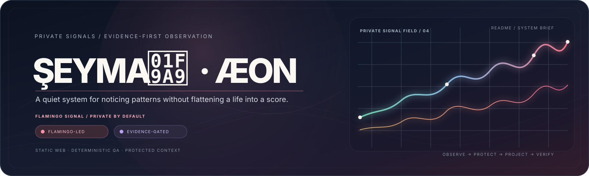
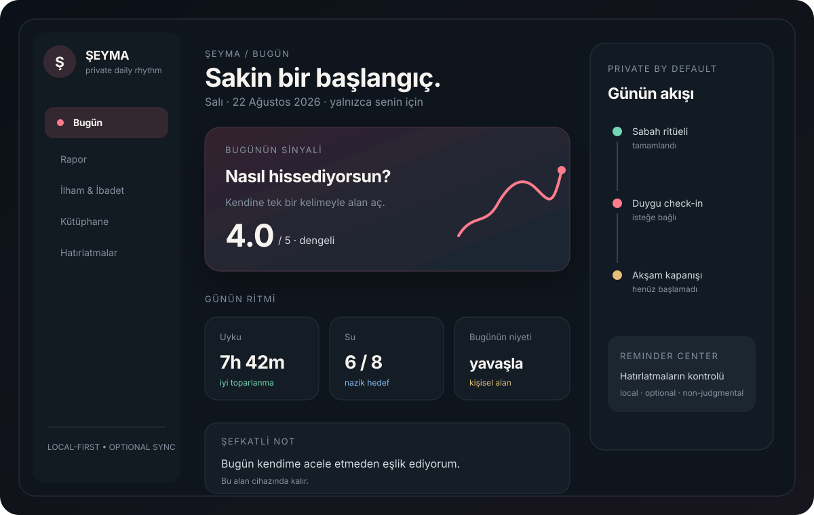
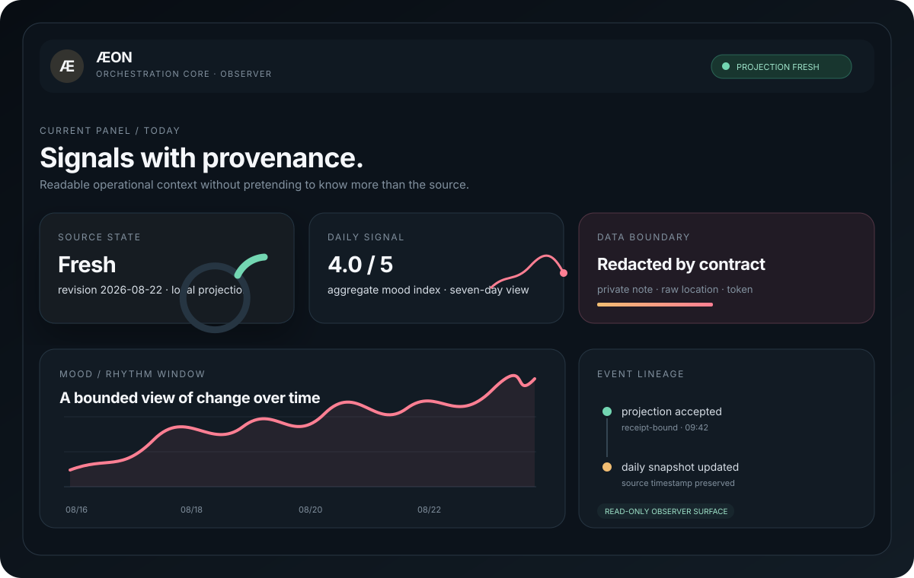
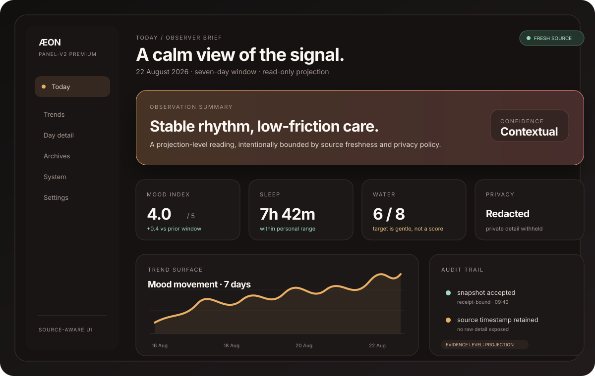
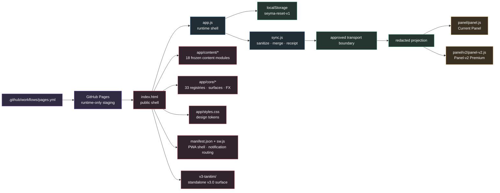
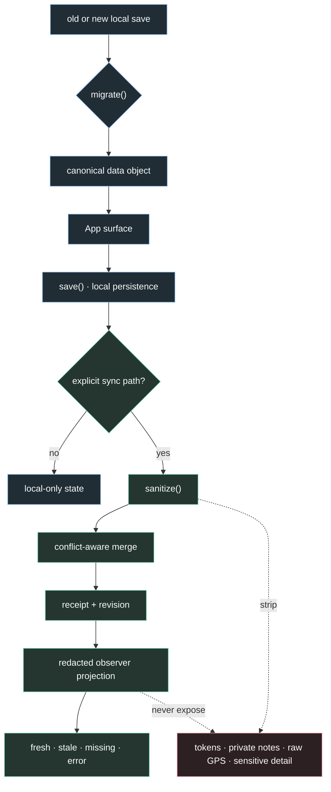
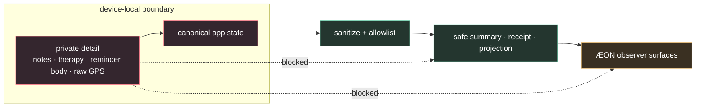
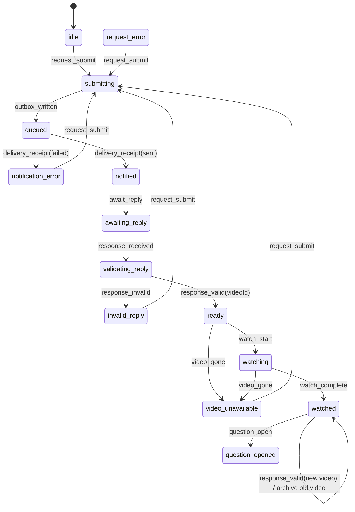
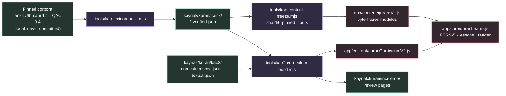
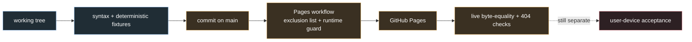

<div align="center">


<br>

<p>
  <a href="https://mustafaras.github.io/s/"></a>
  <a href="https://github.com/mustafaras/s/actions/workflows/pages.yml"></a>
  
  
  
  
</p>

**A private, Turkish-language wellbeing companion and its read-only observer —<br>
built as an inspectable static system: warm on the surface, strict at the boundary.**

<table>
  <tr>
    <td align="center" width="25%"><b>PRIVATE BY DEFAULT</b><br><sub>personal detail stays on the device</sub></td>
    <td align="center" width="25%"><b>STATIC BY DESIGN</b><br><sub>no server, no bundler, no hidden runtime</sub></td>
    <td align="center" width="25%"><b>EVIDENCE-GATED</b><br><sub>every claim keeps its provenance</sub></td>
    <td align="center" width="25%"><b>VERIFIED HEADLESS</b><br><sub>213 deterministic test files, zero browser</sub></td>
  </tr>
</table>

[Overview](#overview) ·
[Gallery](#interface-gallery) ·
[Feature tour](#feature-tour) ·
[Architecture](#architecture) ·
[Privacy](#privacy-and-safety-contracts) ·
[Quran Journey](#quran-journey) ·
[Quranic Arabic](#quranic-arabic-learning) ·
[Verification](#verification) ·
[Repository map](#repository-map)

</div>

---

## Overview

**Şeyma 🦩** is a private, single-user web app for mood, daily rhythm,
reflection, habits, reading, listening, faith routines, Quranic Arabic study
and optional reminders. **ÆON** is a separate observer surface: it reads an
approved, redacted projection of that data so a trusted second person can
follow along — without ever becoming a second source of truth.

The system deliberately separates four things that most dashboards collapse
into one:

| | Layer | Question it answers |
| :-: | --- | --- |
| 1 | **Local record** | What did the person actually enter? |
| 2 | **Canonical state** | How did the software normalize and migrate it? |
| 3 | **Projection** | What is the observer allowed to see? |
| 4 | **Evidence** | What has actually been proven — by test, by deployment, on a device? |

> [!IMPORTANT]
> This is a reflection product, not a diagnostic one. It does not infer a
> clinical condition, prescribe treatment, make dose decisions, or turn a
> personal routine into a score of human worth.

### By the numbers

<table>
  <tr>
    <td align="center"><h3>0</h3><sub>build steps · servers · runtime dependencies</sub></td>
    <td align="center"><h3>33 + 18</h3><sub><code>app/core</code> registries · frozen <code>app/content</code> modules</sub></td>
    <td align="center"><h3>213</h3><sub>committed headless test files in six families</sub></td>
    <td align="center"><h3>3</h3><sub>independent public surfaces with separate contracts</sub></td>
  </tr>
</table>

### Surfaces at a glance

| Surface | Purpose | Trust boundary |
| --- | --- | --- |
| **Şeyma** · [`index.html`](index.html) | Mood, rhythm, notes, routines, faith hub, Arabic study, reflection | Local personal source of truth |
| **ÆON Current Panel** · [`panel.html`](panel.html) | Readable observer summaries and operational status | Redacted projection; read-only |
| **ÆON Panel-v2 Premium** · [`panel-v2.html`](panel-v2.html) | Premium visual system for trends, archives and system state | Independent runtime and contract suite |
| **v3.0 Welcome** · [`v3-tanitim/`](v3-tanitim/) | Standalone release introduction and celebration page | Runs *before* the app runtime; never touches app data |
| **Sync layer** · [`sync.js`](sync.js) | Explicit, sanitized transport and conflict-aware merge | Guarded full-replace boundary with receipts and anti-clobber guards |
| **Verification layer** · [`tests/`](tests/) | Deterministic Node fixtures and VM harnesses | Synthetic data, mocked transport, no browser boot |

---

## Interface gallery

<table>
  <tr>
    <td width="33%" align="center"><br><sub><b>ŞEYMA · TODAY</b><br>Private reflection and daily rhythm</sub></td>
    <td width="33%" align="center"><br><sub><b>ÆON · CURRENT PANEL</b><br>Source-aware observer projection</sub></td>
    <td width="33%" align="center"><br><sub><b>ÆON · PANEL-V2 PREMIUM</b><br>Premium trends and operational context</sub></td>
  </tr>
</table>

<sub>These are source-controlled <b>design previews</b> composed from the real
surfaces, terminology and privacy boundaries — not runtime screenshots, and they
contain no user data. Runtime captures are taken only from a clean, disposable
profile with synthetic demo data (see <a href="#privacy-and-safety-contracts">Privacy</a>).</sub>

---

## Feature tour

<table>
  <tr>
    <td width="50%" valign="top">
      <h4>🌅 Today &amp; daily rhythm</h4>
      Mood, energy and sleep check-ins, notes, habits and a per-day record that
      survives every schema change through an additive <code>migrate()</code>.
      Longitudinal summaries stay descriptive and keep missing days visible.
    </td>
    <td width="50%" valign="top">
      <h4>🕌 İlham &amp; İbadet hub</h4>
      Prayer times, zikirmatik with core presets, qibla, an offset-adjustable
      Hijri calendar with holy-day lookup, 99 Esmâü'l-Hüsnâ, a rotating set of
      100 human-verified verses and a daily inspirational figure.
    </td>
  </tr>
  <tr>
    <td valign="top">
      <h4>📖 Kur'an Yolculuğu</h4>
      A revelation-order journey through all 114 surahs. One explicit request,
      one validated video answer, private learning notes and a monotonic state
      machine that a stale device cannot roll back.
      <a href="#quran-journey">Protocol →</a>
    </td>
    <td valign="top">
      <h4>🔤 Kur'an Arapçası</h4>
      Quranic Arabic study with an FSRS-5 spaced-repetition scheduler, 12 units /
      109 lessons / 524 verified lemmas, a lesson player, a reader for 20 short
      surahs, phonics and articulation-point (mahreç) schemas.
      <a href="#quranic-arabic-learning">Pipeline →</a>
    </td>
  </tr>
  <tr>
    <td valign="top">
      <h4>🔔 Reminder center</h4>
      Local-only, optional and non-judgmental reminders. Native notification copy
      stays generic; detailed context never leaves the app.
    </td>
    <td valign="top">
      <h4>✨ Premium motion &amp; live sky</h4>
      A champagne-gold design system, gated audio/haptic/motion micro-feedback
      (quiet hours 23–07, reduced-motion aware) and a canvas header sky driven by
      live weather: 4 solar times × 8 weather codes × 6 seasons = 192 scenes.
    </td>
  </tr>
  <tr>
    <td valign="top">
      <h4>🛰️ ÆON observer</h4>
      Two independent panels read the same redacted projection and show
      <code>fresh</code>, <code>stale</code>, <code>missing</code>,
      <code>error</code> and <code>redacted</code> as first-class states — never a
      reassuring zero.
    </td>
    <td valign="top">
      <h4>🎉 v3.0 welcome</h4>
      A standalone release page that redirects before the app boots, so the first
      open carries no data or sync risk; its day count is derived, never hard-coded.
    </td>
  </tr>
</table>

---

## Architecture

The runtime is deliberately boring: classic scripts in an explicit order,
explicit ownership, no bundler and no hidden server. That keeps the privacy and
state boundaries inspectable by humans and by deterministic fixtures alike.


```mermaid
flowchart LR
    HTML["index.html<br/>public shell"] --> APP["app.js<br/>runtime shell"]
    HTML --> CONTENT["app/content/*<br/>18 frozen content modules"]
    HTML --> CORE["app/core/*<br/>33 registries · surfaces · FX"]
    HTML --> STYLE["app/styles.css<br/>design tokens"]
    HTML --> PWA["manifest.json + sw.js<br/>PWA shell · notification routing"]
    HTML --> V3["v3-tanitim/<br/>standalone v3.0 surface"]
    APP --> STORE["localStorage<br/>seyma-reset-v1"]
    APP --> SYNC["sync.js<br/>sanitize · merge · receipt"]
    SYNC --> REMOTE["approved transport boundary"]
    REMOTE --> PROJ["redacted projection"]
    PROJ --> PANEL["panel/panel.js<br/>Current Panel"]
    PROJ --> V2["panel/v2/panel-v2.js<br/>Panel-v2 Premium"]
    CI[".github/workflows/pages.yml"] --> SITE["GitHub Pages<br/>runtime-only staging"]
    SITE --> HTML

    classDef shell fill:#31242d,stroke:#ff7c8d,color:#fff;
    classDef runtime fill:#202d35,stroke:#8fbce9,color:#fff;
    classDef storage fill:#24362f,stroke:#73d6b2,color:#fff;
    classDef observer fill:#3a3022,stroke:#e9bb70,color:#fff;
    classDef delivery fill:#302a42,stroke:#b9a0ff,color:#fff;
    class HTML,CONTENT,CORE,STYLE,PWA,V3 shell;
    class APP,SYNC runtime;
    class STORE,REMOTE,PROJ storage;
    class PANEL,V2 observer;
    class CI,SITE delivery;
```

### Design principles

1. **One `data` object.** Every persistent field lives in one canonical object,
   so sync and the observer pick it up automatically. New fields are added
   through an additive, idempotent `migrate()` — never assumed to exist.
2. **Strings, not a framework.** `render()` rebuilds the visible tab as an HTML
   string; interaction is wired through `App.<name>` handlers. No virtual DOM,
   no component runtime to audit.
3. **Registries own bodies; the shell owns state.** `app.js` (~7.8k lines, down
   from ~19k) keeps mutable state, rebinds, timers and handler registration;
   33 `app/core/*` registries own domain logic and rendering.
4. **Theme through tokens.** Colors are CSS variables defined for both light and
   dark themes; no hard-coded hex in components.
5. **Cache-busting is a contract.** Every changed asset carries a new `?v=` pin
   in `index.html`, `sw.js` and `panel-v2.html`, enforced by a freshness fixture.

### Runtime ownership

| Surface | Owns | Must not silently own |
| --- | --- | --- |
| [`app.js`](app.js) | Mutable state, persistence/migration bridges, data rebinds, timer/listener registration, `App` exposure and compatibility shims | Domain/render/reminder bodies, a second persistent store, Panel-v2 rendering |
| [`sync.js`](sync.js) | Sanitized transport, merge helpers, receipts and bounded retries | Raw secrets or unapproved data-repository writes |
| [`app/core/render.js`](app/core/render.js) | Tab, shell and modal HTML builders and the `render()` body (`SeymaRender`) | Persistence, sync, timers or `App` assignment |
| [`app/core/appSurface.js`](app/core/appSurface.js) | Daily/domain/overlay handler bodies, lifecycle callbacks, boot bridges | Global handler registration or independent state |
| [`app/core/reminderSurface.js`](app/core/reminderSurface.js) | Reminder side effects and reminder handler bodies | A second reminder store or external writes |
| [`app/content/`](app/content/) | Frozen catalogs, content layers and pure transport contracts | Runtime persistence or unbounded side effects |
| [`panel/panel.js`](panel/panel.js) · [`panel/v2/panel-v2.js`](panel/v2/panel-v2.js) | Observer projection, polling, charts and controls | Şeyma's local-save semantics |
| [`panel/panelCoverageManifest.js`](panel/panelCoverageManifest.js) | Coverage, redaction and safe projection adapter | Network, DOM mutation or secret discovery |

### Module inventory

| Layer | Modules | Responsibility |
| --- | --- | --- |
| Core boot/state (5) | `constants` · `state` · `syncGlue` · `dateUtils` · `helpers` | Boot constants, migration/state body, save bridge, dates, shared view helpers |
| Domain registries (14) | `prayer` · `zikir` · `quran` · `saygi` · `motivation` · `crisis` · `journal` · `health` · `library` · `report` · `map` · `profile` · `settings` · `messaging` | Domain calculations and HTML bodies exposed as `Seyma*` registries |
| Reminder stack (6) | `reminderCatalog` · `reminderEngine` · `reminderScheduler` · `reminderDelivery` · `reminders` · `reminderSurface` | Frozen reminder contracts, policy, scheduling, delivery and views |
| Quranic Arabic (3) | `quranLearn` · `quranLearnFlow` · `quranLearnViews` | FSRS scheduler and queue, navigation flow, learning screens |
| FX and scene (3) | `mediaFx` · `timeTheme` · `skyFx` | Audio, haptics, motion, time/season theme, live weather sky |
| Surfaces (2) | `render` · `appSurface` | Render builders, `render()`, handler bodies, lifecycle |
| Programs (4) | `motivationProgramV2` · `motivationNarratives` · `saygiPeople` · `profileAssessmentV1` | Frozen motivation, narrative, inspirational-figure and profile content |
| Calendar & Journey (4) | `hijriCalendar` · `quranRevelationOrderV1` · `quranStrikingVersesV1` · `quranTransportV1` | Calendar and catalog data, verse showcase, pure Quran transport contract |
| Faith catalogs (3) | `esmaulHusnaV1` · `esmaulHusnaV2` · `zikirCoreContentV1` | Esmâ and core zikir content layers |
| Arabic content (7) | `quranLexiconV1` · `quranGrammarV1` · `quranShortSurahsV1` · `quranPhonicsV1` · `quranCurriculumV2` · `quranConceptTextsV1` · `quranMahrecSchemasV1` | Tool-generated, byte-frozen learning content |

> [!NOTE]
> `app/core/` files are classic scripts and are **not** discovered
> automatically. A new or moved core module must be added to the same
> load-order contract in four places in one commit: [`index.html`](index.html),
> [`driver.mjs`](.claude/skills/run-seyma/driver.mjs),
> [`zikr-harness.mjs`](.claude/skills/run-seyma/zikr-harness.mjs) and
> [`test_state_rebind_boundary.js`](tests/app/test_state_rebind_boundary.js).

---

## Data lifecycle

Persistent state follows one additive, inspectable path. Migration is
idempotent — $M(M(S)) = M(S)$ — so an old save upgrades without losing unknown
fields, and running it twice creates no new meaning.


```mermaid
flowchart TD
    A["old or new local save"] --> B{"migrate()"}
    B --> C["canonical data object"]
    C --> D["App surface"]
    D --> E["save() · local persistence"]
    E --> F{"explicit sync path?"}
    F -- "no" --> L["local-only state"]
    F -- "yes" --> G["sanitize()"]
    G --> H["conflict-aware merge"]
    H --> I["receipt + revision"]
    I --> J["redacted observer projection"]
    J --> K["fresh · stale · missing · error"]

    G -. "strip" .-> X["tokens · private notes · raw GPS · sensitive detail"]
    J -. "never expose" .-> X

    classDef state fill:#202d35,stroke:#8fbce9,color:#fff;
    classDef safe fill:#24362f,stroke:#73d6b2,color:#fff;
    classDef forbidden fill:#2d2023,stroke:#e8959e,color:#fff;
    class A,B,C,D,E,L state;
    class F,G,H,I,J,K safe;
    class X forbidden;
```

| Projection state | Meaning | UI obligation |
| --- | --- | --- |
| `fresh` | Projection matches the accepted source boundary | Show freshness context and revision/source metadata |
| `stale` | A prior safe projection exists but is older than policy | Show its age; avoid current-state language |
| `missing` | No usable projection is available | Honest empty state; never invent zeros |
| `error` | Transport, parse or compatibility failure | Bounded diagnosis and a retry path |
| `redacted` | Presence is known; content is intentionally withheld | Explain privacy without implying data loss |

---

## Privacy and safety contracts

The most important feature is the boundary itself.

- **Local-first.** Personal state is owned by the device's local data model.
- **Explicit sync.** Transport is opt-in. Two guards protect the remote copy:
  pushes from `localhost`, `127.0.0.1`, `file:` and `*.local` are blocked, and
  any push with fewer recorded days than the remote is refused (anti-clobber).
- **Secrets never travel.** `sanitize()` strips tokens and keys before every
  push; secrets are never written to the data repository.
- **Projection redaction.** Private notes, therapy text, raw profile responses,
  raw GPS and sensitive reminder detail never cross the observer boundary.
- **Reminder separation.** Reminders are local-only, optional and private;
  native copy is generic.
- **No clinical authority.** The product never chooses doses, interactions,
  treatment or missed-dose actions.
- **No generic browser verification.** An existing browser profile can hold
  stale local state and trigger a destructive full replace. Verification runs
  in isolated Node VMs; agent screenshots are allowed only through a controlled
  loopback path with a disposable profile, and are never device acceptance.


```mermaid
flowchart LR
    subgraph LOCAL["device-local boundary"]
        DETAIL["private detail<br/>notes · therapy · reminder body · raw GPS"]
        APPSTATE["canonical app state"]
        DETAIL --> APPSTATE
    end

    APPSTATE --> SAN["sanitize + allowlist"]
    SAN --> SAFE["safe summary · receipt · projection"]
    SAFE --> OBSERVER["ÆON observer surfaces"]
    DETAIL -. "blocked" .-> SAFE
    DETAIL -. "blocked" .-> OBSERVER

    classDef local fill:#34262e,stroke:#ff7c8d,color:#fff;
    classDef safe fill:#24362f,stroke:#73d6b2,color:#fff;
    classDef observer fill:#3a3022,stroke:#e9bb70,color:#fff;
    class DETAIL,APPSTATE local;
    class SAN,SAFE safe;
    class OBSERVER observer;
```

The public deployment is **runtime-only**: the Pages workflow stages the
repository through an explicit `rsync` exclusion list (`kaynak`, `tests`,
`tools`, `.claude`, `demos`, `files`, `jev-gate`, all `*.md`, …) and a guard step
fails the deploy if an internal directory leaks or a runtime asset goes
missing. [`test_deploy_surface_contract.js`](tests/app/test_deploy_surface_contract.js)
runs the real `rsync` flags against the tree to prove it.

---

## Quran Journey

**Raşit ile Kur'an Yolculuğu** walks the 114 surahs in revelation order. It
combines a frozen catalogue, an explicit user request, a guarded message
transport, a validated video response, private learning notes and a
provenance-aware panel projection. It is a learning workflow — not a
theological authority and not a scoring system.

> **Core promise:** one requested surah, one auditable request identity, one
> validated answer at a time — with uncertainty, retries and replacement history
> kept visible.


```mermaid
flowchart LR
    CATALOG["Frozen 114-surah catalogue"] --> APP["Şeyma app<br/>explicit user action"]
    APP -->|write only| OUT["data/quran-request-outbox.json"]
    OUT --> ACTION["GitHub Actions<br/>mail workflow"]
    ACTION -->|write only| DEL["data/quran-delivery.json<br/>sent / failed"]
    HUMAN["Gmail reply or panel input"] --> VALID["validator<br/>sender + token + single URL"]
    VALID -->|write only| RES["data/quran-responses.json"]
    DEL --> PULL["read-only pull"]
    RES --> PULL
    PULL --> APPLY["quranReduce + canonical apply"]
    APPLY --> CANON["data.quranJourney"]
    CANON --> PANELS["Current Panel · Panel-v2"]
    CANON --> USER["surah detail · video · notes"]

    classDef app fill:#34262e,stroke:#ff7c8d,color:#fff;
    classDef transport fill:#24362f,stroke:#73d6b2,color:#fff;
    classDef validate fill:#302a42,stroke:#b9a0ff,color:#fff;
    classDef observer fill:#3a3022,stroke:#e9bb70,color:#fff;
    class CATALOG,APP,CANON,USER app;
    class OUT,DEL,RES,PULL transport;
    class ACTION,VALID,APPLY validate;
    class PANELS observer;
```

| Guarantee | How it is enforced |
| --- | --- |
| Transport never touches the main snapshot | Exactly three allowlisted paths; $W_Q \cap W_M = \emptyset$ via `QuranTransportV1.isWritableTransportPath()` |
| No duplicate mail | A request with a `sent` receipt is never posted again |
| Exactly one video per answer | $\lvert V(m)\rvert = 1$ accepts; zero or several distinct links reject |
| No rollback by a stale device | Monotonic rank merge: $\rho(s_{t+1}) \ge \rho(s_t)$ |
| Watching is intentional | Click-to-load `youtube-nocookie` player; loading is not completion |
| Panels cannot invent state | Both panels read the same allowlisted canonical fields |

<details>
<summary><b>Full protocol</b> — document contracts, validation, state machine, merge, failure matrix</summary>

### Write/read responsibility matrix

| Actor | Operation | Path or state | Allowed payload | Explicit prohibition |
| --- | --- | --- | --- | --- |
| Şeyma app | write | `data/quran-request-outbox.json` | request identity, surah metadata, timestamp, reply token | no `latest.json` replacement; no panel or media write |
| GitHub Actions | read | outbox | pending requests without a `sent` receipt | no second mail for a sent `requestId` |
| GitHub Actions | write | `data/quran-delivery.json` | `sent`/`failed`, bounded receipt metadata | no email body, token, stack trace or address |
| Gmail Apps Script | write | `data/quran-responses.json` | validated response identity, video id, source, fingerprint | no raw sender address or unvalidated URL |
| Panel manual path | write | responses, same contract | explicit `panel_manual` response | no alternate schema |
| App reducer | write | local `data.quranJourney` | canonical transition with supplied timestamp | no status mutation outside `quranReduce` |
| Current Panel / Panel-v2 | read | canonical projection | shared status, stamps, provenance | no panel-specific lifecycle meaning |

### Versioned document contracts

All three documents carry `schemaVersion`, `updatedAt` and a bounded map.
Parsers return `{ ok, value, errors }` and never throw on empty files, invalid
JSON, missing roots or old/future schema versions.

| Field | Constraint | Purpose |
| --- | --- | --- |
| `requestId` | `qr_` + 8–64 URL-safe chars | Stable idempotency and join key |
| `responseId` | `qrr_` + 8–64 URL-safe chars | Answer identity separate from request |
| `surahId` | lowercase slug, e.g. `al-alaq` | Catalog identity without display parsing |
| `revelationOrder` | integer 1–114 | Preserves the learning route |
| `videoId` | exactly 11 YouTube id chars | Minimum identity needed to watch |
| `replyToken` | 32–128 URL-safe chars | Correlation secret; never rendered in a panel |
| `source` | `gmail_reply` \| `panel_manual` | Provenance of the answer path |
| `senderFingerprint` | 16–64 lowercase hex | Correlates a sender without publishing the address |

The outbox is capped at 50 requests, responses at 200. Delivery receipts carry
only `sent`/`failed`, an optional `sentAt`, a provider message id and a short
error code.

### Pure validation boundary

The transport module has no network, storage, DOM, timers or `Date.now()`;
every timestamp is supplied by the caller, so identical input yields identical
output in the fixtures.

```js
requestId   = /^qr_[A-Za-z0-9_-]{8,64}$/
responseId  = /^qrr_[A-Za-z0-9_-]{8,64}$/
surahId     = /^[a-z]+(-[a-z]+)*$/
videoId     = /^[A-Za-z0-9_-]{11}$/
replyToken  = /^[A-Za-z0-9_-]{32,128}$/
timestamp   = /^\d{4}-\d{2}-\d{2}T\d{2}:\d{2}:\d{2}(\.\d{1,3})?Z$/
fingerprint = /^[a-f0-9]{16,64}$/
```

Only `youtube.com/watch?v=`, `m.youtube.com/watch?v=`, `youtu.be/` and
`youtube.com/shorts/` over HTTPS can yield a video id. Channels, playlists,
`javascript:`/`data:` URLs and other hosts are rejected; extracted ids are
deduplicated, and `requestId`, `surahId` and `replyToken` must agree before a
response can reach `ready`.

### Monotonic state machine


```mermaid
stateDiagram-v2
    [*] --> idle
    idle --> submitting: request_submit
    request_error --> submitting: request_submit
    notification_error --> submitting: request_submit
    invalid_reply --> submitting: request_submit
    video_unavailable --> submitting: request_submit
    submitting --> queued: outbox_written
    queued --> notified: delivery_receipt(sent)
    queued --> notification_error: delivery_receipt(failed)
    notified --> awaiting_reply: await_reply
    awaiting_reply --> validating_reply: response_received
    validating_reply --> ready: response_valid(videoId)
    validating_reply --> invalid_reply: response_invalid
    ready --> watching: watch_start
    watching --> watched: watch_complete
    watched --> question_opened: question_open
    ready --> video_unavailable: video_gone
    watching --> video_unavailable: video_gone
    watched --> watched: response_valid(new video) / archive old video
```

| Rank $\rho$ | States |
| :-: | --- |
| 0 | `idle`, `request_error` |
| 1 | `submitting` |
| 2 | `queued`, `notification_error` |
| 3 | `notified` |
| 4 | `awaiting_reply` |
| 5 | `validating_reply`, `invalid_reply` |
| 6 | `ready`, `video_unavailable` |
| 7 | `watching` |
| 8 | `watched` |
| 9 | `question_opened` |

Rank is a safety ordering, not a quality score. Retryable failures share the
rank of the point where they failed, so a retry never invents progress and an
error never deletes the attempted request. A `watched` record is never
downgraded by `video_gone`; a new valid response archives the old video.

### Reducer and multi-device merge

`quranReduce(request, event)` is a pure single-event reducer. Duplicate events
converge — $R(R(q,e),e) = R(q,e)$ — and the result distinguishes a validation
failure (`ok: false`) from an idempotent replay (`ok: true, changed: false`).
`sync.js` carries its own copy of the rank table so the merge cannot drift:

1. Higher rank wins; a `watched` record beats a stale `ready` record.
2. Equal rank uses the newest `updatedAt`.
3. Missing timestamps and provenance are filled from the losing side.
4. `videoHistory` is unioned, deduplicated and capped at 20.
5. Notes are unioned by id, newest version wins, capped at 100.
6. Different surahs merge independently.

### Failure matrix

| Failure | Held at | Canonical state | User action |
| --- | --- | --- | --- |
| Empty or invalid JSON | Parser | safe empty contract | Retry pull |
| Bad token or mismatched surah | Validator | `invalid_reply` | Request a new response |
| Multiple distinct links | Extraction | `invalid_reply` | Ask for one direct link |
| Delivery `failed` | Delivery merge | `notification_error` | Retry without duplicate mail |
| Blocked or removed video | Player / refresh | `video_unavailable` | Keep id; request replacement |
| Duplicate event | Reducer / merge | unchanged | Safe no-op |
| Stale device push | Guarded merge | higher rank kept | Newer evidence preserved |
| Forbidden path | Write gate | denied | Zero write to snapshot or observer files |

A synthetic, deterministic walk-through of the whole flow lives in
[`demos/quran-flow-demo.html`](demos/quran-flow-demo.html) and is exercised by
`tests/quran/test_quran_flow_demo.js`.

</details>

---

## Quranic Arabic learning

**Kur'an Arapçası Öğreniyorum** teaches the Arabic of the Quran from the
letters up. The rule that shapes everything: **Arabic text and
transliteration are never hand-written.** They are compiled from pinned
corpora by network-free tools, reviewed, then frozen byte-for-byte into the
runtime modules.


```mermaid
flowchart LR
    IN["Pinned corpora<br/>Tanzil Uthmani 1.1 · QAC 0.4<br/>(local, never committed)"] --> LEX["tools/kao-lexicon-build.mjs"]
    LEX --> VER["kaynak/kuran/icerik/<br/>*.verified.json"]
    SPEC["kaynak/kuran/kao2/<br/>curriculum.spec.json · texts.tr.json"] --> CUR["tools/kao2-curriculum-build.mjs"]
    VER --> FRZ["tools/kao-content-freeze.mjs<br/>sha256-pinned inputs"]
    FRZ --> MODS["app/content/quran*V1.js<br/>byte-frozen modules"]
    VER --> CUR
    CUR --> CMOD["app/content/quranCurriculumV2.js"]
    CUR --> REV["kaynak/kuran/inceleme/<br/>review pages"]
    MODS --> RT["app/core/quranLearn*.js<br/>FSRS-5 · lessons · reader"]
    CMOD --> RT

    classDef src fill:#24362f,stroke:#73d6b2,color:#fff;
    classDef tool fill:#302a42,stroke:#b9a0ff,color:#fff;
    classDef out fill:#34262e,stroke:#ff7c8d,color:#fff;
    class IN,VER,SPEC,REV src;
    class LEX,CUR,FRZ tool;
    class MODS,CMOD,RT out;
```

| Content | Size | Source |
| --- | --- | --- |
| Lexicon | 524 verified lemmas | Quranic Arabic Corpus v0.4 morphology aligned with Tanzil Uthmani text |
| Curriculum | 12 units · 109 lessons | `curriculum.spec.json` compiled against the frozen lexicon |
| Grammar | 25 concepts with worked examples | `grammar.verified.json` |
| Short surahs | 20 surahs (95–114) · 837 reviewed rows | `surahs.verified.json` |
| Phonics | 28 letters · 12 contrast pairs · 7 rules · 12 mahreç schemas | `phonics.verified.json`, `quranMahrecSchemasV1.js` |
| Scheduling | FSRS-5 | Port of `ts-fsrs` v4.5.2 |

**Reproducibility.** Inputs are pinned by SHA-256 (Tanzil by its *body* hash,
since its copyright header carries a rolling year). Re-running the freeze and
curriculum tools must reproduce the shipped modules byte-for-byte; fixtures
in [`tests/kao/`](tests/kao/) check that, together with the lexicon contract,
the curriculum, accessibility contrast and a performance budget.

> [!NOTE]
> **Honest review status.** The Turkish teaching layer was reviewed under an
> owner-delegated AI review (level L1); there is **no** independent sign-off
> from a domain expert (L2) yet. Isolated-syllable audio is awaiting qualified
> human recordings — the pipeline refuses to synthesize Arabic pronunciation.
> Recitation clips come from datasets licensed CC0 1.0 and CC BY-NC 4.0, with
> attribution kept in the audio manifest.

The content sources, review pages and the two KAO tools live outside the
public deployment: [`kaynak/kuran/`](kaynak/kuran/) and [`tools/kao/`](tools/kao/).

---

## Verification

There is no `package.json`, bundler, framework or npm script — only plain Node.
Everything runs headless: app code boots inside `node:vm` with `fetch` and
timers stubbed dead, so **verification cannot reach the network or push data**.

```bash
# The full gate (≈20–30 min): syntax, all six families, harnesses,
# contrast, plan-check, pin sync, reproducibility and performance.
bash tools/kapi/kapilar.sh                       # add KAO2_ACCEPT_SLOW_HOST=1 on slow hosts

# Fast, focused checks
node --check app.js && node --check sync.js && node --check sw.js
node .claude/skills/run-seyma/driver.mjs         # boots the app twice and drives real interactions
node .claude/skills/run-seyma/zikr-harness.mjs   # İlham & İbadet hub
for f in tests/app/test_*.js; do node "$f" || exit $?; done
node tests/reminders/run-reminder-smoke.mjs
node tools/kao/kao-plan-check.mjs                # KAO source rules
node tools/kao/kao-verify-contrast.mjs           # WCAG contrast of the Arabic surface
node tools/kapi/tekrar-uret.cjs                  # audit findings stay reproducible
git diff --check
```

| Family | Files | Contract |
| --- | :-: | --- |
| [`tests/app/`](tests/app/) | 78 | Migration, merge, anti-clobber, deploy surface, asset pins, FX, v3.0, a11y |
| [`tests/kao/`](tests/kao/) | 55 | Content freeze, lexicon, curriculum, lesson flow, reader, contrast, perf |
| [`tests/panel-v2/`](tests/panel-v2/) | 27 | Tokens, components, accessibility, performance, page contracts |
| [`tests/panel/`](tests/panel/) | 23 | Projection, redaction, polling, boot resilience, provenance |
| [`tests/reminders/`](tests/reminders/) | 21 | Local-only UX, permission, privacy and sync boundaries |
| [`tests/quran/`](tests/quran/) | 9 | Catalog, transport, outbox, merge, panel parity, contrast |

Test evidence is synthetic and deterministic. It is deliberately **not** a
claim that a particular device, browser profile or account has been accepted.

---

## Release model

`main` is the production branch. GitHub Pages stages the runtime-only surface
and deploys it without a build step.


```mermaid
flowchart LR
    W["working tree"] --> Q["syntax + deterministic fixtures"]
    Q --> C["commit on main"]
    C --> CI["Pages workflow<br/>exclusion list + runtime guard"]
    CI --> DEP["GitHub Pages"]
    DEP --> LIVE["live byte-equality + 404 checks"]
    LIVE -. "still separate" .-> DEVICE["user-device acceptance"]

    classDef local fill:#202d35,stroke:#8fbce9,color:#fff;
    classDef delivery fill:#3a3022,stroke:#e9bb70,color:#fff;
    classDef separate fill:#2d2023,stroke:#e8959e,color:#fff;
    class W,Q local;
    class C,CI,DEP,LIVE delivery;
    class DEVICE separate;
```

Every release claim names its evidence level:

| Level | Evidence | Never inferred from |
| --- | --- | --- |
| **T** · source/test | Code plus deterministic fixtures | — |
| **D** · deployment | CI run, Pages deployment, live HTTP byte comparison | a passing test |
| **U** · device | Confirmation on the user's own clean device | a test or a deployment |

$$
Claim_{repo} = T, \qquad Claim_{live} = T \land D, \qquad Claim_{complete} = T \land D \land U
$$

---

## Scientific posture

Şeyma is not a clinical instrument and this repository claims no clinical
validity. The scientific layer is a discipline for measurement, provenance,
privacy and falsifiable engineering claims, borrowing from ecological momentary
assessment, longitudinal self-report and provenance modelling while keeping the
product's scope deliberately small.

| Layer | Allowed claim | Explicitly not claimed |
| --- | --- | --- |
| **Observation** | "A local record exists." | "This explains the person." |
| **Normalization** | "The state passed migration and shape checks." | "The value is clinically valid." |
| **Projection** | "This redacted projection is fresh/stale/missing/error." | "Hidden content is absent." |
| **Interpretation** | "This bounded window shows a change in recorded signals." | "The change has a cause." |
| **Action** | "Offer an optional, user-owned next step." | "Prescribe, diagnose, shame or escalate." |

<details>
<summary><b>Formal model</b> — observations, descriptive windows, projection, provenance</summary>

**Observation is not explanation.** An observation is a contextual record:

$$
o_i = (t_i,\; x_i,\; c_i,\; q_i,\; p_i)
$$

with event time $t_i$, user-entered value $x_i$, context $c_i$,
quality/provenance metadata $q_i$ and privacy class $p_i$. The system may show
$x_i$ or an explicitly defined function of it — never a causal story about the
person.

**Longitudinal summaries are descriptive.** For a window $W$:

$$
\bar{x}_{W} = \frac{1}{n_W}\sum_{i\in W}x_i, \qquad
\Delta_W = \bar{x}_{W_{current}} - \bar{x}_{W_{reference}}, \qquad
\bar{x}_{\emptyset} = \bot
$$

Missingness stays missingness ($\bot$), never a silent zero.

**Projection is an allowlisted function.**

$$
S^{\prime} = sanitize(merge(S_{local}, S_{remote})), \qquad P = \pi_{A}(S^{\prime})
$$

$$
Fields(P) \subseteq Allowlist, \qquad SensitiveFields \cap Fields(P) = \varnothing
$$

**Provenance is a data structure.** An operational claim is tied to
$e = (r,\; h_s,\; t_s,\; t_a,\; t_b,\; o)$ — revision, source hash, source
time, accepted time, build time and owning surface. If a required field is
absent or inconsistent, the UI stays non-green.

</details>

<details>
<summary><b>Threats to validity</b> and how the repository answers them</summary>

| Threat | Mitigation |
| --- | --- |
| Self-report bias | Descriptive language, preserved context, no diagnosis |
| Reactivity | Optional, non-judgmental prompts; no causal claims |
| Missing-not-at-random data | Missing state and coverage windows stay visible |
| Confounding | Charts are descriptive; nothing is prescribed |
| Selection and device bias | Outputs are personal reflection, not population findings |
| Stale projection | Freshness, revision and source state travel with the projection |
| Privacy leakage | Allowlists, redaction classes, synthetic privacy fixtures |
| Browser-state contamination | No browser verification; isolated Node VM boundary |

</details>

<details>
<summary><b>Reference basis</b> — what each source influenced, and what it does not certify</summary>

| Reference | Design implication |
| --- | --- |
| [Shiffman, Stone & Hufford, 2008 — *Ecological Momentary Assessment*](https://doi.org/10.1146/annurev.clinpsy.3.022806.091415) | In-context self-report is treated as observation with missingness, burden and reactivity — not causal truth. |
| [Onnela & Rauch, 2016 — *Smartphone-Based Digital Phenotyping*](https://doi.org/10.1038/npp.2016.7) | Explicit user records only; no passive digital phenotyping. |
| [WHO, 2021 — *Ethics and governance of AI for health*](https://www.who.int/publications/i/item/9789240029200) | Autonomy, privacy, transparency and accountability as release constraints. |
| [NIST Privacy Framework](https://www.nist.gov/privacy-framework) | Privacy as a data-boundary and risk-management problem. |
| [W3C PROV-O](https://www.w3.org/TR/prov-o/) | Hashes, revisions, timestamps and receipts as provenance, not decoration. |
| [W3C WCAG 2.2](https://www.w3.org/TR/WCAG22/) | Keyboard, contrast, focus, reduced motion and target size are tested contracts. |
| [NIST AI RMF 1.0](https://doi.org/10.6028/NIST.AI.100-1) | A governance analogy only; no certification is claimed. |
| [ACM Artifact Review and Badging](https://www.acm.org/publications/policies/artifact-review-and-badging-current) | Reproducibility as an artifact property: commands, fixtures and evidence levels stay inspectable. |

A reference can motivate a constraint; it cannot prove that this
implementation satisfies the source's full standard.

</details>

---

## Repository map

```text
.
├── index.html · app.js · sync.js · sw.js   Şeyma shell, runtime, guarded sync, service worker
├── panel.html · panel-v2.html              ÆON observer shells
├── manifest.json                           PWA metadata
├── app/
│   ├── core/                               33 classic-script registries (state, domains, reminders, KAO, FX)
│   ├── content/                            18 frozen content modules
│   └── styles.css · kao.css                design tokens and surface styles
├── panel/                                  Current Panel and Panel-v2 implementations
├── v3-tanitim/                             standalone v3.0 welcome and celebration surface
├── assets/                                 PWA and ÆON icons
├── demos/                                  profile-assessment page and the synthetic Quran flow demo
├── kaynak/kuran/                           Arabic source data, curriculum spec, review pages (not deployed)
├── tools/                                  network-free content builders; kao/ and kapi/ gate tooling
├── tests/                                  six headless fixture families
├── jev-gate/                               discovery-stage control plane for future typed AI judgments
├── .claude/skills/run-seyma/               data-safe VM verification harnesses
├── .github/                                Pages workflow and README media
└── AGENTS.md · CLAUDE.md                   operational and engineering guidance
```

Planning records, ledgers and evidence from completed programs are kept in a
separate private archive repository, so this tree holds only code, content
inputs, tests and the tooling that verifies them.

---

## Working on this repository

1. Read [`AGENTS.md`](AGENTS.md) for data-safety, browser, sync and handoff
   rules, then [`CLAUDE.md`](CLAUDE.md) for the detailed engineering contract.
2. Check `git status --short --branch` and preserve existing changes.
3. Prove changes with synthetic, headless evidence. Never open the app in an
   everyday browser profile "to check that it runs".
4. When persisted state changes, extend `migrate()` additively, keep unknown
   fields, decide the sync/projection class explicitly and add fixtures for
   present, missing, stale and malformed shapes.
5. Bump the `?v=` pin of every changed asset and keep the four load-order lists
   in sync.
6. Report results by evidence level — source/test, deployment and device are
   separate claims.

See also [`tests/README.md`](tests/README.md) for the full fixture inventory.

<div align="center">

<br>

<sub>Şeyma 🦩 · ÆON — observe carefully, preserve uncertainty, protect private
context, and make every claim traceable to a source.</sub>

</div>
