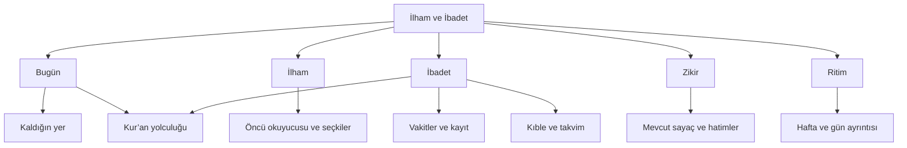

# 02 — Deneyim ve işlev tasarımı

## Ürün vaadi

“Buraya geldiğimde bugün bana iyi gelecek bir içerik buluyorum; ibadet kaydımı kolayca tutuyor, kaldığım yerden devam ediyorum.” Kullanıcıya görev listesi baskısı veya maneviyat puanı üretilmez. Günlük faaliyeti artırmak kadar okumayı bölmemek ve yanlış kayıt oluşturmamak da başarıdır.

## İki aşamalı bilgi mimarisi

**İlk paket:** mevcut beş iç sekme, handler adları ve veri modeli korunur. Başlıkların açıklaması, kart oranları, satır araları, araçların görsel ağırlığı ve okuyucu iyileştirilir. `saygiHTML` çağrı sırası değiştirilmez.

**Sonraki ürün paketi önerisi:** beş iç sekme korunur, görünen adlar **Bugün / İlham / İbadet / Zikir / Ritim** olur. Eski `oz/oncu/iman/zikir/rapor` kimlikleri korunabilir. Kur’an, Bugün ve İbadet'ten en çok iki dokunuşla açılan mevcut bağımsız yolculuk olarak kalır; altı dar sekmeli ikinci bir navigasyon oluşturulmaz. Kıble İbadet araçlarına, tam Kur’an kartı Bugün'e taşınır. Bu, görsel rötuş değil; IIP-09 kapsamındaki davranış değişimidir.

## Özellik sözleşmeleri

| Özellik | Kullanıcı değeri / davranış | Öncelik | Veri etkisi |
|---|---|---|---|
| Günlük odak | Bir ana içerik; süre ve neden önerildiği yazılı; istenirse geç | P1 | Başlangıçta tarihten türetilen seçim, yeni kayıt yok |
| Devam et | Aktif zikir veya Kur’an durumu; mevcut geçerli kayıttan türetilir | P1 | Mevcut kayıt; biyografi okuma konumu ayrı genişletme |
| Öncü keşfi | İsim, bilim/sanat/alan, okunan/okunmayan süzme; sıfır sonuçta filtre temizle | P1 | Oturumluk UI; mevcut kimlikler |
| Okuyucu | Özet/ana metin/kaynak ayrımı, büyütme, bölüm atlama, konum koruma | P1 | Büyütme başlangıçta oturumluk; kalıcı tercih IIP-19 |
| Namaz kaydı | Birincil eylem kayıt, ayrıntılar isteğe bağlı; geri alma ve kayıt zamanı | P0/P1 | Mevcut alanları kullanır; yeni durumlar ayrı şema |
| Kaynaklı seçki | Sabır, merhamet, şükür gibi başlıklarda kısa içerik + kaynak + düşünme | P2 | Sürümlenmiş içerik; ilerleme isteğe bağlı |
| Dua okuma alanı | Arapça / okunuş / anlam / bağlam ayrı; kaynak görülebilir | P2 | Yeni katalog kararı, ses ilk sürümde zorunlu değil |
| Esmâ derinliği | Mevcut anlam/tefekkürle sayaç arasında yumuşak geçiş | P1 | Var olan tefekkür akışı; ikinci not deposu açılmaz |
| Ritim | “Bu hafta 3 gün kayıt var”; vakit/zikir/okuma ayrı; veri eksikliği açık | P1 | Önce mevcut toplamlar; yeni hesap IIP-15 |
| Kaydet ve tekrar bak | Öncü/seçki yer imleri, kaldığın paragraf | P3 | Yeni kalıcı alan ve panel/merge sözleşmesi gerekli |
| 7 günlük yolculuk | Günde bir içerik, kaçırınca ceza yok; bağımsız günler | P3 | Yeni ilerleme şeması gerekli |

## Altı temel akış

1. **30 saniyelik ziyaret:** Bugün → sıradaki vakit ve son güncelleme → mevcut kayıt ekranı → kaydet → geri alınabilir kısa mesaj. Veri yoksa sahte saat gösterilmez.
2. **5 dakikalık okuma:** Bugün'ün içeriği → süre/özet → okuyucu → kaynak → mevcut “Okudum” kaydı. Kaydırma sonu okunduğunun kanıtı değil, mevcut düğmenin açılma koşuludur; otomatik tamamlanma yok. Erişilebilir alternatif IIP-11'de kararlaştırılır.
3. **Zikre devam:** Devam et → mevcut aktif preset ve hatim → sayaç. Panel yoklaması, sekme dönüşü ve gün değişimi ilerlemeyi kaybettirmez. Mevcut geri alma davranışı korunur.
4. **Kur’an çalışması:** Bugün/İbadet → mevcut sûre durumu → video/metin/not. Yeni bir “istek gönder” kısayolu transport kapılarını atlayamaz; tekrarlı e-posta oluşmaz.
5. **Kaynak yokken kullanım:** yerel içerik varsa göster → uzaktan içerik için cache etiketi → cache de yoksa açık boş durum ve tekrar dene. Genel “çevrimdışıyım” rozeti yerine her kaynağın kullanılabilirliği yazılır.
6. **Haftaya bakış:** Ritim → dönem ve veri kapsamı → ayrı faaliyet toplamları → gün detayı. Zikir adedi ile namaz/okuma tek skora dönüştürülmez.

## Durumlar ve metin örnekleri

| Durum | Örnek metin / eylem |
|---|---|
| İlk kullanım | “İstersen kısa bir okumayla başlayalım.” · İçeriği aç |
| Kayıt yok | “Bu gün için henüz kayıt yok.” · Kayıt ekranını aç |
| Ağ hatası | “Kaynağa şu an ulaşamadık.” · Yeniden dene / Kaynağı aç |
| Eski vakit | “Gösterilen saatler … tarihinde güncellendi.” · Yenile |
| Sensör reddi | “Canlı pusula kapalı. Hesaplanan yönü görebilirsin.” |
| Kaydedilemedi | “Kaydedilemedi; yazdıkların bu ekranda duruyor.” · Tekrar dene |
| Ara verilmiş | “Kaldığın yer burada.” · Devam et |

## Bilinçli olarak ertelenenler

Tam mushaf ve lisanslı kıraat akışı, uygulama kapalıyken garantili ezan, native widget/Live Activity, yeni sunucu, yapay zekâyla dinî hüküm veya kişisel psikolojik profil üretimi. Bunlar ilk paket vaadi değildir. Kullanıcı isterse bağımsız ürün/altyapı kararları olarak ele alınır.

## V2 ayrıntıları

Ekran bazındaki bağlayıcı detay [12 ekran şartnamesinde](specs/02-EKRAN-SARTNAMESI.md); belirsiz davranışlar [etkileşim karar tablolarında](specs/03-ETKILESIM-SOZLESMELERI.md). A paketindeki IIP-03 ayrıca hesap değiştirmeden güvenli kopya düzeltmesini kapsar.
