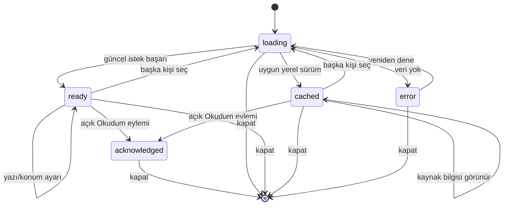

# Etkileşim sözleşmeleri

## Devam et karar tablosu

Yeni “son etkinlik” zamanını uydurmak yerine mevcut kaydı kullan. En çok iki satır: aktif ve arşivlenmemiş zikir hatmi; geçerli mevcut Kur’an çalışması. İkisinin zamanları karşılaştırılabilir değilse sabit sıra Zikir→Kur’an. Okunmuş biyografi aktif çalışma sayılmaz. Kalıcı okuma konumu C'de gelene kadar “kaldığın paragraf” vaadi yok.

| Girdi | Çıktı |
|---|---|
| Hiç geçerli aktif kayıt yok | Devam bölümü yok; tek keşif önerisi |
| Bir geçerli kayıt | Ad/tür/gerçek durum ile bir satır |
| İki geçerli kayıt | İki satır; tek birleşik ilerleme yüzdesi yok |
| Arşivlenmiş hatim / silinmiş sûre hedefi | Satır yok; bozuk kaydı render sırasında onarma yok |
| Uzak güncelleme gelmiş | Kullanıcı taslağı/odağı bozmadan durum satırı güncellenir |

## Günlük kürasyon

Uygulamanın mevcut yerel gün hesabı tek kaynaktır. Seçim gün+catalogVersion ile deterministik; başlangıç listesi yalnız kabul edilmiş içerik. Liste boşsa mevcut günlük öncü; o da yoksa açık boş durum. Gün ortasında tekrar render seçim değiştirmez. Gece yarısında açık okuyucu korunur; ana ekrana sonraki giriş güncellenir. Kullanıcı tarafından seçilmiş tema oturumluk olabilir; davranıştan gizli tema/duygu çıkarılmaz.

İleri pilot için tema sırası altı tema arasında döner; aynı gün birden fazla yeni içerik yüklemesi yapılmaz. “Başka bir içerik” eylemi eklenecekse oturum içi seçimdir, günlük tamamlanma veya streak üretmez. Bu ek eylem IIP-12 kapsam kararına yazılır.

## Okuyucu durum makinesi

Bu çizim hedef UI durumlarıdır; mevcut domain state adlarını yeniden adlandırma talimatı değildir. Her istek kişi+oturum kimliği taşır; kapatılmış/değişmiş bağlama gelen yanıt uygulanmaz. Uzun metin cache'ten gelse de otomatik “Okudum” yok. B'de önerilen erişilebilir alternatif: bölüm sonuna klavyeyle git + açık tamamladım beyanı; okuma süresi gözetimi veya zorunlu quiz yok. A'da mevcut gate değişmez.

## Bağlam ve odak

Modal açılırken tetikleyici kimliği ve scroll anchor saklanır. Kapatırken mevcut tetikleyici yoksa bölüm başlığına dönülür. Arama listesi yeniden boyanırken input düğümü, seçim aralığı ve IME composition korunur. Türkçe normalizasyon görsel kaynağı değiştirmez. Aa değişiminde ilk görünür paragraf anchor olarak korunur; C'de `contentId/revision/blockId`, revizyon farklıysa “İçerik güncellendi” ve başa dönüş.

## Yazma ve geri alma

Kaydet pending iken aynı eylem ikinci kez etkili olamaz. Mevcut local save/remote sync ayrılır: “Cihaza kaydedildi” ile “Eşitlendi” aynı mesaj değildir. Yerel hata varsa başarı animasyonu yok; mümkün olan taslak ekranda kalır. Cancel'ın önceki alan değerlerine etkisi ilgili eski domain davranışıyla karşılaştırılır. Görsel A paketi bu davranışları değiştirmez.

Undo yeni bir domain imkânı gerektiriyorsa sırf toast içine düğme koyarak yapılmaz; IIP-14/20 sözleşmesinde kapsam ve fixture gerekir. Zikirde mevcut geri alma, yeni genel undo ile birleştirilmez.

## Zaman ve cache

Cache geçerliliği yalnız yaşa göre değil gün/şehir/konum/yöntem eşleşmesiyle değerlendirilir. Uygulama tarihini cihaz timezone'u dışında sessizce yeniden tanımlama yok. Ağ çağrısı gecikince kullanıcı seçtiği şehirden başka şehrin yanıtı ekrana düşmez. Yeni getiri yoksa tekrarlı fetch döngüsü yaratılmaz. Kıble sensörü kapatılınca listener yaşam döngüsü sona erer; dönen geç olay overlay'i yeniden açamaz.

## Hareket koreografisi

Kontrol geri bildirimi girişe hemen cevap verir; kayıt başarısı ancak gerçek yerel sonuçla. İçerik geçişinde başlık ve gövde aynı transaction görünür, eski kişi başlığı+yeni metin kombinasyonu olmaz. Reduced-motion'da kaydırma/parallax yerine anlık state ve kısa opaklık tercihi; hareket işlev şartı değil. Ses mevcut tercihler ve quiet-time sözleşmesindedir, yeni içerik açılışında otomatik çalınmaz.
