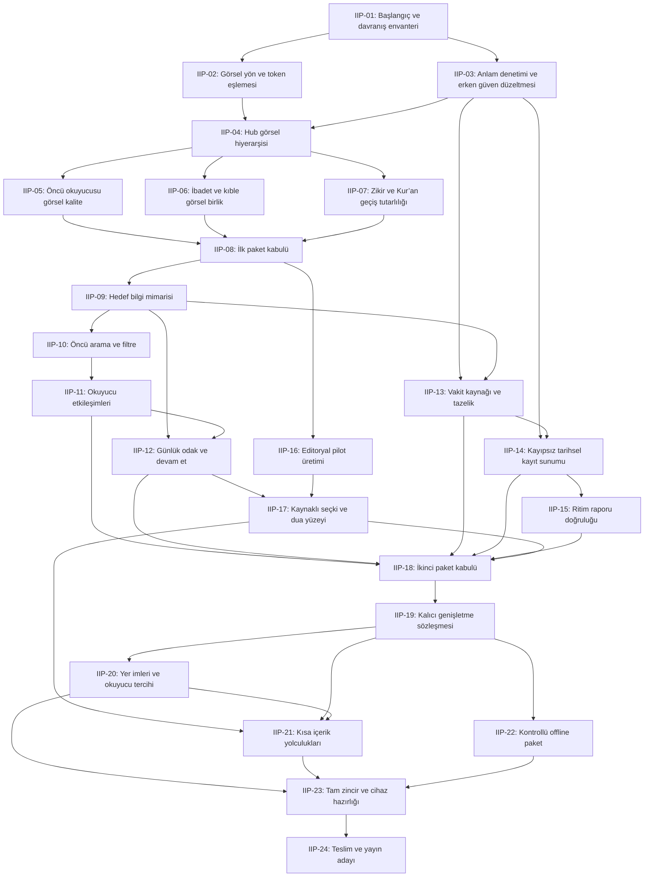

# Bağımlılıklar ve yazma sınırları

DAG teknik önkoşulları gösterir; yetki değildir. Varsayılan artan kart sırası. Aynı dosyayı yazan kartlar DAG bağımsız olsa da paralel uygulanmaz.

## Koordinasyon

- 02 tasarım ve 03 alan incelemesi teorik olarak ayrılabilir; 03 runtime yazarsa kendi allowlist/lock ile.
- 05/06/07 ortak styles.css nedeniyle seri yazılır.
- 16 içerik hazırlığı, B mühendisliğinden ayrı artifactlerde yürüyebilir; yayın incelemesi bekler.
- 20/21 data/state ortaklığı ve 22 SW entegrasyonu integratörce sıraya alınır.
- State/ledger tek yazarı integratördür. Paralel çalışma yalnız oturum yetkisiyle.
