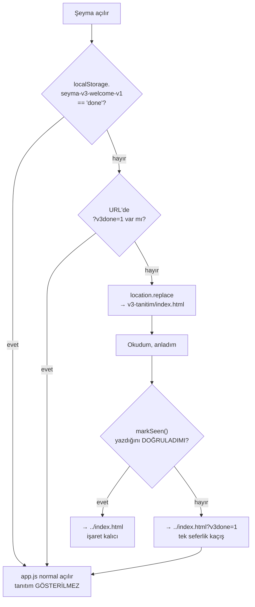

# Şeyma 3.0 — "Hoş Geldin" tanıtım sayfası

Sürüm 3.0'ın yeniliklerini kullanıcıya **bir kez** anlatan, ayrı bir yüzey.
Kullanıcı en sondaki **"Okudum, anladım"** düğmesine bastığında kalıcı olarak
işaretlenir ve bu cihazda bir daha gösterilmez.

> Devir belgeleri:
> - [`DEVIR-PROMPTU.md`](DEVIR-PROMPTU.md) — **Claude'a verilecek devir promptu.**
>   Kullanıcının bu iş boyunca istediği her şeyi birebir listeler, her birinin
>   nasıl doğrulanacağını söyler, gerçek `seyma-data` referans değerlerini verir ve
>   kanıt üretmeden "bitti" denmesini yasaklar.
> - [`STARTER.md`](STARTER.md) — ilk görevin sözleşmesi (85 gün varsayımıyla
>   yazılmıştır; gün sayısı artık veriden türetilir → 84).
>
> Bu README tamamlanan işi özetler.

---

## Dosyalar

| Doküman | Rol |
|---|---|
| `index.html` | Sayfa kabuğu. **`#root` + `data-theme="dark"` zorunlu** (tokenlar `app/styles.css`'te `#root` üzerinde tanımlı). Ayrıca konfeti canvas'ı + ilerleme çubuğu. |
| `v3.css` | Temel düzen + kutlama efekteri. 98 tasarım token'ını **tüketir**. Ham hex yalnızca neredeyse-siyah sahne zeminlerinde ve altın üstü mürekkep için. |
| `v3.js` | Kalıcılık (yazma + **doğrulama**), scroll-reveal, ilerleme çubuğu, sayaç animasyonu, konfeti. |
| `v3-snapshot.js` | **STATİK ANLIK GÖRÜNTÜ (üretilmiş dosya, elle düzenlenmez).** `node tools/v3-snapshot-build.mjs` seyma-data'yı salt-okur GET eder, sayfanın kendi modülleriyle özetler, **yalnız sayısal** çıktıyı yazar (not/günlük/etiket/ham kayıt/token YOK; yazmadan önce yasaklı alan taraması). Sayfa bunu görünce **ağa çıkmaz, anahtar aramaz, cihaz deposuna bakmaz** — her cihazda aynı sayılar. `--check` güncelliği doğrular. |
| `v3-data.js` | **Salt-okur** veri katmanı. Öncelik: **anlık görüntü** → bellek (uzak) → cihaz deposu. Ağ YOK. `SOURCE` ile kaynağı izler (`snapshot`/`remote`/`device`/`none`). |
| `v3-source.js` | **Salt-okur uzak kaynak köprüsü.** Uygulamanın zaten sakladığı token varsa `data/latest.json`'ı **yalnız-GET** çeker — **repo esastır**, cihaz kaydı yalnız yedektir. Yazmaz, diske kaydetmez. |
| `v3-stats.js` | **İstatistik motoru**: betimsel istatistik, regresyon, korelasyon, histogram. |
| `v3-statsview.js` | İstatistik görselleştirme (histogram, kutu grafiği, eğilim, korelasyon). |
| `v3-charts.js` | Grafik çizimi (ısı haritası, trend, çubuklar, rozetler). |
| `../index.html` (kök) | Tek ekleme: `<head>`'de 1 inline bootstrap `<script>` (yönlendirme kararı). |
| `../tests/app/test_v3_welcome.js` | **284 kontrollük** sözleşme fixture'ı (kontrast ölçümü + köprü sözleşmesi dâhil). |
| `../app/core/settings.js` | Ayarlar → Hakkında **v3.0** metni + "3.0'da neler değişti?" köprüsü. |
| `../app/core/render.js` | Başlangıç ekranı **v3.0** rozeti. |

## Statik anlık görüntü — neden ve nasıl (2026-09-15)

Kullanıcı isteği: *"o veriyi çek ve SADECE bu sayfada STATİK olarak göster."*
Canlı köprü (token ile GET) yalnız anahtarın bulunduğu tarayıcıda çalışıyordu;
masaüstünde 15 günlük bayat cihaz kaydı görünüyordu. Artık:

1. `node tools/v3-snapshot-build.mjs` → `v3-tanitim/v3-snapshot.js` (≈16 KB).
   Sayılar canlı yolla **birebir** aynıdır: aynı `v3-data.js`/`v3-stats.js`
   kodu, gerçek veriyle, node:vm içinde çalıştırılır; çıktı budanır.
2. Sayfa `window.SeymaV3Snapshot` görünce **hiç ağ isteği yapmaz** (fixture +
   headless CDP ölçümü: dış istek 0, localStorage 0).
3. Rozet: *"✓ Eşitlenmiş veri · 15 Eylül 2026 anlık görüntüsü · sayfaya
   gömülü, salt-okur (ağ yok)"*.
4. "Kaçıncı gün" sayacı yine uygulamanın formülüyle **bugüne** göre türetilir
   (kutlama bugünündür); veri özeti anlık görüntü tarihine aittir ve kart
   altında *"… → 15 Eylül 2026 · 84 kayıtlı gün"* yazar.

> ⚠️ **Gizlilik:** `mustafaras/s` public'tir. Dosyaya yalnız sayısal özet
> girer (günlük tik sayısı, ruh hâli **puanı** 1–5, uyku saati, oranlar,
> rozetler, istatistik tablosu); not/günlük/niyet/öğün/ilaç/etiket/konum/token
> **girmez** — üretici yazmadan önce tarar, fixture dosyayı metin düzeyinde
> yeniden tarar. Yine de kişiye ait sağlık sayılarıdır: **push kararı
> kullanıcınındır** (dal LOCAL-ONLY). Yenilemek için aracı tekrar çalıştır.

## Alışkanlık haritası v2 (2026-09-15)

Gün etiketleri (Pt/Ça/Cu/Pz) sabit 11px HTML satırlarıydı; SVG ızgara
genişliğe göre ölçeklendiği için satırlar kayıyordu → etiketler artık **SVG
içinde**, hücreyle aynı koordinat sisteminde. Üstte ay işaretleri (3 sütundan
kısa aylar yazılmaz — Haz/Tem çakışması). 84/84 günde bulunan ve bilgi
taşımayan altın "ruh hâli" çerçevesi kaldırıldı; 5 kademeli tek-ton altın
ölçek; altta tek satır özet ("12/15 en dolu gün · %59 ortalama doluluk").

## Kutlama katmanı (gün sayısı)

- **Hero flamingosu:** gerçek 🦩 emojisi (uygulamanın kendi simgesi). Emoji
  platformun kendi fontundan gelir; bu yüzden **renk verilmez** (renkli emojiyi
  boyamak bozar) — yalnız boyut, gölge ve süzülme hareketi. Em boyutu `rem`
  olmadığı için taban 84px'e sabittir ve ≤370px'te 68px'e iner.
- **Sayaç:** `data-count` taşıyan öğeler hedefe sayar (easeOutCubic). Nihai
  metin HTML'de zaten yazılıdır → JS kapalı veya reduced-motion açıkken de
  doğru görünür, sayı asla "0"a düşmez.
- **Konfeti:** kendi canvas'ında, token'lı altın/pembe palet, viewport'a göre
  ölçeklenen parçacık (mobil 42 / orta 66 / geniş 88 — üst sınırlı), sekme
  arkada kalınca `cancelAnimationFrame` ile durur. **Reduced-motion'da canvas
  hiç kurulmaz.**
- **13 kutlama efekti** (flamingo süzülmesi, altın parıltı, kıvılcımlar, bulut/
  sis/yağmur/yıldırım, ses dalgası, modül nabzı, hero halesi): tümü
  `prefers-reduced-motion: reduce` altında kapanır ve statik karelerle
  değiştirilir. Fixture **efekt listesini ad ad** doğrular, sayıyı değil —
  böylece bir efekt sessizce silinemez.
- **Tek emoji:** 🦩 (hero + kapanış + footer). Başka dekoratif emoji yok —
  fixture bunu sayar. Not: bu, kullanıcının açık isteğiyle uygulamanın
  "emojisiz prestij tonu" kuralından bilinçli bir sapmadır.

## Gün sayısı nereden geliyor (kanıt)

Gün sayısı **artık sabit değil** — kaynak veriden türetilir:

```
dayCount = diffDays(data.startDate, bugün) + 1
```

Bu, uygulamanın kendi formülüdür (`dateUtils.js`:
`dayIndexFor(date) = diffDays(startDate, date) + 1`).

- **Gerçek veri (`mustafaras/seyma-data`, 2026-09-15):** `startDate = 2026-06-24`
  → **84 gün** (ilk kayıtlı gün `2026-06-24`, son gün `2026-09-15`, boşluk yok).
- Statik HTML geçerli bir **varsayılan** taşır (JS kapalıyken de sayı görünür):
  **24 Haziran 2026 / 84** — gerçek `startDate` ile aynı. (2026-09-15'e kadar
  statik metin `23 Haziran / 85` diyordu; veri/token olmayan bir tarayıcıda JS
  bunu düzeltemediği için kullanıcı yanlış sayıyı görüyordu — düzeltildi, fixture
  artık statik başlangıcın gerçek `startDate` ile eşit olmasını zorunlu kılar.)
  JS açıkken gerçek sayıya düzeltilir — hero, sayaç, kapanış başlığı ve footer
  dâhil (`trWords()` Türkçe sayı sözcüğünü üretir: 84 → "seksen dört").
- `startDate` yoksa **en erken kayıtlı gün** kullanılır; hiç yoksa sahte sayı
  gösterilmez (`dayCount: null` → dürüst boş durum).
- Bağımsız koroborasyon: deponun veri kaybı kaydı (`AGENTS.md`) 2026-07-10'daki
  ezilmenin **17 günlük** veriyi sildiğini söyler → başlangıç ~23 Haziran.
  Fixture **±1 gün örtüşme** arar, kesin eşitlik dayatmaz.

> **Neden değişti:** sayfa eskiden `85`'i sabit yazıyordu. Gerçek veri
> `startDate = 2026-06-24` dediği için doğru sayı **84**'tür; sabit yazım bu
> yüzden bir gün fazla gösteriyordu. Artık sayı veriden gelir, sabit değildir.

## Kişisel veri özeti (v3-data.js + v3-charts.js)

Sayfa, kullanıcının **kendi kayıtlarını** okur ve yolculuğunu görselleştirir:
özet sayılar, **alışkanlık ısı haritası**, son 30 günün yönü, en çok tutunduğu
alışkanlıklar ve **kazandığı rozetler**.

### Güvenlik sözleşmesi (pazarlıksız)

| Kural | Durum |
|---|---|
| Depoya yazma | **Yok** — hiçbir modülde `setItem`/`removeItem`/`clear` geçmez |
| Ağ çağrısı | Yalnız **`v3-source.js`**, yalnız **GET** (`v3-data.js`/`v3-charts.js`/`v3-stats*.js` ağdan muaftır) |
| Uzak veri kalıcılığı | **Yok** — yalnız bellekte (`setData`); sayfa yenilenince yeniden çekilir, diske yazılmaz |
| Yazma yöntemi | **Yok** — `PUT`/`POST`/`PATCH`/`DELETE` hiçbir modülde geçmez |
| Token sızması | **Yok** — token yalnız `Authorization` başlığında; console/DOM/metne yazılmaz |
| Kimlik kaynağı | Yalnız **cihazın kendi deposundaki** `settings.ghToken`/`ghRepo` (kullanıcıya sorulmaz) |
| İstek politikası | Kimlik **varsa repo esastır** (tek GET, sayfa ömür boyu bir kez gösterilir); kimlik yoksa ağa **hiç çıkılmaz** |
| Okunan anahtar | Yalnız `seyma-reset-v1` |
| Kişisel metin | `note`/`journal`/`intention`/`meals` **ekrana çıkmaz** |
| Ruh hâli | Yalnız **sayısal seviye** (1–5) ve oran; **etiket yazılmaz** |
| Tek istisna | `nickname` — kullanıcının kendi takma adı, yalnız selamlamada |

Bir fixture bu sözleşmenin tamamını kaynak düzeyinde doğrular.

### Uzak kaynak köprüsü (`v3-source.js`)

**Sorun:** uygulama açılışta uzak veriyi **çekmiyor** — yalnız kendi verisini
**gönderiyor** (`sync.js schedule`). Dolayısıyla deposu boş/eski olan bir cihazda
sayfa eksik görünüyordu; oysa doğru veri `mustafaras/seyma-data` içindedir.
**Çözüm — sıra (repo esastır):**

1. Cihazda `settings.ghToken` var mı? → **Var:** `data/latest.json`'ı bir kez
   GET et → başarılıysa **onu** çiz (cihazda kayıt olsa bile — bayat olabilir).
2. Token yok, ya da ağ/okuma hatası → **cihaz kaydı** varsa onunla çiz
   (rozet `device`).
3. İkisi de yok → dürüst boş durum (rozet gizli).

DEVIR-PROMPTU §6'daki 6 senaryo (A–F) bu sırayı headless olarak doğrular; sayfa
ömür boyu bir kez gösterildiği için tek GET'in maliyeti ihmal edilebilir.

**1 MB üstü dosya tuzağı:** `data/latest.json` 2,2 MB'dir; GitHub Contents API
200 döner ama `content` **boş** gelir (`encoding:"none"`). Köprü bu yüzden
`sha` ile `git/blobs/<sha>` ham içeriğine düşer (`sync.js ghGetFileSafe` ile aynı
yol) ve `atob`un bozduğu Türkçe karakterler için UTF-8 `TextDecoder` kullanır.

### Veri kaynağı rozeti

Sayfa **hangi kaynaktan okuduğunu açıkça söyler** — "eşitlenmiş veri" derken
sessizce cihaz kaydını gösterme yanılsamasına düşülmez:

| `data-src` | Gösterilen | Anlamı |
|---|---|---|
| `remote` | ✓ Eşitlenmiş veri · kendi özel veri deposundan salt-okur okundu | Repo'dan okundu |
| `device` | Bu cihazdaki kayıt · eşitlenmiş veriye ulaşılamadı | Repo'ya ulaşılamadı |
| `none` | (rozet `hidden` ile tamamen gizli) | Gösterilecek kayıt yok |

`v3-data.js` durumu `SOURCE` içinde izler (`source()` ile okunur); rozet hem
dolu hem boş durumda yazılır.

**Neden ulaşılamadı? (2026-09-15, kullanıcı sorusu: "neden repo verisini
kullanmıyorsun")** — köprü başarısızlık nedenini kodlar (`no-creds` ·
`http_<n>` · `blob-http_<n>` · `timeout` · `network` · `parse` · `empty`),
`SeymaV3Data.setRemoteFailure()` ile veri katmanına bırakır; rozet (`device`)
ve boş durum (`none`) bunu Türkçe açıklar: *"bu tarayıcıda eşitleme anahtarı
yok — sayfayı telefondan aç ya da uygulamayı bu tarayıcıda açıp Ayarlar →
Eşitleme'den anahtarı gir"*, *"anahtar reddedildi (HTTP 401)"*, *"zaman aşımı
(30 sn)"* vb. Token/ham veri metne asla girmez. En sık senaryo: masaüstü
tarayıcıda 15 günlük bayat `seyma-reset-v1` + anahtar yok → sayfa "Senin 15
günün" der ve artık **nedenini** de söyler. Zaman aşımı 9 → **30 sn** (2,2 MB
blob mobilde sessizce cihaza düşürüyordu). Sayaç yarışı kapatıldı: `v3.js`
hedefi her karede `data-count`'tan okur, `updateDynamicText` `v3Target`'ı da
günceller (uzak veri animasyon sürerken gelince eski sayı geri yazılmıyor). Amaç teşhis edilebilirlik: kullanıcı baktığı
sayının gerçekten `seyma-data`'dan geldiğini görebilmelidir.

### Uygulamanın kendi formülleri aynalanır

Uydurma metrik yoktur; her sayı uygulamanın kendi tanımını kullanır:

| Metrik | Kaynak |
|---|---|
| Seri (`countRec>=4`, tatil dondurur) | `app.js bestStreak`, `report.js` |
| Alışkanlık sayısı + `since` aktivasyonu | `app.js habitCountOn` + `HABITS[]` |
| Su hedefi (8 / tatilde 10 / kullanıcı hedefi) | `health.js waterGoalCups` |
| Adım (manuel → health → izlenen, 0,72 m) | `health.js effSteps` |
| İlaçsız gece serisi | `health.js medFreeStreak` |
| Rozet eşikleri | `report.js badgesGrid` |

> **Dürüstlük notu:** `report.js`'in 8 rozetinden **`protein hedefi`
bırakıldı** — `dayNutrition()` bir besin veritabanına (`FOOD_DB`) dayanır ve bu
sayfa onu dürüstçe çözemez. Yerine herkese açık bir rozet kondu
("<gün>. güne ulaşmak", sayı gerçek veriden gelir), böylece toplam yine 8 kaldı.

### Boş durum

Orijin başına `localStorage` boş olabilir (ör. uygulamaya farklı bir kökenden
bakıldıysa). Bu durumda önce **salt-okur repo okuması** denenir; o da mümkün
değilse **sahte grafik çizilmez** ve bölüm dürüst bir metinle gelir.

## Uygulama içi sürüm (v3.0)

Ayarlar → Hakkında **"Şeyma 🦩 · v3.0 — Günışığı yenildi"** ve bir
**"3.0'da neler değişti?"** köprüsü taşır; köprü sayfaya döner (`<a>`).

> ⚠️ **Köprü bilinçli olarak düz `<a>`.** fx2 fixture'ları `combinedSource`
> üzerinden App yüzeyini **718** ve tıklama niteliği sayısını **391** olarak
> düz metin taramasıyla sabitler; `settings.js` ve `render.js` bu taramaya
> dâhildir. Yeni bir handler ya da düğme eklemek bu pinleri kırar.
>
> ⚠️ **Daha ince tuzak:** tarama YORUMLARI DA SAYAR. Açıklama yorumuna
> `App.<ad>=` veya tıklama niteliği adı yazmak sayacı **+1** kaydırır ve üç
> fx2 fixture'ını düşürür (bir kez yaşandı). Yorumlarda bu biçimleri kullanmayın.

## Tetikleme akışı



**Neden `<head>`'de:** karar ilk boyamadan önce verilir. Tanıtım görülmediyse
`app.js` hiç **çalışmaz** — hiçbir veri okunmaz/yazılmaz, buluta tek satır gitme
ihtimali doğmaz. (Ölçüldü: tarayıcının preload tarayıcısı `<body>` betiklerini
*indirebilir*; indirmek çalıştırmak değildir — `window.App` hiç oluşmaz, depo boş
kalır. Bu index.html'deki yorumda da böyle yazılı.)

**Neden `?v3done=1` var:** `localStorage` okunabiliyor ama **yazılamıyorsa**
(gizli mod, dolu kota), saf "işaret yok → yönlendir" mantığı
`index → v3 → index → …` **sonsuz döngüsü** üretirdi. `v3.js` bu yüzden işareti
geri okuyup doğrular; doğrulayamazsa kaçış parametresiyle döner ve kök bootstrap
onu görünce bir kez atlar. Uçtan uca test edildi.

## Kalıcılık sözleşmesi

- **Anahtar:** `seyma-v3-welcome-v1` · **değer:** `done`
- Uygulamanın **`seyma-reset-v1`** anahtarından **ayrı namespace**. "Verileri
  sıfırla" bu anahtarı silmez → okunmuşsa tanıtım yine gösterilmez (§"bir daha asla").
- `localStorage` **kullanıcı tarafından** silinirse gösterilmesi **doğru davranıştır**;
  buna karşı koruma bilinçli olarak **yoktur**.

## Tasarım

- Gerçek siyah zemin (`#000`), champagne altın aksan, emoji yok.
- Yalnız token'lı renk/süre: `--text`, `--muted`, `--faint`, `--accent`,
  `--gold-1…3`, `--card-solid`, `--elev-2/3`, `--f-large`/`--f-*`, `--dur-*`, `--ease-*`.
- Kademeli giriş (`IntersectionObserver`), gecikme 220 ms'de sınırlı.
- **`prefers-reduced-motion: reduce`** → hareket kapanır, içerik görünür kalır.
- **İçerik gizli kalma arızası yapısal olarak imkânsız:** gizli başlangıç durumu
  yalnız `html.v3-js` altında uygulanır (o sınıfı JS ekler). Betik çalışmazsa
  hiçbir şey gizlenmez; ayrıca 1,6 sn'lik güvenlik zaman aşımı her öğeyi açar.

### Ölçülen kontrast (WCAG AA)

Fixture canlı `app/styles.css` tokenlarını okuyup ölçer; en zor çift **5.76:1**:

| Çift | Oran |
|---|---|
| gövde metni / kart | 16.33:1 |
| ikincil metin / kart | 7.97:1 |
| bölüm etiketi / siyah | 5.76:1 |
| buton metni / altın (en açık uç) | 15.75:1 |
| odak halkası / kart (3:1) | 10.04:1 |

## Gelişmiş istatistik ("Sayıların dili")

`v3-stats.js` gerçek matematik yapar; `v3-statsview.js` bunu grafiklere çevirir.

| Yöntem | Nerede |
|---|---|
| Ortalama, medyan, mod, **örneklem SS (n−1)**, CV | Betimsel tablo |
| **Çeyrekler (tip-7 interpolasyon)**, IQR | Kutu grafiği |
| **Tukey IQR kuralı** ile aykırı değer tespiti | Kutu grafiğinin noktaları |
| **En küçük kareler regresyonu** (eğim, kesişim, **R²**) | "Zaman içinde yön" |
| **Pearson r** + güvenilirlik eşiği | "Neyle birlikte değişiyor" |
| **Hareketli ortalama** (7 gün, pencere dolmadan başlamaz) | Seyir çizgileri |
| Moment dökümü (son 7 vs önceki 7) | Veri özeti |
| Haftanın günü profili (ort. oran + ort. ruh hâli) | "Haftanın günleri" |

### Dürüstlük kuralları (koda gömülü)

- **n &lt; 3** → eğilim/korelasyon **hiç hesaplanmaz** (null; "%0" yazılmaz).
- **n &lt; 10** korelasyonlar **"düşük örneklem"** olarak işaretlenir.
- Aykırı değerler **gizlenmez**, nokta olarak gösterilir.
- Hedef paydası yalnız **ölçümün kaydedildiği** günlerdir — boş gün başarısızlık sayılmaz.
- "Korelasyon **nedensellik değildir**" uyarısı arayüzde durur.
- Sayıların nasıl üretildiğini anlatan bir **dürüstlük notu** bölüm sonundadır.

### Hedef eşikleri — SABİT YAZILMAZ

Kullanıcı geri bildirimiyle bulunan gerçek kusur: "Hedefleri tutturabildin mi"
bölümü eşikleri **sabit** yazıyordu ve **adım hedefi 4.500** alınmıştı. Oysa
4.500 (`STEP_TICK_MIN`) yürüyüş **tikinİn** eşiğidir; adım **hedefi**
`stepsGoal()` ile **9.000**'dir (tatilde 12.000/9.000/5.000).

Artık her eşik **her gün için** uygulamanın kendi fonksiyonundan okunur:
`waterGoal(date)` · `stepsGoal(date)` · `sleepGoalHours(date)`. Böylece
`settings.targets` doluysa kullanıcı hedefi geçerli olur, tatil günü esnetmesi
aynen uygulanır ve gerçek veriyle sapma oluşmaz.

**Etki (gerçek 84 gün):** adım tutturma **%55 → %10** — düzeltme önemliydi.

Bölüm ayrıca bunları **açıkça yazar**: kullanılan eşiklerin sayıları
(7,5 saat · 8 bardak · 9.000 adım · 15 alışkanlık), alışkanlık sayısının yol
boyunca değiştiği (ilk gün **8** → bugün **15**), "tam gün"ün her gün kendi
tarihine göre hesaplandığı ve paydanın yalnız o ölçümün kaydedildiği günler
olduğu.

| Hedef | Gerçek 84 gün |
|---|---|
| 7,5+ saat uyku | %69 (56/81) |
| 8+ bardak su | %96 (75/78) |
| 9.000+ adım | %10 (5/51) |
| Günün tüm alışkanlıkları (15) | %0 (0/84) |

### Gerçek veriyle doğrulama (2026-09-15)

Salt-okur olarak `seyma-data`'dan indirilen **84 günlük** gerçek kayıtla uçtan uca
test edildi (tamamı `/tmp`'de; repoya ya da sayfaya **gömülmedi**). Sayfanın
ürettiği değerler bağımsız Node hesabıyla birebir aynı çıktı:

| Ölçüm | n | Ort. | Medyan | SS | CV |
|---|---|---|---|---|---|
| Ruh hâli (1–5) | 84 | 3,39 | 3,00 | 0,81 | %24 |
| Uyku (saat) | 81 | 7,54 | 7,50 | 1,04 | %14 |
| Su (bardak) | 78 | 8,95 | 9,00 | 1,51 | %17 |
| Adım | 51 | 4.729 | 4.500 | 2.928 | %62 |

> ⚠️ **BULUNAN KUSUR:** `report.js`'in rozeti **"7/7 mükemmel"** diyor ama
> karşılaştırması `countRec >= habitCountOn(date)`, yani bugün **15** alışkanlık
> (aktivasyona göre ilk gün 8). Gerçek 84 günde en fazla **12** tik var → "tam
> gün" hiç oluşmamış. Etiket eski 7 habitatlık dönemden kalmış.
> **Sayfa tarafı düzeltildi (B1, 2026-09-15):** `v3-data.js` eşiği aynen aynalar,
> etiketi gerçek paydadan üretir → **"Tüm alışkanlıklar (15/15)"**; fixture sabit
> "7/7" yazımının geri gelmemesini zorunlu kılar. `report.js`'teki uygulama
> etiketi ayrı bir karttır, dokunulmadı.
>
> **B2 (uygulama, kullanıcı onayıyla düzeltildi):** yürüyüş tiki
> `habitProgress → stepsGoal(date)` (9.000) ile dolar; `STEP_TICK_MIN=4500`
> hiçbir yerde okunmuyordu. `appSurface.js:76`, `app.js` `derivedProgText`,
> `setWalkSteps` toast'ı ve HABITS kart başlığındaki bayat "4.500" metinleri
> gerçek hedefe çekildi (pinler 718/391/554 korundu).


```bash
node tests/app/test_v3_welcome.js          # 284 kontrol (sözleşme + kontrast + kutlama + veri + köprü + uygulama içi)
node --check v3-tanitim/v3.js
node .claude/skills/run-seyma/driver.mjs   # exit 0
node tools/shell-inventory.mjs --gate      # PASS · 7.610 / 0 / 408 / 57
```

Tam kapı seti (2026-09-15): tests/app **53/53** · panel 23/23 · panel-v2 27/27 ·
Kur'an 9/9 · reminders 21/21 · driver + zikr 95/95 · `App.x=554`.

### Kontrollü yerel görsel QA

Port-9000 protokolüne uyulur (`CLAUDE.md` → DATA SAFETY). QA sırasında:

- Sunucu **yalnız** `127.0.0.1:9000`'e bağlandı.
- `forceSync=1` / `seyma-sync-force` **kullanılmadı**; gerçek token girilmedi.
- `127.0.0.1:9000`'de kullanıcının **gerçek `seyma-reset-v1` verisi duruyordu** —
  bu yüzden akış testleri **`localhost:9000`** (aynı port, ayrı origin = izole,
  boş depo) üzerinde yapıldı. `app.js` hiçbir an `127.0.0.1` origin'inde
  çalıştırılmadı.
- Ağ izlemesi: **GitHub'a giden 0 istek**.
- Sunucu turn bitmeden kapatıldı.

## Bilinen sınırlar

- **Push/deploy yok.** Bu iş LOCAL-ONLY; push, merge, tag ve cihaz kabulü ayrı onay ister.
- Sayfa koyu temayı **sabitler** (açık temada `--page` bir gradient olduğu için
  token olarak kullanılamaz).
- Dosya `file://` üzerinden değil, http(s) üzerinden açılmalıdır (yönlendirme
  göreli yol ile çalışır).
- Metinden küçük bir sapma bilinçli: kart 08'de "eşitleme anahtarları yedeğe
  girmez" ifadesi `sync.js`'in `sanitize()` fonksiyonunu (`ghToken`, `syncUrl`,
  `openaiKey`, `auth` silinir) anlatır.
