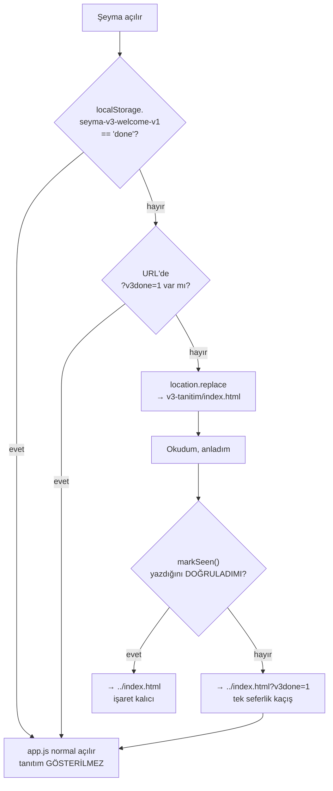

# Şeyma 3.0 — "Hoş Geldin" tanıtım sayfası

Sürüm 3.0'ın yeniliklerini kullanıcıya **bir kez** anlatan, ayrı bir yüzey.
Kullanıcı en sondaki **"Okudum, anladım"** düğmesine bastığında kalıcı olarak
işaretlenir ve bu cihazda bir daha gösterilmez.

> Devir belgesi: [`STARTER.md`](STARTER.md) — görevin tam sözleşmesi, tuzaklar ve
> kabul kriterleri. Bu README tamamlanan işi özetler.

---

## Dosyalar

| Dosya | Rol |
|---|---|
| `index.html` | Sayfa kabuğu. **`#root` + `data-theme="dark"` zorunlu** (tokenlar `app/styles.css`'te `#root` üzerinde tanımlı — panel-v2.html ile aynı desen). |
| `v3.css` | Sayfaya özel düzen. 98 tasarım token'ını **tüketir**, yeniden tanımlamaz. Ham hex yalnız 4 yerde (ikisi zemin, ikisi altın zemin üzerinde okunur koyu metin). |
| `v3.js` | Üç iş: kalıcılık (yazma + **doğrulama**), kademeli scroll-reveal, ve hiçbir şeye dokunmadan çalışmak. |
| `../index.html` (kök) | Tek ekleme: `<head>`'de 1 inline bootstrap `<script>` (yönlendirme kararı). |
| `../tests/app/test_v3_welcome.js` | 90 kontrollük sözleşme fixture'ı. |

## Tetikleme akışı



**Neden `<head>`'de:** karar ilk boyamadan önce verilir. Tanıtım görülmediyse
`app.js` hiç **çalışmaz** — hiçbir veri okunmaz/yazılmaz, buluta tek satır gitme
ihtimali doğmaz. (Ölçüldü: tarayıcının preload tarayıcısı `<body>` betiklerini
*indirebilir*; indirmek çalıştırmak değildir — `window.App` hiç oluşmaz, depo boş
kalır. Bu index.html'deki yorumda da böyle yazılı.)

**Neden `?v3done=1` var:** `localStorage` okunabiliyor ama **yazılamıyorsa**
(gizli mod, dolu kota), saf "işaret yok → yönlendir" mantığı
`index → v3 → index → …` **sonsuz döngüsü** üretirdi. `v3.js` bu yüzden işareti
geri okuyup doğrular; doğrulayamazsa kaçış parametresiyle döner ve kök bootstrap
onu görünce bir kez atlar. Uçtan uca test edildi.

## Kalıcılık sözleşmesi

- **Anahtar:** `seyma-v3-welcome-v1` · **değer:** `done`
- Uygulamanın **`seyma-reset-v1`** anahtarından **ayrı namespace**. "Verileri
  sıfırla" bu anahtarı silmez → okunmuşsa tanıtım yine gösterilmez (§"bir daha asla").
- `localStorage` **kullanıcı tarafından** silinirse gösterilmesi **doğru davranıştır**;
  buna karşı koruma bilinçli olarak **yoktur**.

## Tasarım

- Gerçek siyah zemin (`#000`), champagne altın aksan, emoji yok.
- Yalnız token'lı renk/süre: `--text`, `--muted`, `--faint`, `--accent`,
  `--gold-1…3`, `--card-solid`, `--elev-2/3`, `--f-large`/`--f-*`, `--dur-*`, `--ease-*`.
- Kademeli giriş (`IntersectionObserver`), gecikme 220 ms'de sınırlı.
- **`prefers-reduced-motion: reduce`** → hareket kapanır, içerik görünür kalır.
- **İçerik gizli kalma arızası yapısal olarak imkânsız:** gizli başlangıç durumu
  yalnız `html.v3-js` altında uygulanır (o sınıfı JS ekler). Betik çalışmazsa
  hiçbir şey gizlenmez; ayrıca 1,6 sn'lik güvenlik zaman aşımı her öğeyi açar.

### Ölçülen kontrast (WCAG AA)

Fixture canlı `app/styles.css` tokenlarını okuyup ölçer; en zor çift **5.76:1**:

| Çift | Oran |
|---|---|
| gövde metni / kart | 16.33:1 |
| ikincil metin / kart | 7.97:1 |
| bölüm etiketi / siyah | 5.76:1 |
| buton metni / altın (en açık uç) | 15.75:1 |
| odak halkası / kart (3:1) | 10.04:1 |

## Doğrulama

```bash
node tests/app/test_v3_welcome.js          # 90 kontrol (sözleşme + kontrast)
node --check v3-tanitim/v3.js
node .claude/skills/run-seyma/driver.mjs   # exit 0
node tools/shell-inventory.mjs --gate      # PASS · 7.610 / 0 / 408 / 57
```

Tam kapı seti (2026-09-15): tests/app **53/53** · panel 23/23 · panel-v2 27/27 ·
Kur'an 9/9 · reminders 21/21 · driver + zikr 95/95 · `App.x=554`.

### Kontrollü yerel görsel QA

Port-9000 protokolüne uyulur (`CLAUDE.md` → DATA SAFETY). QA sırasında:

- Sunucu **yalnız** `127.0.0.1:9000`'e bağlandı.
- `forceSync=1` / `seyma-sync-force` **kullanılmadı**; gerçek token girilmedi.
- `127.0.0.1:9000`'de kullanıcının **gerçek `seyma-reset-v1` verisi duruyordu** —
  bu yüzden akış testleri **`localhost:9000`** (aynı port, ayrı origin = izole,
  boş depo) üzerinde yapıldı. `app.js` hiçbir an `127.0.0.1` origin'inde
  çalıştırılmadı.
- Ağ izlemesi: **GitHub'a giden 0 istek**.
- Sunucu turn bitmeden kapatıldı.

## Bilinen sınırlar

- **Push/deploy yok.** Bu iş LOCAL-ONLY; push, merge, tag ve cihaz kabulü ayrı onay ister.
- Sayfa koyu temayı **sabitler** (açık temada `--page` bir gradient olduğu için
  token olarak kullanılamaz).
- Dosya `file://` üzerinden değil, http(s) üzerinden açılmalıdır (yönlendirme
  göreli yol ile çalışır).
- Metinden küçük bir sapma bilinçli: kart 08'de "eşitleme anahtarları yedeğe
  girmez" ifadesi `sync.js`'in `sanitize()` fonksiyonunu (`ghToken`, `syncUrl`,
  `openaiKey`, `auth` silinir) anlatır.
