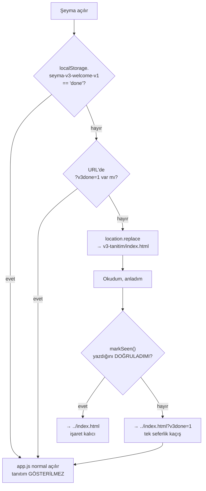

# Şeyma 3.0 — "Hoş Geldin" tanıtım sayfası

Sürüm 3.0'ın yeniliklerini kullanıcıya **bir kez** anlatan, ayrı bir yüzey.
Kullanıcı en sondaki **"Okudum, anladım"** düğmesine bastığında kalıcı olarak
işaretlenir ve bu cihazda bir daha gösterilmez.

> Devir belgesi: [`STARTER.md`](STARTER.md) — görevin tam sözleşmesi, tuzaklar ve
> kabul kriterleri. Bu README tamamlanan işi özetler.

---

## Dosyalar

| Doküman | Rol |
|---|---|
| `index.html` | Sayfa kabuğu. **`#root` + `data-theme="dark"` zorunlu** (tokenlar `app/styles.css`'te `#root` üzerinde tanımlı). Ayrıca konfeti canvas'ı + ilerleme çubuğu. |
| `v3.css` | Temel düzen + kutlama efekteri. 98 tasarım token'ını **tüketir**. Ham hex yalnızca neredeyse-siyah sahne zeminlerinde ve altın üstü mürekkep için. |
| `v3.js` | Kalıcılık (yazma + **doğrulama**), scroll-reveal, ilerleme çubuğu, sayaç animasyonu, konfeti. |
| `v3-data.js` | **Salt-okur** veri katmanı: kullanıcının kendi kayıtlarını özetler. |
| `v3-stats.js` | **İstatistik motoru**: betimsel istatistik, regresyon, korelasyon, histogram. |
| `v3-statsview.js` | İstatistik görselleştirme (histogram, kutu grafiği, eğilim, korelasyon). |
| `v3-charts.js` | Grafik çizimi (ısı haritası, trend, çubuklar, rozetler). |
| `../index.html` (kök) | Tek ekleme: `<head>`'de 1 inline bootstrap `<script>` (yönlendirme kararı). |
| `../tests/app/test_v3_welcome.js` | **137 kontrollük** sözleşme fixture'ı (kontrast ölçümü dâhil). |
| `../app/core/settings.js` | Ayarlar → Hakkında **v3.0** metni + "3.0'da neler değişti?" köprüsü. |
| `../app/core/render.js` | Başlangıç ekranı **v3.0** rozeti. |

## Kutlama katmanı (85. gün)

- **Hero flamingosu:** gerçek 🦩 emojisi (uygulamanın kendi simgesi). Emoji
  platformun kendi fontundan gelir; bu yüzden **renk verilmez** (renkli emojiyi
  boyamak bozar) — yalnız boyut, gölge ve süzülme hareketi. Em boyutu `rem`
  olmadığı için taban 84px'e sabittir ve ≤370px'te 68px'e iner.
- **Sayaç:** `data-count` taşıyan öğeler hedefe sayar (easeOutCubic). Nihai
  metin HTML'de zaten yazılıdır → JS kapalı veya reduced-motion açıkken de
  doğru görünür, sayı asla "0"a düşmez.
- **Konfeti:** kendi canvas'ında, token'lı altın/pembe palet, viewport'a göre
  ölçeklenen parçacık (mobil 42 / orta 66 / geniş 88 — üst sınırlı), sekme
  arkada kalınca `cancelAnimationFrame` ile durur. **Reduced-motion'da canvas
  hiç kurulmaz.**
- **13 kutlama efekti** (flamingo süzülmesi, altın parıltı, kıvılcımlar, bulut/
  sis/yağmur/yıldırım, ses dalgası, modül nabzı, hero halesi): tümü
  `prefers-reduced-motion: reduce` altında kapanır ve statik karelerle
  değiştirilir. Fixture **efekt listesini ad ad** doğrular, sayıyı değil —
  böylece bir efekt sessizce silinemez.
- **Tek emoji:** 🦩 (hero + kapanış + footer). Başka dekoratif emoji yok —
  fixture bunu sayar. Not: bu, kullanıcının açık isteğiyle uygulamanın
  "emojisiz prestij tonu" kuralından bilinçli bir sapmadır.

## 85 rakamı nereden geliyor (kanıt)

Uygulamanın kendi formülü (`dateUtils.js`):
`dayIndexFor(date) = diffDays(startDate, date) + 1`.

- **23 Haziran 2026 → 15 Eylül 2026 = 85 gün** (kapsayıcı).
- Bağımsız koroborasyon: deponun veri kaybı kaydı (`AGENTS.md`) 2026-07-10'daki
  ezilmenin **17 günlük** veriyi sildiğini söyler → başlangıç ~23 Haziran.
  Kayıt hangi günü kapsadığını belirtmediği için fixture **±1 gün örtüşme**
  arar, kesin eşitlik dayatmaz.

## Kişisel 85 gün özeti (v3-data.js + v3-charts.js)

Sayfa, kullanıcının **kendi kayıtlarını** okur ve yolculuğunu görselleştirir:
özet sayılar, **alışkanlık ısı haritası** (85 hücre), son 30 günün yönü,
en çok tutunduğu alışkanlıklar ve **kazandığı rozetler**.

### Güvenlik sözleşmesi (pazarlıksız)

| Kural | Durum |
|---|---|
| Depoya yazma | **Yok** — iki dosyada `setItem`/`removeItem`/`clear` hiç geçmez |
| Ağ çağrısı | **Yok** — `fetch`/XHR/`sendBeacon` hiç geçmez |
| Okunan anahtar | Yalnız `seyma-reset-v1` |
| Kişisel metin | `note`/`journal`/`intention`/`meals` **ekrana çıkmaz** |
| Ruh hâli | Yalnız **sayısal seviye** (1–5) ve oran; **etiket yazılmaz** |
| Tek istisna | `nickname` — kullanıcının kendi takma adı, yalnız selamlamada, cihazda kalır |

Bir fixture bu sözleşmenin tamamını kaynak düzeyinde doğrular.

### Uygulamanın kendi formülleri aynalanır

Uydurma metrik yoktur; her sayı uygulamanın kendi tanımını kullanır:

| Metrik | Kaynak |
|---|---|
| Seri (`countRec>=4`, tatil dondurur) | `app.js bestStreak`, `report.js` |
| Alışkanlık sayısı + `since` aktivasyonu | `app.js habitCountOn` + `HABITS[]` |
| Su hedefi (8 / tatilde 10 / kullanıcı hedefi) | `health.js waterGoalCups` |
| Adım (manuel → health → izlenen, 0,72 m) | `health.js effSteps` |
| İlaçsız gece serisi | `health.js medFreeStreak` |
| Rozet eşikleri | `report.js badgesGrid` |

> **Dürüstlük notu:** `report.js`'in 8 rozetinden **`protein hedefi`
bırakıldı** — `dayNutrition()` bir besin veritabanına (`FOOD_DB`) dayanır ve bu
sayfa onu dürüstçe çözemez. Yerine herkese açık bir rozet kondu
("85. güne ulaşmak"), böylece toplam yine 8 kaldı.

### Boş durum

Orijin başına `localStorage` boş olabilir (ör. uygulamaya farklı bir kökenden
bakıldıysa). Bu durumda **sahte grafik çizilmez**; bölüm dürüst bir metinle
gelir: kayıtların yalnız bu cihazda olduğunu ve uygulamada işaretledikçe
dolacağını söyler.

## Uygulama içi sürüm (v3.0)

Ayarlar → Hakkında **"Şeyma 🦩 · v3.0 — Günışığı yenildi"** ve bir
**"3.0'da neler değişti?"** köprüsü taşır; köprü sayfaya döner (`<a>`).

> ⚠️ **Köprü bilinçli olarak düz `<a>`.** fx2 fixture'ları `combinedSource`
> üzerinden App yüzeyini **718** ve tıklama niteliği sayısını **391** olarak
> düz metin taramasıyla sabitler; `settings.js` ve `render.js` bu taramaya
> dâhildir. Yeni bir handler ya da düğme eklemek bu pinleri kırar.
>
> ⚠️ **Daha ince tuzak:** tarama YORUMLARI DA SAYAR. Açıklama yorumuna
> `App.<ad>=` veya tıklama niteliği adı yazmak sayacı **+1** kaydırır ve üç
> fx2 fixture'ını düşürür (bir kez yaşandı). Yorumlarda bu biçimleri kullanmayın.

## Tetikleme akışı



**Neden `<head>`'de:** karar ilk boyamadan önce verilir. Tanıtım görülmediyse
`app.js` hiç **çalışmaz** — hiçbir veri okunmaz/yazılmaz, buluta tek satır gitme
ihtimali doğmaz. (Ölçüldü: tarayıcının preload tarayıcısı `<body>` betiklerini
*indirebilir*; indirmek çalıştırmak değildir — `window.App` hiç oluşmaz, depo boş
kalır. Bu index.html'deki yorumda da böyle yazılı.)

**Neden `?v3done=1` var:** `localStorage` okunabiliyor ama **yazılamıyorsa**
(gizli mod, dolu kota), saf "işaret yok → yönlendir" mantığı
`index → v3 → index → …` **sonsuz döngüsü** üretirdi. `v3.js` bu yüzden işareti
geri okuyup doğrular; doğrulayamazsa kaçış parametresiyle döner ve kök bootstrap
onu görünce bir kez atlar. Uçtan uca test edildi.

## Kalıcılık sözleşmesi

- **Anahtar:** `seyma-v3-welcome-v1` · **değer:** `done`
- Uygulamanın **`seyma-reset-v1`** anahtarından **ayrı namespace**. "Verileri
  sıfırla" bu anahtarı silmez → okunmuşsa tanıtım yine gösterilmez (§"bir daha asla").
- `localStorage` **kullanıcı tarafından** silinirse gösterilmesi **doğru davranıştır**;
  buna karşı koruma bilinçli olarak **yoktur**.

## Tasarım

- Gerçek siyah zemin (`#000`), champagne altın aksan, emoji yok.
- Yalnız token'lı renk/süre: `--text`, `--muted`, `--faint`, `--accent`,
  `--gold-1…3`, `--card-solid`, `--elev-2/3`, `--f-large`/`--f-*`, `--dur-*`, `--ease-*`.
- Kademeli giriş (`IntersectionObserver`), gecikme 220 ms'de sınırlı.
- **`prefers-reduced-motion: reduce`** → hareket kapanır, içerik görünür kalır.
- **İçerik gizli kalma arızası yapısal olarak imkânsız:** gizli başlangıç durumu
  yalnız `html.v3-js` altında uygulanır (o sınıfı JS ekler). Betik çalışmazsa
  hiçbir şey gizlenmez; ayrıca 1,6 sn'lik güvenlik zaman aşımı her öğeyi açar.

### Ölçülen kontrast (WCAG AA)

Fixture canlı `app/styles.css` tokenlarını okuyup ölçer; en zor çift **5.76:1**:

| Çift | Oran |
|---|---|
| gövde metni / kart | 16.33:1 |
| ikincil metin / kart | 7.97:1 |
| bölüm etiketi / siyah | 5.76:1 |
| buton metni / altın (en açık uç) | 15.75:1 |
| odak halkası / kart (3:1) | 10.04:1 |

## Gelişmiş istatistik ("Sayıların dili")

`v3-stats.js` gerçek matematik yapar; `v3-statsview.js` bunu grafiklere çevirir.

| Yöntem | Nerede |
|---|---|
| Ortalama, medyan, mod, **örneklem SS (n−1)**, CV | Betimsel tablo |
| **Çeyrekler (tip-7 interpolasyon)**, IQR | Kutu grafiği |
| **Tukey IQR kuralı** ile aykırı değer tespiti | Kutu grafiğinin noktaları |
| **En küçük kareler regresyonu** (eğim, kesişim, **R²**) | "Zaman içinde yön" |
| **Pearson r** + güvenilirlik eşiği | "Neyle birlikte değişiyor" |
| **Hareketli ortalama** (7 gün, pencere dolmadan başlamaz) | Seyir çizgileri |
| Moment dökümü (son 7 vs önceki 7) | Veri özeti |
| Haftanın günü profili (ort. oran + ort. ruh hâli) | "Haftanın günleri" |

### Dürüstlük kuralları (koda gömülü)

- **n &lt; 3** → eğilim/korelasyon **hiç hesaplanmaz** (null; "%0" yazılmaz).
- **n &lt; 10** korelasyonlar **"düşük örneklem"** olarak işaretlenir.
- Aykırı değerler **gizlenmez**, nokta olarak gösterilir.
- Hedef paydası yalnız **ölçümün kaydedildiği** günlerdir — boş gün başarısızlık sayılmaz.
- "Korelasyon **nedensellik değildir**" uyarısı arayüzde durur.
- Sayıların nasıl üretildiğini anlatan bir **dürüstlük notu** bölüm sonundadır.

### Gerçek veriyle doğrulama (2026-09-15)

Salt-okur olarak `seyma-data`'dan indirilen **84 günlük** gerçek kayıtla uçtan uca
test edildi (tamamı `/tmp`'de; repoya ya da sayfaya **gömülmedi**). Sayfanın
ürettiği değerler bağımsız Node hesabıyla birebir aynı çıktı:

| Ölçüm | n | Ort. | Medyan | SS | CV |
|---|---|---|---|---|---|
| Ruh hâli (1–5) | 84 | 3,39 | 3,00 | 0,81 | %24 |
| Uyku (saat) | 81 | 7,54 | 7,50 | 1,04 | %14 |
| Su (bardak) | 78 | 8,95 | 9,00 | 1,51 | %17 |
| Adım | 51 | 4.729 | 4.500 | 2.928 | %62 |

> ⚠️ **BULUNAN KUSUR (uygulamada, düzeltilmedi):** `report.js`'in rozeti
> **"7/7 mükemmel"** diyor ama karşılaştırması `countRec >= habitCountOn(date)`,
> yani bugün **15** alışkanlık (aktivasyona göre ilk gün 8). Gerçek 84 günde en
> fazla **12** tik var → "tam gün" hiç oluşmamış. Etiket eski 7 habitatlık
> dönemden kalmış. **Bu iş kapsamında düzeltilmedi** (uygulama dosyasına ve
> pinlenmiş yüzeye dokunmamak için); kullanıcıya bildirildi.


```bash
node tests/app/test_v3_welcome.js          # 176 kontrol (sözleşme + kontrast + kutlama + veri + uygulama içi)
node --check v3-tanitim/v3.js
node .claude/skills/run-seyma/driver.mjs   # exit 0
node tools/shell-inventory.mjs --gate      # PASS · 7.610 / 0 / 408 / 57
```

Tam kapı seti (2026-09-15): tests/app **53/53** · panel 23/23 · panel-v2 27/27 ·
Kur'an 9/9 · reminders 21/21 · driver + zikr 95/95 · `App.x=554`.

### Kontrollü yerel görsel QA

Port-9000 protokolüne uyulur (`CLAUDE.md` → DATA SAFETY). QA sırasında:

- Sunucu **yalnız** `127.0.0.1:9000`'e bağlandı.
- `forceSync=1` / `seyma-sync-force` **kullanılmadı**; gerçek token girilmedi.
- `127.0.0.1:9000`'de kullanıcının **gerçek `seyma-reset-v1` verisi duruyordu** —
  bu yüzden akış testleri **`localhost:9000`** (aynı port, ayrı origin = izole,
  boş depo) üzerinde yapıldı. `app.js` hiçbir an `127.0.0.1` origin'inde
  çalıştırılmadı.
- Ağ izlemesi: **GitHub'a giden 0 istek**.
- Sunucu turn bitmeden kapatıldı.

## Bilinen sınırlar

- **Push/deploy yok.** Bu iş LOCAL-ONLY; push, merge, tag ve cihaz kabulü ayrı onay ister.
- Sayfa koyu temayı **sabitler** (açık temada `--page` bir gradient olduğu için
  token olarak kullanılamaz).
- Dosya `file://` üzerinden değil, http(s) üzerinden açılmalıdır (yönlendirme
  göreli yol ile çalışır).
- Metinden küçük bir sapma bilinçli: kart 08'de "eşitleme anahtarları yedeğe
  girmez" ifadesi `sync.js`'in `sanitize()` fonksiyonunu (`ghToken`, `syncUrl`,
  `openaiKey`, `auth` silinir) anlatır.
