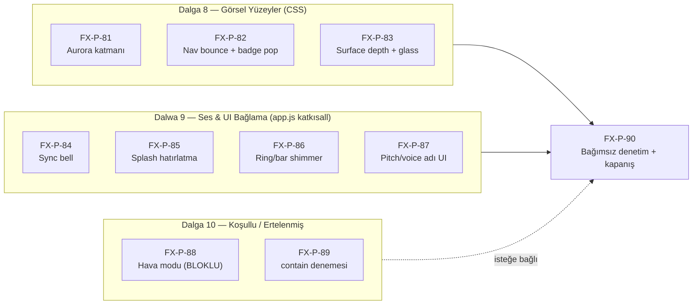

# Premium FX — Eksik Yüzeyler Tamamlama Planı (Dalga 8–10)

**Belge:** `premium-fx-plan/deliverables/PLAN-GORSEL-YUZEY-TAMAMLAMA.md`
**Sürüm:** 1.0
**Tarih:** 2026-09-05
**Öncül:** [`PREMIUM-OZELLIK-ENVANTERI.md`](PREMIUM-OZELLIK-ENVANTERI.md) — 14 özellik grubu uygulandı/doğrulandı; **12 madde planda var, koddaki karşılığı yok/eksik**.
**Kapsam:** Bu belge, envanterde ❌ olarak işaretlenen maddeleri kapatmak için **yeniden oluşturulan prompt serisinin (FX-P-81…FX-P-90)** ayrıntılı uygulama planıdır.
**Kaynak sözleşme:** [`../.prompts/PROMPT-CATALOG.md`](../.prompts/PROMPT-CATALOG.md) §1 (S1–S10) ve [`../SAFEGUARDS.md`](../SAFEGUARDS.md) (I1–I6) — **aynen miras alınır; çakışma olursa katalog hakimdir.**

> **Yerel-only kuralı (değişmez):** Tüm commitler yalnızca yerel kalır. `git push`, PR, tag, merge to `main`, deploy ve `mustafaras/seyma-data` yazması **yasaktır**; her biri ayrı kullanıcı onayına tabidir. Bkz. [`../LOCAL-ONLY-IMPLEMENTATION.md`](../LOCAL-ONLY-IMPLEMENTATION.md).

---

## 0. Yönetici Özeti

| | |
|---|---|
| **Sorun** | 74 promptluk FX serisi "tamamlandı" denildi; ancak plan (§4.1–4.6) ile kod arasında **12 boşluk** kaldı. 6'sı 2026-09-05'te kapatıldı (P0-1…P3-6); kalan **10 boşluk + 2 ertelenen** bu planın konusudur. |
| **Yaklaşım** | Yeni prompt serisi: **Dalga 8 (Görsel Yüzeyler, CSS-ağırlıklı)** → **Dalga 9 (Ses/UI Bağlama, app.js katkısall)** → **Dalga 10 (Koşullu/Ertelenmiş)** → **FX-P-90 bağımsız denetim**. |
| **Prompt sayısı** | 10 yeni prompt (FX-P-81…90); 2'si koşullu/ertelenmiş. |
| **Kod etkisi** | 4 prompt salt CSS/HTML; 4 prompt app.js'e **yalnızca guard'lı katkusal çağrı** ekler (FX-P-13/15/22/35 örneği); 1 prompt `timeTheme.js` + `index.html`; 1 prompt ayarlar kartı + additive `App.set*` handler. |
| **Veri etkisi** | **Sıfır.** Yeni `settings.*` alanı gerekmez (aurora dahil tüm gating mevcut alanlarla: `premiumAtmosphere`). I1–I6 dokunulmaz. |
| **Risk profili** | Düşük — en büyük dosya etkisi app.js'te ~6 katkusal satır/prompt; hiçbir fonksiyon imzası, `App.*` yüzeyi, `data` şekli, `migrate()`/`save()`/`sync.js` davranışı değişmez. |

---

## 1. Kapsam: Kapatılacak 12 Madde (Envanterden)

| Envanter # | Madde | Öncelik | Dalga | Prompt |
|---|---|---|---|---|
| 1 | Aurora arka plan katmanı (§4.4.2) | **P0** | 8 | FX-P-81 |
| 2 | `SeyOnSynced()` kristal bell (§4.1.3) | **P0** | 9 | FX-P-84 |
| 3 | Bottom nav aktif ikon bounce (§4.6.2) | P1 | 8 | FX-P-82 |
| 4 | ÆON unread badge pop animasyonu (§4.6.4) | P1 | 8 | FX-P-82 |
| 5 | Genel `.surface` hover/active derinlik (§4.5.1) | P1 | 8 | FX-P-83 |
| 6 | Splash veri-durumu hatırlatması (§4.3.3) | P2 | 9 | FX-P-85 |
| 7 | Habits SVG ring + motivation bar shimmer (§4.5.3) | P2 | 9 | FX-P-86 |
| 8 | Glass & blur genişlemesi (§4.5.6) | P2 | 8 | FX-P-83 |
| 9 | `voicePitch` / `voiceVoiceName` UI (envanter §8.10) | P2 | 9 | FX-P-87 |
| 10 | Yağmur/bulut hava-API modu (§4.4.3) | P3 | 10 | FX-P-88 (koşullu) |
| 11 | `#app` contain optimizasyonu (audit kararı) | P3 | 10 | FX-P-89 (deneysel) |
| 12 | FX-P-66/67 (A/B kopya deneyi + launch-ritual genişletmesi) | P3 | 10 | FX-P-90 kapsamında karar |

**Kapsam dışı (bilinçli):** Yeni ses/haptik deseni, yeni settings alanı, yeni modül dosyası, `app.js` bölme/modülerleştirme (ayrı program: `monolit-bolumlenme-plan/`).

---

## 2. Başlangıç Öncesi: Seri Açılış Protokolü

74'lük seri `FX-SERI-KAPANIS-BELGESI.md` ile resmen kapandı. Yeni seri açılmadan önce **bir kez** yapılır (bu planın FX-P-81'i başlamadan kullanıcı onayıyla):

1. **Prompt kartları yazılır:** `premium-fx-plan/.prompts/` altına `FX-P-81.md` … `FX-P-90.md`, bu belgedeki §5 kartlarından birebir üretilerek (format: `FX-P-61.md` YAML başlığı + Amaç/Girdi/Adımlar/Test/S6).
2. **Katalog güncellenir:** `PROMPT-CATALOG.md` sürüm 1.2 — "Dalga 8–10 (10 prompt)" bölümü eklenir; ortak sözleşme S1–S10 değişmez.
3. **Durum makinesi sıfırlanır:** `FX-PROMPT-STATE.json` → `lastCompletedPrompt: null`, `activePrompt: null`, `currentPhase: "Dalga 8 başlıyor"`, `series: "FX-WAVE-2"`, `planVersion: "3.0"`, `implementationComplete: false`. Eski seri alanları (`postClosureFixes` vb.) belge amaçlı korunur.
4. **Dal kararı (kullanıcı kapısı — bkz. §8):** Mevcut dal `zikirmatik-manuel-zikir` FX değişikliklerini zaten taşıyor (premium-fx-local atası). İki seçenek:
   - **(A) Önerilen:** mevcut HEAD'den yeni yerel dal: `git checkout -b premium-fx-gorsel-yuzey` — zikirmatik işinden bağımsız geri alınabilir.
   - **(B)** doğrudan `zikirmatik-manuel-zikir` üzerinde yerel commitler (dal karmaşası olur; önerilmez).
5. **Context load sırası** her oturumda: `CURRENT-STATE.md` → `LEDGER.md` → `NEXT-STEPS.md` → `LOCAL-ONLY-IMPLEMENTATION.md` → `PROMPT-CATALOG.md` → `SPEC-FAZ-*.md` (ilgiliyse) → `SAFEGUARDS.md` → bu belge §5 ilgili kart.

---

## 3. Mimari İlke: app.js'i Minimize Etmek

Planın en önemli mühendislik kararı — her eksik için **en düşük dokunma yüzeyi** seçilir:

| Eksik | Naif çözüm | **Seçilen çözüm** | app.js etkisi |
|---|---|---|---|
| Aurora | `render()` içine div ekle | `index.html`'e statik `#sey-aurora` katmanı (`#sey-splash` örneği) + CSS `#root.theme-aurora` kuralı + sınıfı `timeTheme.js` `apply()` yönetir | **0 satır** |
| Nav bounce / badge pop | render'da class ekle | Salt CSS: `.sey-bottomnav-item.is-active` durum seçicileri (render zaten `is-active` + badge span üretiyor, `app.js:14772-14775`) | **0 satır** |
| `.surface` hover + glass | JS hover handler | Salt CSS `:hover`/`:active` + `backdrop-filter`/`color-mix` genişlemesi | **0 satır** |
| Sync bell | — | `SeyOnSynced()` gövdesine **tek guard'lı satır** (FX-P-15 deseninin aynısı) | +1 satır |
| Splash hatırlatma | — | boot/hideSplash akışına koşullu metin güncellemesi (guard'lı) | ~8 satır |
| Ring/bar shimmer | — | FX-P-35 deseni: guard'lı `SeyFx.shimmer(el)` çağrıları | +6 satır |
| Pitch/voice adı UI | — | Ayarlar kartına 2 kontrol + additive `App.setVoicePitch`/`App.setVoiceVoiceName` (I2 **ekleme** — yasak değil) | ~30 satır |

Bu ilke I2/I6 uyumunu ve tek-prompt-tek-commit geri alınabilirliğini korur. **Hiçbir prompt mevcut bir handler'ın adını/imzasını değiştirmez; sadece yeni handler ekler.**

---

## 4. Dalga ve Bağımlılık Haritası



- Dalga 8 içinde promptlar **birbirinden bağımsız**; sırayla uygulanır ama paralel çalışmaya uygun ayrışabilir (farklı dosyalar).
- Dalga 9 promptları bağımsızdır; yalnız FX-P-87, FX-P-61'de oluşturulan sesli rehberlik kartını genişletir (o kart zaten mevcut).
- FX-P-90 **her zaman en son**; tüm dalgaların regression'ını tek geçişte doğrular.

---

## 5. Prompt Kartları (Ayrıntılı)

> Her kart, `.prompts/FX-P-NN.md` dosyasına yazılacak içeriğin tam taslağıdır. Ortak adımlar (S7 üç dosya güncellemesi, S8 yerel commit, S9 cache-bump) her kartta geçerlidir ve tekrar yazılmaz.

### FX-P-81 · Aurora arka plan katmanı (P0)

- **Amaç:** `premiumAtmosphere` açıkken çok düşük opaklı `seyAurora` hareketli arka plan katmanı; metin okunabilirliği bozulmaz.
- **Dosyalar:** `index.html` (+~6 satır), `app/styles.css` (+~25 satır), `app/core/timeTheme.js` (+~8 satır), `app/core/timeTheme.js` fixture.
- **Adımlar:**
  1. `index.html`: `#app`'in kardeşi olarak statik katman: `<div id="sey-aurora" aria-hidden="true"></div>` — `position:fixed; inset:0; z-index:0; pointer-events:none; opacity:0;` (splash örneğindeki gibi açıklama yorumuyla).
  2. `styles.css`: `#root.theme-aurora #sey-aurora { opacity:.16; animation: seyAurora 14s ease-in-out infinite; background: radial-gradient(...mevcut --accent tonları...); }` — koyu temada ayrı opaklık (`.10`); **`will-change: transform`**; `prefers-reduced-motion` altında `animation:none; opacity:0` (katman tamamen söner — SAFEGUARDS §2.1'in `sey-fx-aurora` listesi buna hazır).
  3. `timeTheme.js`: `apply()` içinde, `isPremiumFxEnabled()` zaten mevcut gating — root'a `theme-aurora` sınıfını ekle/kaldır (`classList.add/remove`); `applySeasonal()` gibi idempotent. `app.js` **değişmez** (mevcut `apply()` çağrısı render sonunda zaten çalışıyor, `app.js` render sonu guard bloğu).
  4. Kontrast: `docs/apple-design/verify-contrast.mjs` çalıştır — metin tokenlarına dokunulmadığı için geçmeli.
- **Yasak:** `app.js` düzenlemek; `--page`/`--bg` değerlerini değiştirmek (yalnız katman opaklığı); yeni settings alanı.
- **Test:** `test_premium_time_theme.js`'e 4 assertion: `apply()` → root'ta `theme-aurora` var/yok (premium kapalıyken), reduced-motion'da CSS kural varlığı (statik), `#sey-aurora` index.html'de mevcut, `pointer-events:none`. driver + zikr + S5.

### FX-P-82 · Bottom nav bounce + badge pop (P1)

- **Amaç:** Aktif sekme ikonunda hafif bounce; ÆON/mesaj unread badge'inde pop girişi.
- **Dosyalar:** `app/styles.css` (+~30 satır). **app.js/index.html değişmez.**
- **Adımlar:**
  1. Bounce: `@keyframes seyNavBounce { 0%{transform:translateY(0) scale(1)} 40%{transform:translateY(-3px) scale(1.06)} 100%{transform:translateY(0) scale(1)} }` → `.sey-bottomnav-item.is-active .sey-bottomnav-glyph { animation: seyNavBounce .32s var(--ease-premium); }` (render `is-active`'i zaten basıyor).
  2. Badge pop: `@keyframes seyBadgePop { 0%{transform:scale(.4);opacity:0} 60%{transform:scale(1.12)} 100%{transform:scale(1);opacity:1} }` → `.sey-bottomnav-badge { animation: seyBadgePop .3s var(--ease-premium); transform-origin:center; }`.
  3. Reduced-motion: iki kural da `animation:none !important` (SAFEGUARDS §2.1 `sey-fx-nav-bounce` slotu).
  4. Performans: yalnız `transform/opacity` — `will-change` gerekmez (kısa ömürlü animasyon).
- **Yasak:** render döngüsünde HTML değişikliği; badge metnini değiştirmek.
- **Test:** statik CSS kanıtı fixture'ı (`test_premium_reduced_motion.js`'e satırlar: keyframe adları + reduce kuralı); driver görsel dump (`--dump bugun`, nav bölgesi) ile `is-active` doğrulaması; S5.

### FX-P-83 · `.surface` hover/active derinlik + glass & blur genişlemesi (P1)

- **Amaç:** Plandaki §4.5.1/§4.5.6: genel kart derinliği (`translateY(-2px)` hover, `scale(.97)` active) ve glass zenginleştirmesi.
- **Dosyalar:** `app/styles.css` (+~35 satır). **app.js değişmez.**
- **Adımlar:**
  1. **Mevcut `.surface`/`.card` seçicilerini tespit et** (grep: `\.surface\b|\.card\b` en yoğun class'lar) — yalnız gerçekten kullanılan seçicilere kural yaz; `!important` yok.
  2. Hover: `transform:translateY(-2px); box-shadow: 0 10px 24px color-mix(in srgb, var(--text) 8%, transparent); transition: transform .18s var(--ease-premium), box-shadow .18s ease;`
  3. Active/touch: `:active { transform: scale(.97); }` — mobilde hover olmadığı için active tek başına anlamlı.
  4. **Dokunma cihazı koruması:** kural `@media (hover:hover)` bloğuna sarılır (masaüstü hover'a özgü), `:active` herkes için.
  5. Glass genişlemesi: seçili yüzeylere (header, bottomnav, overlay backdrop) `backdrop-filter: blur(14px) saturate(1.1)` + `color-mix` kenar ışığı (`border-color: color-mix(in srgb, var(--text) 10%, var(--field-bd))`) — **iOS eski sürüm notu:** `@supports (backdrop-filter: blur(1px))` guard'ı; desteklemeyen tarayıcı mevcut görünümde kalır.
  6. Reduced-motion: `transition:none` (zaten mevcut global reduce kuralı yeterli olabilir; kontrol et).
- **Yasak:** renk tokenlarını değiştirmek; `contain` eklemek (FX-P-89'a ait); tüm kartlara körlemesine blur basmak (performans — yalnız listede belirtilen yüzeyler).
- **Test:** `verify-contrast.mjs` + statik CSS fixture (`@supports` + `@media (hover:hover)` kanıtı) + driver render dump görsel kontrolü + S5.

### FX-P-84 · `SeyOnSynced()` kristal bell (P0)

- **Amaç:** Plandaki §4.1.3: sync başarısında (manuel eşitleme onayı) bell sesi, header check morph ile eşzamanlı.
- **Dosyalar:** `app.js` (+1 guard'lı satır). 
- **Adımlar:**
  1. `SeyOnSynced` gövdesi (`app.js:5407`): `ui.saveActionPending` dalının içine (kullanıcı **elle** eşitlediğinde görsel onayın verildiği tek yer — QY-22 yorumu), `toast('Panel ile eşitlendi')` satırının hemen üstüne:
     ```js
     if(window.SeyAudio&&typeof window.SeyAudio.bell==='function'){ try{ window.SeyAudio.bell(); }catch(e){} }
     ```
  2. **Kapsam kararı (kasıtlı):** arka plandaki otomatik save'lerde çan **çalmaz** — gürültü kirliliği olurdu; yalnız kullanıcının tetiklediği eşitleme onayı çalar. Bu, FX-P-15'in "ritüel koşulu" ilkesinin aynısıdır.
  3. `bell()` zaten `isSoundAllowed` gating'li (uiSounds + premium + reduced-motion istisnası yok — çan bilinçli geri bildirim, tap istisnası gibi düşünülebilir; **varsayılan: reduced-motion'da sessiz**, mediaFx'te zaten öyle).
- **Yasak:** `SeyOnSynced`'in diğer satırlarına dokunmak; `save()`/`sync.js` (I4).
- **Test:** `test_premium_audio_fx.js`'e assertion (SeyOnSynced gövdesinde guard'lı bell çağrısı kanıtı — string-level, audio fixture deseni); faz10 sync fixture değişmez; S5 + S6 (App sayacı değişmez).

### FX-P-85 · Splash veri-durumu hatırlatması (P2)

- **Amaç:** Plandaki §4.3.3: dünün kaydedilmediği açılışta splash alt metni nazikçe hatırlatır; tamamsa minimalist karşılama.
- **Dosyalar:** `app.js` (hideSplash/boot bölgesi ~`17401-17416`, +~10 satır).
- **Adımlar:**
  1. boot'ta `hideSplash` çağrısından **önce** (splash görünürken): `var d=data&&data.days&&data.days[yesterdayStr()]; var done=d&&(d.mood||d.ticks&&Object.keys(d.ticks).length);`
  2. `#sey-splash` içindeki alt satır (`index.html` statik "Günışığına hoş geldin") JS ile güncellenmez — **yerine** splash içinde dinamik `<div id="sey-splash-note">` boş bırakılır; boot'ta dün kayıtsızsa: `note.textContent='Dünü de kaydetmeyi unutma ☀️'` (Türkçe, sıcak ton — CLAUDE.md §7). Kayıt tamamsa not boş kalır.
  3. Uygulama: `index.html`'e tek boş div + `app.js` boot'ta guard'lı 3 satır. `launchRitual` kapalıysa splash hiç görünmediğinden akış zaten atlanır.
  4. Ses yok (autoplay yasağı — SAFEGUARDS §3.2).
- **Yasak:** `yesterdayStr` gibi yardımcıları yeniden yazmak (mevcut dateUtils kullan); yeni settings alanı; push yok.
- **Test:** `test_premium_launch_splash.js`'e 3 assertion: dün boş → not metni var; dün dolu → not boş; `launchRitual=false` → akış not'a dokunmaz. driver + S5.

### FX-P-86 · Habits ring + motivation bar shimmer (P2)

- **Amaç:** Plandaki §4.5.3: shimmer motorunu (zaten çalışan) iki eksik noktaya bağlamak.
- **Dosyalar:** `app.js` (+2 guard'lı çağrı bloğu, FX-P-35 deseni).
- **Adımlar:**
  1. **Habits ring:** ring güncellenen handler (su/habit sonrası ring yeniden çizilen nokta — ring markup `app.js:11229/11478` üretim yerleri; hedef: ring SVG'yi saran konteyneri seçen en yakın stabil seçici, örn. `document.querySelector('.sey-habits-ring-wrap')` — uygulama sırasında gerçek wrapper adı koddan doğrulanır; yoksa ring'i saran mevcut `<div style="position:relative…">` parent'ına id eklemek **I6 kapsamında katkısaldır**).
  2. Tamamlama artışında (before<ht && after>=ht koşulu zaten success chime'ınki): `if(window.SeyFx&&typeof window.SeyFx.shimmer==='function'){ try{ window.SeyFx.shimmer(ringEl); }catch(e){} }`
  3. **Motivation bar:** `App.completeMotivationTask` başarı dalında bar konteynerine aynı guard'lı `shimmer` (bar `progBar` çıktısı `app.js:10674`).
  4. Gating `isPremiumFxEnabled` zaten `shimmer` içinde; çağrı noktaları koşulsuz guard'lı olur.
- **Yasak:** `progBar` helper'ının imzasını değiştirmek; yeni keyframe (`.sey-shimmer` mevcut).
- **Test:** fx_utils fixture mevcut; `test_premium_fx_utils.js`'e 2 string-level çağrı kanıtı; driver + S5 + S6.

### FX-P-87 · `voicePitch` / `voiceVoiceName` arayüzü (P2)

- **Amaç:** Envanter §8.10: settings alanları `migrate()`'te backfill'li ama UI yok; sesli rehberlik kartına iki ek kontrol.
- **Dosyalar:** `app.js` (ayarlar kartı render + 2 additive handler, ~35 satır).
- **Adımlar:**
  1. Sesli rehberlik kartı (satır ~12554 civarı, mevcut dil/hız/ses kontrollerinin altına):
     - **Yerel pitch** (yalnız `voiceCloudTts` kapalıyken anlamlı — koşullu gösterim): `0.7–1.3` aralıklı `<input type="range">`, `onchange="App.setVoicePitch(this.value)"`.
     - **Yerel ses adı:** `<select>` — `speechSynthesis.getVoices()` içinden `voiceLang` ile filtrelenmiş liste; `onchange="App.setVoiceVoiceName(this.value)"`. Bulut TTS açıkken her iki kontrol `disabled` + açıklama ("Bulut sesinde geçersiz").
  2. Additive handler'lar (I2 ekleme — mevcut yüzeye dokunmaz):
     ```js
     App.setVoicePitch=function(v){ var x=parseFloat(v); if(isNaN(x)) return; data.settings.voicePitch=Math.min(1.3,Math.max(0.7,x)); save(); render(); };
     App.setVoiceVoiceName=function(v){ if(typeof v!=='string') return; data.settings.voiceVoiceName=v||null; save(); render(); };
     ```
  3. `mediaFx.js` zaten `voicePitch`/`voiceVoiceName` okuyor (migrate-spec'e göre); davranış değişikliği gerekmez — **doğrula**, gerekirse tek satır clamp hizalaması.
- **Yasak:** mevcut `App.setVoiceGuidance/setVoiceLang/setVoiceRate/setVoiceCloudVoice` gövdelerini değiştirmek; `migrate()` (alanlar zaten backfill'li).
- **Test:** `test_premium_voice.js`'e handler birim testleri (clamp sınırları, boş değer red); driver + S5 + S6 (App sayacı +2).

### FX-P-88 · Yağmur/bulut hava-API modu (P3 — **BLOKLU**)

- **Durum:** Planda §4.4.3 "gelecekte hava API'si varsa" koşullu. Uygulamada hava durumu veri kaynağı yok.
- **Karar:** **Bu seride UYGULANMAZ.** Ön koşul: kullanıcının açık onayıyla harici hava API'si entegrasyonu (gizlilik: SAFEGUARDS §3.1 "harici URL'ye asla otomatik istek atılmamalı" — bu yüzden opt-in + kullanıcı tercihi gerekir). Kart taslağı burada durur; tetikleyici kullanıcı kararıdır.
- **Kabaca kapsamı (kayıt amaçlı):** opt-in `settings.weatherFx` + tek harici istek (kullanıcı onaylı sağlayıcı) + yağmur/kar CSS katmanı (FX-P-81'in `#sey-aurora` altyapısı yeniden kullanılır) + offline fallback sessiz.

### FX-P-89 · `#app` contain izole denemesi (P3 — deneysel)

- **Durum:** `VISUAL-FX-AUDIT.md` kararı: `contain: layout paint` modal/fixed nav regreso riski nedeniyle ertelendi.
- **Adımlar (deneysel, geri alınabilir tek commit):**
  1. Önce **ölçüm**: `driver.mjs` render dump + modal aç/kapa akışı referans ekran görüntüsü (kontrollü port-9000 protokolü, kullanıcı istediyse).
  2. `app/styles.css`: `#app { contain: layout style; }` — **`paint` kullanma** (splash `#sey-splash` `#app` dışında olduğundan fixed nav taşma riski düşük ama `style` ile başla).
  3. Modal, sticky header, toast, overlay aç/kapa davranışını driver + panel fixture'larıyla doğrula.
  4. **Herhangi bir görsel regresyonda:** commit geri alınır; madde kalıcı olarak "uygulanmayacak" işaretlenir.
- **Yasak:** `#root` veya `body`'ye contain; `paint`/`size` kombinasyonu ilk denemede.

### FX-P-90 · Bağımsız denetim + seri kapanışı (final)

- **Amaç:** FX-P-70'ın tekrarı — bu kez **çağrı-noktası odaklı** (geçmişteki hata: motor var, çağrı yok; fixture'lar gate'i kendisi enjekte ediyordu).
- **Adımlar:**
  1. 12 maddenin her biri için **canlı kod kanıtı**: grep ile motor + çağrı noktası + CSS kural üçlüsü; fixture çıktıları; FX-P-81..89 her biri için ayrı satır.
  2. **Öğrenilen dersi uygula:** en az bir fixture gerçek `migrate()` çıktısını gerçek motorlara vererek uçtan uca doğrulamalı (gate-defaults deseni).
  3. `FX-VERIFY-RAPORU-2.md` raporu; `FX-SERI-KAPANIS-BELGESI`'ne ek bölüm; `CURRENT-STATE.md` + `LEDGER.md` + durum makinesi kapanışı (`implementationComplete: true` yalnız tümü ✅ ise).
  4. FX-P-66/67 kapsamı: kullanıcı isterse ayrı kart; istemezse kalıcı olarak "ertelenmiş" kapanır.
  5. Final regression: S5 tam set + premium ailesi + 23 panel + 27 panel-v2 + 9 quran + 20 reminder + 3 boundary + kontrast/tema.

---

## 6. Uygulama Sırası ve Zaman

| Sıra | Prompt | Öncelik | Tahmin | Bağımlılık |
|---|---|---|---|---|
| 1 | FX-P-81 Aurora | P0 | 1 oturum | Seri açılış protokolü (§2) |
| 2 | FX-P-82 Nav/Badge | P1 | yarım oturum | — |
| 3 | FX-P-83 Surface/Glass | P1 | 1 oturum | — |
| 4 | FX-P-84 Sync bell | P0 | yarım oturum | — |
| 5 | FX-P-85 Splash notu | P2 | yarım oturum | splash mevcut (✅) |
| 6 | FX-P-86 Ring/bar shimmer | P2 | yarım oturum | — |
| 7 | FX-P-87 Pitch/voice UI | P2 | 1 oturum | — |
| 8 | FX-P-89 contain (opsiyonel) | P3 | yarım oturum | FX-P-83 (hover transition'ları sonrası ölçüm daha anlamlı) |
| 9 | FX-P-90 Denetim/kapanış | — | 1 oturum | 1–7 tamam |
| — | FX-P-88 Hava modu | P3 | — | **BLOKLU**: hava API kararı |

**Toplam:** ~6 oturum (koşullular hariç). Her prompt tek yerel commit (`premium-fx: FX-P-NN <Türkçe açıklama>`).

---

## 7. Doğrulama Protokolü (Her Promptta — S5/S6 Miras)

```bash
# S5 — doğrulama kapısı
node --check app.js && node --check sync.js && node --check app/core/timeTheme.js
node .claude/skills/run-seyma/driver.mjs
node .claude/skills/run-seyma/zikr-harness.mjs          # 95/95
node tests/app/test_faz10_sync.js
for f in tests/app/test_premium_*.js; do node "$f" || echo "FAIL: $f"; done
for f in tests/panel-v2/test_panel_v2_*.js; do node "$f" || echo "FAIL: $f"; done

# S6 — değişmezlik kanıtı (önce/sonra aynı)
grep -o 'App\.[a-zA-Z0-9_]*\s*=' app.js | sort -u | wc -l        # FX-P-87'de +2 hariç sabit
grep -c 'src="app.js' index.html                                  # 1
grep -c 'src="sync.js' index.html                                 # 1
```

**Prompta özel ekler:** FX-P-81 → kontrast fixture; FX-P-86/87 → ilgili premium fixture'a assertion; FX-P-85 → launch-splash fixture güncellemesi.

**Cache-bumping (S9):** Dalga 8 sonunda `styles.css`+`timeTheme.js`+`index.html`; Dalga 9 sonunda `app.js`+`index.html` → `?v=20260906a` formatı.

---

## 8. Kullanıcı Kararı Kapıları (Başlamadan Cevaplanacak)

1. **Dal seçimi:** (A) yeni yerel dal `premium-fx-gorsel-yuzey` (önerilen) / (B) `zikirmatik-manuel-zikir` üstünde devam.
2. **FX-P-89 contain:** deneme isteniyor mu, yoksa kalıcı erteleme mi?
3. **FX-P-88 hava modu:** harici hava API'si (opt-in, gizlilik onaylı) istenecek mi bir gelecek seride?
4. **FX-P-66/67:** kapatılsın mı, uygulansın mı?
5. **Seri sonu merge kararı:** `premium-fx-gorsel-yuzey` → `main` yalnız bu kapıda ve ayrı onayla.

---

## 9. Risk Matrisi ve Geri Alma

| Risk | Olasılık | Etki | Önlem |
|---|---|---|---|
| Aurora metin kontrastını düşürür | düşük | orta | opaklık ≤%16, `verify-contrast.mjs` zorunlu, koyu temada daha düşük |
| Genel hover kuralları beklenmeyen bileşenlere yayılır | orta | düşük | kural yazmadan önce seçici envanteri; `@media (hover:hover)`; görsel dump kontrolü |
| `backdrop-filter` eski iOS'ta boşluk görünümü | orta | düşük | `@supports` guard; desteklenmeyende mevcut görünüm |
| `SeyOnSynced` bell'i otomatik save'de de çalar | düşük | orta | yalnız `ui.saveActionPending` dalı (manuel eşitleme) |
| FX-P-87 yerel ses listesi iOS'ta boş döner | orta | düşük | `getVoices` async/`voiceschanged` guard'ı; boşsa select gizlenir |
| contain layout regresyonu | düşük | orta | `style` ile sınırlı başla; tek commit; anında revert |
| "Motor var çağrı yok" tekrarı | düşük | **yüksek** | FX-P-90 çağrı-noktası denetimi + her promptta string-level çağrı kanıtı |

**Geri alma:** Her prompt tek commit → `git revert <hash>` yeterli; hiçbir prompt şema/migrasyon taşıdığı için veri tarafı geri alma gerekmez.

---

## 10. Anti-Amnesia Yükümlülükleri

Her promptta (S7): `LEDGER.md` satırı → `CURRENT-STATE.md` "Durum/Devam Eden" → `FX-PROMPT-STATE.json` (`activePrompt` başlangıçta, `lastCompletedPrompt` bitişte). Bu plan, `docs/` köküne değil yalnız `premium-fx-plan/deliverables/` altına konur; kök `AGENTS.md`/`CLAUDE.md` "premium FX" yönlendirme satırı FX-P-90'da bu belgeye güncellenir.

## 11. Tanım-ı Kabul (Seri Kapanışı İçin)

- [ ] 12 maddeden 10'u ✅ (FX-P-88 hariç — bloklu; FX-P-89 kararlı)
- [ ] Envanter belgesi güncellendi: ❌ → ✅ satırlar kanıt linkli
- [ ] Premium fixture ailesi + tüm regression: 0 FAIL
- [ ] S6 değişmezlik kanıtları serinin başı ve sonu aynı (FX-P-87'nin +2 handler'ı belgeli)
- [ ] `LOCAL-ONLY`: `git log origin/main..HEAD --oneline` → tüm commitler yerel; push/merge/deploy yok
- [ ] `seyma-data`'ya tek byte yazılmadı

---

*Bu plan, [`PREMIUM-OZELLIK-ENVANTERI.md`](PREMIUM-OZELLIK-ENVANTERI.md) tespiti üzerine kuruludur ve PROMPT-CATALOG v1.1 ortak sözleşmesine (S1–S10) tabidir. Uygulama, §8'deki kullanıcı kararları alındıktan sonra başlar.*